# CVIS Ecosystem Overview

**Healthcare IT Cardiology Informatics Consultant Readiness Curriculum**  
*Module 1: EHR Ecosystem Foundation | Lesson 1.1*

---

## 📌 Overview

This lesson establishes the architectural and market foundation for understanding cardiovascular information systems (CVIS) within modern healthcare IT environments. Through systematic analysis of vendor positioning, standards frameworks, and integration patterns, you'll develop the consultant's mental model for assessing any cardiology IT environment.

**Learning Outcome:** Move from "which system is better" thinking to contextual architectural assessment—the cornerstone of consulting expertise.

---

## 🎯 What You'll Learn

### 📋 Core Concepts

- **CVIS Philosophy:** Data-centric integration vs. image-focused PACS
- **Three-Tier Architecture:** Enterprise EHR → Department CVIS → Modality devices
- **Market Dynamics:** Epic Cupid dominance, Cerner challenges, hybrid patterns
- **Standards Ecosystem:** HL7, DICOM, IHE as strategic interoperability tools
- **Consultant Frameworks:** Diagnostic questions for organizational readiness

---

## 💡 Concept 1: CVIS Data Integration Philosophy

### The Fundamental Distinction

**Clinical Reality Example:**

An echo cardiologist needs:
- 🖼️ Ultrasound images + 📊 Ejection fraction + 📏 Chamber dimensions + 🩺 Valve assessment + 📅 Prior study comparison + 🔗 HF diagnosis correlation + ⚡ CDS alert if EF ≤35%

A radiologist primarily needs:
- 🖼️ CT/MRI images + 📋 Report availability

**CVIS emphasizes data integration where images play second fiddle to comprehensive clinical context.**

### 📊 Diagram: CVIS vs PACS Philosophy Comparison

This diagram illustrates the fundamental philosophical difference between CVIS (data-centric) and PACS (image-centric) systems. CVIS handles comprehensive clinical data including measurements, clinical context, and multi-source fusion, while PACS focuses primarily on image visualization and storage. The echo study example demonstrates how CVIS manages all seven data types while PACS handles mainly images.

```mermaid
graph LR
    subgraph CVIS["🫀 CVIS PHILOSOPHY"]
        CV1[Data Integration]
        CV2[Measurements Priority]
        CV3[Clinical Context]
        CV4[Multi-Source Fusion]
        
        CV1 --> CV2
        CV2 --> CV3
        CV3 --> CV4
    end
    
    subgraph PACS["📷 PACS PHILOSOPHY"]
        PA1[Image Visualization]
        PA2[Picture Archiving]
        PA3[Viewing Tools]
        PA4[Storage Focus]
        
        PA1 --> PA2
        PA2 --> PA3
        PA3 --> PA4
    end
    
    subgraph Echo["Example: Echo Study"]
        E1[Images]
        E2[Ejection Fraction]
        E3[Chamber Dimensions]
        E4[Valve Assessment]
        E5[Prior Comparisons]
        E6[HF Diagnosis Link]
        E7[CDS Alert EF≤35%]
    end
    
    CVIS -.->|Handles All| Echo
    PACS -.->|Handles Primarily| E1
    
    style CVIS fill:#7B68EE,stroke:#4B3A9E,stroke-width:4px,color:#fff
    style PACS fill:#4A90E2,stroke:#2E5C8A,stroke-width:4px,color:#fff
    style Echo fill:#50C878,stroke:#2E7D4E,stroke-width:3px,color:#fff
```

---

## 🏗️ Concept 2: Three-Tier Architecture Model

### Flow Understanding

1. **🏥 Enterprise Level** initiates clinical workflow (orders in Epic)
2. **🏢 Department Level** coordinates cardiology work (CVIS manages scheduling, reporting)
3. **📱 Modality Level** acquires clinical data (machines generate images/measurements)
4. **🔗 Standards Layer** coordinates everything (HL7/DICOM/IHE enable data movement)

### 📊 Diagram: Three-Tier CVIS Architecture with Standards Layer

This architectural diagram shows the complete data flow through three organizational tiers: Enterprise EHR (Epic), Department CVIS, and Modality devices (Echo, Cath, EP). The Standards Layer (HL7, DICOM, IHE) orchestrates bidirectional communication—orders flow down from EHR to CVIS to modalities, while results flow back up. This architecture eliminates manual data entry and enables automated clinical decision support.

## 📊 Concept 3: Market Landscape & Positioning

### 🎯 Platform Comparison Matrix

| **Dimension** | **🏆 Epic Cupid** | **🔄 Cerner PowerChart** |
|--------------|-------------------|--------------------------|
| **Market Position** | 42-48% (📈 Growing) | 22.9-24.9% (📉 Declining) |
| **Architecture** | EMR-centric modules | Unified Millennium platform |
| **Integration** | Seamless within Epic | More open for third-party |
| **Cardiology Depth** | 🟡 Basic-Intermediate | 🟢 Intermediate-Advanced |
| **Hybrid Frequency** | 🔴 Common (Cupid + CVIS) | 🟡 Less common |
| **Standards Support** | HL7 v2.x, DICOM, FHIR | HL7 v2.x, HL7 FHIR, DICOM |
| **Future Direction** | Incremental evolution | Complete EHR rebuild (2025+) |

### 📊 Diagram: EHR Market Share Distribution in Cardiology

```mermaid
%%{init: {'theme':'base', 'themeVariables': {'primaryColor':'#FF6B6B','primaryTextColor':'#fff','primaryBorderColor':'#C44','secondaryColor':'#4ECDC4','tertiaryColor':'#45B7D1'}}}%%
graph TD
    A["<b>📊 EHR MARKET SHARE - CARDIOLOGY 2024</b>"]
    
    A --> B["<b>Epic Cupid</b>"]
    A --> C["<b>Cerner PowerChart</b>"]
    A --> D["<b>Allscripts</b>"]
    A --> E["<b>Meditech</b>"]
    A --> F["<b>athenahealth</b>"]
    A --> G["<b>Other Vendors</b>"]
    
    B --> B1["<b>████████████████████████████████████████████ 45%</b>"]
    C --> C1["<b>████████████████████████ 24%</b>"]
    D --> D1["<b>████████████ 12%</b>"]
    E --> E1["<b>████████ 8%</b>"]
    F --> F1["<b>██████ 6%</b>"]
    G --> G1["<b>█████ 5%</b>"]
    
    style A fill:#1A237E,stroke:#0D1440,stroke-width:3px,color:#fff,font-size:20px,font-weight:bold
    style B fill:#FF5252,stroke:#D32F2F,stroke-width:2px,color:#fff,font-size:16px
    style C fill:#00BFA5,stroke:#00897B,stroke-width:2px,color:#fff,font-size:16px
    style D fill:#448AFF,stroke:#2962FF,stroke-width:2px,color:#fff,font-size:16px
    style E fill:#FF9800,stroke:#F57C00,stroke-width:2px,color:#fff,font-size:16px
    style F fill:#9C27B0,stroke:#7B1FA2,stroke-width:2px,color:#fff,font-size:16px
    style G fill:#795548,stroke:#5D4037,stroke-width:2px,color:#fff,font-size:16px
    style B1 fill:#FF5252,stroke:#D32F2F,stroke-width:2px,color:#fff,font-size:14px
    style C1 fill:#00BFA5,stroke:#00897B,stroke-width:2px,color:#fff,font-size:14px
    style D1 fill:#448AFF,stroke:#2962FF,stroke-width:2px,color:#fff,font-size:14px
    style E1 fill:#FF9800,stroke:#F57C00,stroke-width:2px,color:#fff,font-size:14px
    style F1 fill:#9C27B0,stroke:#7B1FA2,stroke-width:2px,color:#fff,font-size:14px
    style G1 fill:#795548,stroke:#5D4037,stroke-width:2px,color:#fff,font-size:14px
```

This market share diagram illustrates the competitive landscape of EHR systems in cardiology, dominated by Epic Cupid at 45% market share, followed by Cerner PowerChart (24%), Allscripts (12%), Meditech (8%), athenahealth (6%), and other vendors (5%), highlighting Epic's strong position in specialized cardiology solutions.

## Workflow Sequence Diagram

```mermaid
sequenceDiagram
    participant Epic as 🏥 Epic EHR
    participant Cupid as 🫀 Epic Cupid
    participant Echo as 📡 Echo Machine
    participant PACS as 💾 PACS
    
    Note over Epic,PACS: 🟦 1️⃣ ORDER PHASE (HL7)
    rect #FF6B6B
    Epic->>+Cupid: HL7 ORM (Procedure Order)
    Cupid->>-Epic: HL7 ACK (Order Accepted)
    end
    
    Note over Epic,PACS: 🟦 2️⃣ SCHEDULING PHASE (HL7)
    rect #FFA726
    Cupid->>+Epic: HL7 SIU (Appointment Scheduled)
    Epic->>-Cupid: HL7 ACK (Schedule Updated)
    end
    
    Note over Epic,PACS: 🟩 3️⃣ ACQUISITION PHASE (DICOM)
    Note over Echo: 🔷 Sonographer logs into Echo machine
    rect #42A5F5
    Cupid->>+Echo: DICOM Modality Worklist Query
    Echo->>-Cupid: Patient Demographics from MWL
    Note over Echo: 🩺 Perform echo exam
    Echo->>+PACS: DICOM C-STORE (Images + SR)
    PACS->>-Echo: DICOM Storage Confirmation
    end
    
    Note over Epic,PACS: 🟩 4️⃣ REVIEW PHASE (DICOM)
    Note over Cupid: 👨‍⚕️ Cardiologist opens Cupid
    rect #66BB6A
    Cupid->>+PACS: DICOM Query/Retrieve
    PACS->>-Cupid: DICOM Images for Review
    end
    
    Note over Epic,PACS: 🟦 5️⃣ RESULTS PHASE (HL7)
    Note over Cupid: ✍️ Cardiologist signs report
    rect #AB47BC
    Cupid->>+Epic: HL7 ORU (Preliminary Results)
    Cupid->>Epic: HL7 MDM (Final Report with Note)
    Epic->>-Cupid: HL7 ACK (Report Received)
    end
```

---

## 🔌 Standards-Based Integration: How Data Flows

### 🔄 Echo Workflow: Complete Data Journey

This sequence demonstrates how patient data flows through the entire cardiology ecosystem, from order entry in the EHR through image acquisition and back to clinical documentation.

### 📊 Diagram: Echo Study End-to-End Workflow Sequence

This sequence diagram traces a complete echo study from order placement through result delivery and clinical decision support. It demonstrates how HL7 ORM messages initiate orders, DICOM MWL auto-populates patient demographics, DICOM MPPS/Storage/SR transmit procedure data, and HL7 ORU messages return results to the EHR. The workflow culminates in automated CDS alerts (e.g., EF ≤35%), showcasing fully integrated, zero-manual-entry cardiology informatics.

```mermaid
sequenceDiagram
    participant Epic as 🏥 Epic EHR
    participant CVIS as 🏢 CVIS
    participant Echo as 📱 Echo Machine
    participant Card as 👨‍⚕️ Cardiologist
    
    Epic->>+CVIS: HL7 ORM Order Message
    Note over CVIS: Creates study<br/>Schedules patient
    CVIS->>+Echo: DICOM MWL (Patient Demographics)
    Note over Echo: Auto-populates<br/>patient info
    Card->>Echo: Performs Echo Exam
    Echo->>Echo: Captures Images + Measurements
    Echo->>CVIS: DICOM MPPS (Procedure Status)
    Echo->>CVIS: DICOM Storage (Images)
    Echo->>CVIS: DICOM SR (Structured Measurements)
    Card->>CVIS: Completes Report
    CVIS->>Epic: HL7 ORU Result Message
    Note over Epic: Results visible<br/>in chart
    Epic->>Card: CDS Alert (if EF ≤35%)
    
    Note over Epic,Card: Complete integration<br/>No manual data entry<br/>Automated clinical decision support
```

### 📋 Standards Reference Guide

| **Standard** | **Purpose** | **🎯 Cardiology Value** |
|-------------|------------|-------------------------|
| **HL7 v2.x** | Text-based messaging | Patient data, orders, results backbone |
| **DICOM** | Medical imaging data/workflow | MWL, Storage, MPPS, Structured Reports |
| **IHE CATH** | Cath workflow coordination | Emergency procedures, worklist management |
| **IHE ECHO** | Echo workflow coordination | Intermittent connections, multi-stage exams |
| **HL7 FHIR** | Modern RESTful API | Future interoperability, ONC mandate |

---

## 🔗 Healthcare Interoperability Standards Ecosystem

### Complete Standards Landscape

Understanding how different healthcare standards interact is crucial for architecting robust CVIS implementations.

### 📊 Diagram: Complete Healthcare Interoperability Standards Ecosystem

This comprehensive ecosystem diagram maps the four major standards families in healthcare IT: HL7 v2.x (clinical messaging), DICOM (medical imaging), IHE profiles (workflow coordination), and HL7 FHIR (modern APIs). Each family contains specific implementations (e.g., ADT, MWL, CATH profile, RESTful resources). The connecting arrows show evolution paths—legacy HL7 v2.x provides the foundation for DICOM imaging context, IHE profiles coordinate both, and FHIR represents the future direction. Understanding these relationships enables consultants to design cost-effective, standards-compliant integration architectures.

```mermaid
graph TB
    subgraph Root["🔗 HEALTHCARE INTEROPERABILITY STANDARDS ECOSYSTEM"]
        direction TB
        
        subgraph HL7v2["📨 HL7 v2.x - CLINICAL MESSAGING"]
            HL7_1["<b>ADT - Admission/Discharge/Transfer</b><br/>Patient Registration & Movement"]
            HL7_2["<b>ORM - Order Entry</b><br/>Procedure & Lab Orders"]
            HL7_3["<b>ORU - Observation Results</b><br/>Lab & Clinical Results"]
            HL7_4["<b>Demographics</b><br/>Patient Identity & Insurance"]
            HL7_5["<b>Text-Based Protocol</b><br/>Pipe-Delimited Messages"]
        end
        
        subgraph DICOM["🖼️ DICOM - MEDICAL IMAGING STANDARD"]
            DICOM_1["<b>MWL - Modality Worklist</b><br/>Scheduled Procedure Steps"]
            DICOM_2["<b>Storage SCP/SCU</b><br/>Image Archive & Retrieve"]
            DICOM_3["<b>MPPS - Modality Performed</b><br/>Procedure Status Updates"]
            DICOM_4["<b>SR - Structured Reports</b><br/>Measurements & Findings"]
            DICOM_5["<b>Image Transfer</b><br/>PACS Communication"]
        end
        
        subgraph IHE["🔄 IHE - INTEGRATION PROFILES"]
            IHE_CATH["<b>IHE CATH Profile</b><br/>🫀 Cardiac Catheterization<br/>• Emergency Workflow<br/>• Real-time Updates<br/>• Worklist Mgmt"]
            IHE_ECHO["<b>IHE ECHO Profile</b><br/>📡 Echocardiography<br/>• Portable Studies<br/>• Multi-Stage Exams<br/>• Offline Capability"]
            IHE_XDS["<b>IHE XDS Profile</b><br/>📂 Document Sharing<br/>• Cross-Enterprise<br/>• Registry/Repository<br/>• Metadata Exchange"]
        end
        
        subgraph FHIR["🚀 HL7 FHIR - MODERN API"]
            FHIR_1["<b>RESTful Architecture</b><br/>JSON/XML Resources"]
            FHIR_2["<b>ONC Certification</b><br/>Regulatory Mandate"]
            FHIR_3["<b>Future Direction</b><br/>Next-Gen Integration"]
            FHIR_4["<b>Patient Access APIs</b><br/>Consumer Empowerment"]
        end
    end
    
    HL7v2 -.->|"Legacy Foundation"| DICOM
    DICOM -.->|"Image Context"| IHE
    IHE -.->|"Workflow Coordination"| FHIR
    HL7v2 -.->|"Evolution Path"| FHIR
    
    style Root fill:#1a1a2e,stroke:#16213e,stroke-width:4px,color:#fff
    style HL7v2 fill:#e94560,stroke:#c4314b,stroke-width:3px,color:#fff
    style DICOM fill:#0f3460,stroke:#082340,stroke-width:3px,color:#fff
    style IHE fill:#16c172,stroke:#12a05e,stroke-width:3px,color:#fff
    style FHIR fill:#f39c12,stroke:#d68910,stroke-width:3px,color:#000
    
    style HL7_1 fill:#ff6b9d,stroke:#ff4081,stroke-width:2px,color:#000
    style HL7_2 fill:#ff6b9d,stroke:#ff4081,stroke-width:2px,color:#000
    style HL7_3 fill:#ff6b9d,stroke:#ff4081,stroke-width:2px,color:#000
    style HL7_4 fill:#ff6b9d,stroke:#ff4081,stroke-width:2px,color:#000
    style HL7_5 fill:#ff6b9d,stroke:#ff4081,stroke-width:2px,color:#000
    
    style DICOM_1 fill:#4dabf7,stroke:#1c7ed6,stroke-width:2px,color:#fff
    style DICOM_2 fill:#4dabf7,stroke:#1c7ed6,stroke-width:2px,color:#fff
    style DICOM_3 fill:#4dabf7,stroke:#1c7ed6,stroke-width:2px,color:#fff
    style DICOM_4 fill:#4dabf7,stroke:#1c7ed6,stroke-width:2px,color:#fff
    style DICOM_5 fill:#4dabf7,stroke:#1c7ed6,stroke-width:2px,color:#fff
    
    style IHE_CATH fill:#51cf66,stroke:#37b24d,stroke-width:2px,color:#000
    style IHE_ECHO fill:#51cf66,stroke:#37b24d,stroke-width:2px,color:#000
    style IHE_XDS fill:#51cf66,stroke:#37b24d,stroke-width:2px,color:#000
    
    style FHIR_1 fill:#ffd43b,stroke:#fab005,stroke-width:2px,color:#000
    style FHIR_2 fill:#ffd43b,stroke:#fab005,stroke-width:2px,color:#000
    style FHIR_3 fill:#ffd43b,stroke:#fab005,stroke-width:2px,color:#000
    style FHIR_4 fill:#ffd43b,stroke:#fab005,stroke-width:2px,color:#000
```

---

## 🏗️ Architect's Decision Framework

### 🔍 Diagnostic Assessment Questions

**Use these with clients to determine optimal approach:**

1. **🩺 Clinical Complexity:** *"How many cath procedures/year? EP ablations? Advanced imaging requirements?"*
2. **🏢 Enterprise Maturity:** *"When did you implement Epic? How mature is current implementation?"*
3. **💻 IT Bandwidth:** *"Can your IT team maintain interfaces? What's your interface staffing?"*
4. **📋 Registry Participation:** *"Are you required to report to NCDR? What's your data quality?"*
5. **🎯 Pain Points:** *"Show me current workflows—where are the manual workarounds?"*

### 📊 Diagram: Consultant Decision Framework Flowchart

This decision flowchart guides consultants through a systematic assessment process to recommend either Epic Cupid-only or hybrid architecture (Epic + best-of-breed CVIS). The framework evaluates four critical dimensions: clinical volume/complexity, IT resources, registry requirements, and interface budget. Organizations answering "yes" to all four questions are candidates for hybrid architecture with standards-based integration (HL7, DICOM, IHE). All other paths lead to Epic Cupid-only recommendations with native integration. This diagnostic approach ensures context-appropriate, cost-effective architecture decisions.

---

## 💡 Three Critical Consultant Breakthroughs

### 🎯 Breakthrough 1: Hybrid Architecture Is Strategic, Not Compromise

**Consultant Realization:** You're not recommending "the best system"—you're making context-appropriate recommendations for each organization's unique situation.

### 💰 Breakthrough 2: Standards Drive Cost Reduction

**Consultant Value Proposition:** Recommending standards-based architecture saves clients significant money while improving implementation outcomes.

### 🎯 Breakthrough 3: Data Integration Enables Clinical Value

CVIS success depends on comprehensive data integration that supports clinical decision-making, not just image storage.

---

## 🎓 Consultant Competencies Developed

### 🏆 Five Capability Domains

| **Domain** | **🎯 Key Skills** | **📈 Importance** |
|-----------|------------------|------------------|
| **🏗️ Technical Architecture** | System assessment, gap analysis, vendor evaluation | ⭐⭐⭐⭐⭐ |
| **📊 Vendor Landscape** | Market positioning, capability analysis, trend awareness | ⭐⭐⭐⭐⭐ |
| **⚙️ Standards Mastery** | HL7/DICOM/IHE expertise, cost-reduction strategies | ⭐⭐⭐⭐⭐ |
| **🩺 Clinical Workflow** | Specialty differentiation, quality impact, registry linkage | ⭐⭐⭐⭐ |
| **💼 Consultant Decision-Making** | Diagnostic questioning, contextual recommendations, ROI focus | ⭐⭐⭐⭐⭐ |

---

## 🚀 Immediate Application

### 🎯 Your First Client Engagement

**Client says:** *"We have Epic but cardiologists are frustrated with echo documentation"*

**You now know to ask:**

- 🏥 Walk me through current workflow—where are manual workarounds?
- 🔧 Do you use third-party CVIS or only Epic Cupid?
- 📊 What's your hemodynamic integration capability?
- 🎯 Are you meeting ACC/AHA 2014 structured reporting standards?
- 📋 What's your NCDR registry data quality?

**This diagnostic approach distinguishes consultants from implementers.**

---

## 📊 Knowledge Check

### 🎯 Question 1: What differentiates CVIS from PACS?

**Answer:** CVIS emphasizes **data integration** (measurements, waveforms, clinical context) while PACS prioritizes **image visualization**. Cardiology's defining characteristic is merging diverse data types where "images are important but play second fiddle" to comprehensive data fusion.

**Consultant Implication:** Epic Cupid design reflects this—enterprise system, not specialty data platform.

### 🔧 Question 2: Name three IHE standards and their cardiology purpose.

**Answer:**

- **DICOM MWL:** Auto-populates patient demographics on modality (eliminates manual entry)
- **DICOM MPPS:** Reports procedure status back to CVIS (enables automation)
- **DICOM SR:** Encodes measurements in standardized format (ensures data quality)

**Consultant Implication:** These standards eliminate manual work, enable automation, and ensure data interoperability.

### 🏗️ Question 3: When is hybrid architecture (Epic Cupid + best-of-breed CVIS) appropriate?

**Answer:** When organization has:

- 🏥 Active interventional/EP programs (justifies specialized system)
- 👥 Mature physician governance (manages complexity)
- 📋 Advanced reporting requirements (ACC/AHA 2014 compliance)
- 💰 Budget to support interfaces and maintenance

**Consultant Implication:** Pragmatic choice for complex organizations; requires interface design expertise and ongoing management.

**🔙 Back to Curriculum Home** | **➡️ Next: 02-standards-interoperability**

