## Epic EHR Architecture Fundamentals
Understanding How Epic's Unified Architecture Shapes Cardiology Information System Design

Executive Summary
🎯 What I've Learned
This lesson synthesizes foundational knowledge about Epic's system architecture and its specific application to cardiovascular information systems. The key learning outcomes demonstrate architectural thinking necessary for Epic Cupid consulting

| 🎯 Learning Outcome | 💡 Key Insight |
|---------------------|----------------|
| **🟢 Epic's Unified Database Philosophy** | Epic operates on a single patient-centric Chronicles database (not component-based), meaning cardiology data is immediately available across the enterprise without interface delays—a fundamental advantage requiring consultant understanding of data persistence patterns |
| **🔵 Three-Tier Data Architecture (Chronicles → Clarity → Caboodle)** | Different tiers serve different clinical and analytical purposes; misalignment between operational and reporting needs causes most cardiology analytics projects to fail. Consultants must translate clinical requirements to appropriate data tier. |
| **🟣 Standards-Based Integration Layers (HL7 v2, FHIR, DICOM, IHE)** | Modern cardiology workflows require simultaneous fluency across four standards frameworks, not just Epic configuration knowledge. This separation of concerns is what distinguishes consultants from power users. |
| **🟠 Third-Party CVIS Dependencies** | Epic Cupid provides workflow/EMR integration but lacks native cardiac PACS—most implementations require vendor management across 3-5 cardiovascular-specific systems. Consultants must architect hybrid solutions. |
| **🟡 Cardiology Workflow Architecture (Pre/Intra/Post-Procedure)** | Cupid's procedural components enable pre-built workflows, but subspecialty customization requires understanding how workflow status, inventory, and device tracking integrate with Chronicles data. |

## 💼 Why This Knowledge Is Critical for Cardiovascular Informatics Consultants

### These concepts directly address what Epic hiring managers assess when evaluating consulting candidates:
---
| 🎯 Skill Domain | 💼 Why Hiring Managers Value It | 🔗 Connection to This Lesson |
|----------------|----------------------------------|------------------------------|
| **🟢 Strategic Architecture Thinking** | Differentiate between architectural constraints vs. configuration gaps | Understanding why Epic uses unified database (Chronicles) helps you advise customers on what's achievable vs. what requires customization or third-party solutions |
| **🔵 Translating Clinical Requirements to Technical Design** | A cardiologist says "I need images visible in the chart"; you must determine whether this requires DICOM worklist integration, PACS viewer deployment, or workflow redesign | You'll learn exactly how echocardiography and cath lab images flow through Epic ecosystem |
| **🟣 Standards Fluency Beyond Vendor Specifics** | HL7/FHIR/DICOM/IHE expertise is portable across platforms; Epic-specific syntax is not | This lesson teaches standards frameworks that apply to any EHR, positioning you as a true healthcare IT professional |
| **🟠 Hybrid Technology Stack Management** | Real cardiology deployments are never "Epic-only"—they're Epic + vendor CVIS + PACS + registry systems | Architects who understand interoperability patterns win consulting engagements for complex implementations |
| **🟡 Evidence-Based Advisory Capability** | Cite peer-reviewed implementations and KLAS research to justify architectural recommendations | This lesson provides the evidential foundation for consultant credibility |

### Core Concept 1: Epic's Unified Database Philosophy
The Strategic Decision: Why "All-in-One" Architecture Matters
Epic's foundational architectural choice was made in 1979: build a single, integrated system where all clinical modules share identical data structures and database instances, rather than acquiring best-of-breed point solutions that communicate through interfaces.
This decision cascades through everything Epic does, especially cardiology:

### Traditional Best-of-Breed CVIS Model - Diagram Description

This diagram illustrates the **traditional approach** to cardiovascular information systems where multiple standalone systems must interface with each other:

- **Three Separate Systems:** The architecture consists of three independent components - a Standalone CVIS System (red), Separate Registry Software (teal), and a PACS System (yellow)
- **Bidirectional Interfaces:** Each system communicates through complex bidirectional interfaces, creating multiple integration points that require ongoing maintenance
- **Interface Complexity:** Each connection point (shown in purple) represents technical complexity, potential points of failure, and maintenance overhead
- **Data Silos:** Clinical data exists in separate databases, requiring constant synchronization and reconciliation
- **Delayed Information Flow:** Data must traverse multiple systems before becoming available to all care teams
- **Vendor Lock-in Risk:** Each system may come from different vendors with proprietary formats and protocols

This model requires significant IT resources to maintain interfaces, troubleshoot integration issues, and ensure data consistency across platforms. The architecture creates natural barriers to real-time clinical collaboration and increases the total cost of ownership.

### Epic Unified Architecture Model - Diagram Description

This diagram illustrates **Epic's revolutionary approach** to healthcare information systems, where all clinical data resides in a single, unified database:

- **Single Source of Truth:** The Chronicles Database (green) serves as the centralized repository for all clinical information across every department and specialty
- **Native Integration:** All modules—Cupid (Cardiology), Emergency Department, ICU, Laboratory, and Radiology—are built on the same data schema and access the same database directly
- **Zero Interface Complexity:** Unlike the traditional model, there are no interfaces to maintain between clinical modules because they all share the same underlying architecture
- **Real-Time Data Availability:** Cardiac data entered in Cupid is immediately accessible to emergency physicians, ICU staff, lab technicians, and radiologists without any delay or synchronization
- **Simplified IT Infrastructure:** Healthcare IT teams manage one database platform instead of multiple disparate systems, reducing maintenance overhead and technical complexity
- **Enhanced Care Coordination:** All care team members see the same patient data simultaneously, enabling better clinical decision-making and patient safety

This unified architecture represents a fundamental shift from traditional "best-of-breed" systems, eliminating data silos and enabling true interoperability at the database level rather than through complex middleware interfaces.

## Core Concept 1: Epic's Unified Database Philosophy
The Strategic Decision: Why "All-in-One" Architecture Matters
Epic's foundational architectural choice was made in 1979: build a single, integrated system where all clinical modules share identical data structures and database instances, rather than acquiring best-of-breed point solutions that communicate through interfaces.
This decision cascades through everything Epic does, especially cardiology:

Why This Matters for Cardiovascular Consulting
Scenario: A cardiologist orders a CT angiography and wants the automatic BNP result from the lab to appear in the Cupid dashboard simultaneously.

In best-of-breed model: Lab system → HL7 interface → CVIS system = 5-15 minute lag
In Epic model: Lab data hits Chronicles → Cupid pulls live from Chronicles = sub-second

This architectural choice shapes every consultant recommendation. When a customer says "Our cardiac dashboard shows stale data," the answer isn't "upgrade the CVIS"—it's understanding Chronicles-Clarity-Caboodle latency and selecting the right data tier.

---

```mermaid
graph LR
    A["📱 Point of Care<br/><b>Clinician Documentation</b>"]:::clinicalStyle
    B["🗄️ Chronicles<br/><b>InterSystems IRIS</b><br/>Source of Truth"]:::chroniclesStyle
    C["💻 Front-End<br/><b>Applications</b>"]:::frontendStyle
    D["📊 Clarity<br/><b>Oracle/SQL Server</b><br/>Relational Database"]:::clarityStyle
    E["☁️ Caboodle<br/><b>Cloud-native EDW</b><br/>Analytics Platform"]:::caboodleStyle
    F["⚕️ Clinical Decision<br/><b>Support</b><br/>Real-time Alerts"]:::cdsStyle
    G["📈 Population Health<br/><b>Dashboards</b><br/>Registry Analytics"]:::analyticsStyle
    
    A -->|"⚡ Real-time"| B
    B -->|"🚀 Hyperdrive<br/>Hyperspace<br/>APIs"| C
    B -->|"🌙 Nightly ETL<br/>~24hr latency"| D
    D -->|"⭐ StarSchema<br/>Dimensional Model"| E
    C -->|"👤 User<br/>Interaction"| F
    E -->|"🔪 SlicerDicer<br/>Analytics"| G
    
    classDef clinicalStyle fill:#4A90E2,stroke:#2E5C8A,stroke-width:3px,color:#FFFFFF,font-weight:bold
    classDef chroniclesStyle fill:#E94B3C,stroke:#B8341F,stroke-width:4px,color:#FFFFFF,font-weight:bold
    classDef frontendStyle fill:#9B59B6,stroke:#6C3483,stroke-width:3px,color:#FFFFFF,font-weight:bold
    classDef clarityStyle fill:#3498DB,stroke:#21618C,stroke-width:3px,color:#FFFFFF,font-weight:bold
    classDef caboodleStyle fill:#2ECC71,stroke:#1E8449,stroke-width:3px,color:#FFFFFF,font-weight:bold
    classDef cdsStyle fill:#F39C12,stroke:#B9770E,stroke-width:3px,color:#FFFFFF,font-weight:bold
    classDef analyticsStyle fill:#1ABC9C,stroke:#117A65,stroke-width:3px,color:#FFFFFF,font-weight:bold
```

## Epic Three-Tier Architecture Overview

This diagram illustrates Epic's foundational data architecture, showing how clinical information flows through three distinct layers from point of care to analytics:

### Core Components

- **📱 Point of Care:** Where clinicians document patient encounters in real-time
- **🗄️ Chronicles (InterSystems IRIS):** Epic's operational database and single source of truth, storing all clinical data in a hierarchical, cache-based structure optimized for transaction processing
- **💻 Front-End Applications:** User-facing systems (Hyperspace, Hyperdrive) that interact with Chronicles through APIs
- **📊 Clarity (Oracle/SQL Server):** Relational reporting database populated via nightly ETL processes with ~24-hour latency, designed for ad-hoc queries and standard reporting
- **☁️ Caboodle:** Cloud-native enterprise data warehouse using dimensional modeling (star schema) for advanced analytics and population health

### Key Data Flows

- **⚡ Real-time Path:** Clinical documentation flows instantly to Chronicles, enabling immediate clinical decision support and alerts
- **🌙 Analytics Path:** Data moves from Chronicles → Clarity (nightly) → Caboodle (dimensional transformation) for retrospective analysis, dashboards, and registry reporting

### Why This Architecture Matters

This three-tier design separates operational efficiency (Chronicles) from analytical performance (Clarity/Caboodle), preventing reporting queries from impacting clinical workflows. Understanding this architecture is essential for consultants to properly scope integration projects, set realistic expectations for data latency, and design solutions that leverage the appropriate tier for each use case.

---
## Core Concept 2: Three-Tier Data Architecture
Architecture Diagram: Data Flows from Chronicles Through Analytics

Layer 1: Chronicles — The Operational Source of Truth
Purpose: Real-time clinical data capture and immediate availability to care teams
Data Persistence:

All documentation entered in front-end applications (Hyperspace desktop, Hyperdrive web)
Stored in Chronicles immediately upon save
Available to other applications within sub-second latency
Format: Proprietary hierarchical structure (not directly SQL-queryable)

Cardiology-Specific Examples:

Cath lab technician documents stent type and position → immediately visible to interventionalist
Echo technician enters chamber measurements → immediately appears in cardiologist's review panel
Vital sign monitor transmits HR/BP to bedside → visible in cardiac ICU dashboard in real-time

Consultant Consideration: When a customer asks "Can we build a real-time cardiology outcomes dashboard?", the answer depends on whether you're querying Chronicles directly (via FHIR APIs) or waiting for Clarity overnight batch.
Layer 2: Clarity — The Reporting Database
Purpose: Enable complex SQL queries and BI tool connectivity (Tableau, Power BI, Looker)
Data Persistence:

Nightly ETL extracts from Chronicles
Loaded into relational structure (Oracle or Microsoft SQL Server)
Typically 24-hour latency (data from "yesterday")
Full SQL queryability via Epic's "Kit" standardized views

---
## Cardiology Workflow Example:

```mermaid
graph TB
    subgraph PRE["🔵 PRE-PROCEDURE PHASE"]
        A["📅 Snapboard<br/>(Scheduling)"]:::preStyle
        B["📋 Pre-Proc Navigator<br/>(Orders, Meds)"]:::preStyle
        C["🚨 Quick Case<br/>(STEMI Activation)"]:::preStyle
    end

    subgraph INTRA["🟢 INTRA-PROCEDURE PHASE"]
        D["📊 Status Board<br/>(Lab Utilization)"]:::intraStyle
        E["⏱️ Case Tracking<br/>(Critical Events)"]:::intraStyle
        F["📝 Procedure Log<br/>(Real-time Docs)"]:::intraStyle
        G["🫀 Vessel Drawing<br/>(Coronary Findings)"]:::intraStyle
    end

    subgraph POST["🟡 POST-PROCEDURE PHASE"]
        H["✅ Post-Proc Navigator<br/>(Completion)"]:::postStyle
        I["📄 Study Review<br/>(Report Creation)"]:::postStyle
        J["📬 In Basket<br/>(Deficiency Tracking)"]:::postStyle
    end

    K["🗄️ Chronicles Database<br/>(Unified Record)"]:::dbStyle

    PRE -->|"Workflow Transition"| INTRA
    INTRA -->|"Workflow Transition"| POST

    A -.->|"All data<br/>stored in"| K
    B -.->|"All data<br/>stored in"| K
    C -.->|"All data<br/>stored in"| K
    D -.->|"Real-time<br/>updates"| K
    E -.->|"Real-time<br/>updates"| K
    F -.->|"Real-time<br/>updates"| K
    G -.->|"Real-time<br/>updates"| K
    H -.->|"Final<br/>documentation"| K
    I -.->|"Final<br/>documentation"| K
    J -.->|"Final<br/>documentation"| K

    classDef preStyle fill:#4A90E2,stroke:#2E5C8A,stroke-width:3px,color:#FFFFFF,font-weight:bold
    classDef intraStyle fill:#2ECC71,stroke:#1E8449,stroke-width:3px,color:#FFFFFF,font-weight:bold
    classDef postStyle fill:#F39C12,stroke:#B9770E,stroke-width:3px,color:#FFFFFF,font-weight:bold
    classDef dbStyle fill:#E94B3C,stroke:#B8341F,stroke-width:4px,color:#FFFFFF,font-weight:bold
```

## Cupid Workflow Diagram Overview

This diagram illustrates the complete Epic Cupid workflow for cardiac catheterization procedures, organized into three distinct phases that track a patient's journey through the cath lab:

### 🔵 Pre-Procedure Phase

- **Snapboard:** Manages procedure scheduling and appointment coordination
- **Pre-Proc Navigator:** Handles pre-procedure orders, medication reconciliation, and patient preparation
- **Quick Case:** Enables rapid activation for urgent cases like STEMI (ST-Elevation Myocardial Infarction)

### 🟢 Intra-Procedure Phase

- **Status Board:** Provides real-time visibility into lab utilization and room status
- **Case Tracking:** Documents critical events and timestamps during the procedure
- **Procedure Log:** Captures real-time procedural documentation as events occur
- **Vessel Drawing:** Records coronary anatomy findings and intervention details through graphical representations

### 🟡 Post-Procedure Phase

- **Post-Proc Navigator:** Manages procedure completion, post-op orders, and patient disposition
- **Study Review:** Facilitates final report creation and review
- **In Basket:** Tracks documentation deficiencies and follow-up requirements

### Central Data Hub

All components connect to the **Chronicles Database**, Epic's unified record system, ensuring seamless data flow across all phases. This architecture enables real-time updates during procedures while maintaining a comprehensive longitudinal record for each patient encounter.

### Key Workflow Benefits

- **Phase-based Organization:** Clear separation of pre, intra, and post-procedure activities improves efficiency and reduces errors
- **Real-time Integration:** All data flows immediately to Chronicles, enabling instant access across the care team
- **Comprehensive Documentation:** From scheduling through final reporting, every aspect of the cath lab procedure is captured in a single, unified system

---
## 1. CVIS and PACS Integration Architecture

**CVIS and PACS Integration Architecture**

This diagram illustrates how cardiovascular information systems (CVIS) and picture archiving and communication systems (PACS) work together in a healthcare environment.

**Key Components:**

- **Modalities**: Echo machines, Cath Lab systems, and other cardiology devices that generate medical images
- **PACS System**: Handles image storage, archiving, and retrieval. Includes archive storage and viewing workstations
- **CVIS System**: Manages clinical workflows, reporting, and structured data. Includes a database and clinical workstations
- **Integration Layer**: DICOM interface handles image transmission from modalities to PACS; HL7 interface manages patient data, orders, and results between systems
- **Bi-directional Communication**: CVIS and PACS query each other to link studies, share context between workstations, allowing cardiologists to access both clinical reports and images seamlessly

The architecture enables efficient cardiology workflow where images flow to PACS for storage while clinical data flows to CVIS for reporting, with both systems integrated for comprehensive patient care.

### 2. NCDR CathPCI Registry Star Schema

The **NCDR CathPCI Registry Star Schema** is a data warehouse design for organizing cardiac catheterization procedure data. Here are its key components:

**Central Fact Table:**

- **FACT_CATH_PROCEDURE** - Contains measurable outcomes and metrics from catheterization procedures, with foreign keys linking to all dimension tables

**Dimension Tables:**

- **DIM_PATIENT** - Patient demographics including age group, gender, race/ethnicity, and risk factors
- **DIM_VESSEL** - Vessel information including name (LAD, LCx, RCA) and TIMI flow measurements (initial and final)
- **DIM_ENCOUNTER** - Hospital encounter details like admission/discharge dates and facility
- **DIM_DATE** - Time hierarchy with full date, year, quarter, and month
- **DIM_DEVICE** - Device details including type, manufacturer, and model

**Example Query:** The diagram illustrates how to calculate the percentage of LAD interventions achieving TIMI 3 flow by joining the fact table to the vessel dimension, filtering for LAD procedures, and calculating the success rate.

This star schema design enables efficient querying and analysis of cardiac catheterization quality metrics for registry reporting.

### 3. Simplified CVIS-PACS Integration

### Simplified CVIS-PACS Integration Overview

This diagram illustrates the streamlined integration between Cardiovascular Information Systems (CVIS) and Picture Archiving and Communication Systems (PACS) in a clinical cardiology environment.

### Key Components:

- **Imaging Modalities (Echo & Cath Lab):** These are the source systems that capture cardiovascular images. The Echo machine and Cath Lab send DICOM images directly to PACS for storage, while simultaneously communicating with CVIS for worklist management and procedure information.
- **PACS (Picture Archiving and Communication System):** Serves as the central image repository, receiving and storing all cardiovascular images from various modalities. It provides image retrieval and viewing capabilities for clinicians.
- **CVIS (Cardiovascular Information System):** Functions as the clinical data hub, managing patient demographics, procedure reports, worklists, and clinical documentation. It maintains bidirectional communication with PACS to link clinical data with corresponding images.
- **Clinician Workflow:** Healthcare providers interact with both systems - accessing clinical reports and data through CVIS while reviewing and analyzing images through PACS. The integration ensures seamless context-sharing between the two systems.

### Integration Benefits:

- Automated image-to-report linking
- Single sign-on and context sharing between systems
- Streamlined clinical workflow
- Comprehensive patient data access
- Reduced manual data entry and potential errors

| Customer Question | Right Data Tier | Why |
|------------------|----------------|-----|
| 🔴 "Show me right-now alerts when EF drops below 35%" | **Chronicles (FHIR API)** | Requires sub-second latency; cannot use nightly batches |
| 🟡 "Create echo turn-around time dashboard for our quality goals" | **Clarity (SQL)** | Requires reportable historical data; real-time not necessary |
| 🟢 "Submit registry data to ACC CathPCI" | **Caboodle (FHIR/HL7)** | Dimensional model supports registry data mapping; can integrate third-party CVIS data |
| 🔵 "Show population-level heart failure trends by cardiologist" | **Caboodle (SlicerDicer)** | Dimensional schema supports drill-down; analytics preferred over operational queries |

---
## Core Concept 3: Standards-Based Interoperability
Why Standards Matter More Than Product Knowledge
This is where Epic consultants differentiate themselves from configuration specialists.
An Epic power user knows: "Click Ambulatory → Cardiology → Orders → Echo."
A cardiovascular informatics consultant knows: "HL7 v2 ORU^R01 messages carry LOINC-coded observations that map to FHIR Observation resources, enabling semantic interoperability with downstream CVIS and registry systems."
Hiring managers hire consultants for the second skill.
Layer 1: HL7 v2 Messaging (The Foundation)
Historical context: HL7 v2 (Health Level 7 version 2.x) became the de facto standard for healthcare system integration in 1989. Despite being text-based and sometimes fragile, it remains the dominant integration standard in U.S. healthcare.
Epic processes 45 billion HL7 messages monthly between Epic and non-Epic systems.

---
# 🏥 HL7 Message Types for Cardiology Integration

| 📋 Message Type | 🔔 Trigger | 💙 Cardiology Use Case |
|-----------------|-----------|------------------------|
| **ADT** (A01, A04) | Patient movement | 🚨 **STEMI activation**: Patient arrives ED, ADT^A01 triggers cardiac unit bed assignment and automatic cardiology paging in Cupid |
| **ORM^O01** | Order entry | 🩺 Cardiologist orders echo; message triggers echo scheduling system to create appointment slot |
| **ORU^R01** | Result return | 📊 Echo measurements sent back to Epic: **EF=45%**, **LA=42mm** via LOINC-coded OBX segments |
| **MDM^T01** (T02, T03) | Document entry/update | 📝 Completed echo report received; appended to patient chart as clinical note in Chronicles |
| **SIU^S12** | Schedule change | ❌ Procedure cancellation; notify holding area system to remove patient from cath lab queue |

---
**Legend**: 📋 Message | 🔔 Event | 💙 Clinical Action

---
Critical Consultant Knowledge: LOINC Code Mapping
When an HL7 message carries "EF=45%", how does Epic know this means "Ejection Fraction" and stores it correctly in Chronicles?
Answer: LOINC (Logical Observation Identifiers Names and Codes)

---

```mermaid
graph TD
    A["HL7 Message Segment:<br/>OBX|1|NM|18102-5^Ejection Fraction|||45|%|35-75|"]
    B["LOINC Code 18102-5<br/>'Left ventricular Ejection fraction'<br/>(semantic identifier)"]
    C["Epic Maps 18102-5 → Cupid<br/>measurement field<br/>'EF_EJECTION_FRACTION' in Chronicles"]
    D["Cardiologist sees:<br/>[EF 45%] in structured results panel"]
    
    A -->|Decode| B
    B -->|Map| C
    C -->|Display| D
    
```

Why This Matters: A consultant who understands LOINC mapping can troubleshoot why "labs are coming in but not mapping correctly" versus requiring IT vendor support for every data flow issue.

Layer 2: FHIR R4 (The Modern API Approach)
Context: FHIR (Fast Healthcare Interoperability Resources) released as HL7 Standard in 2017. It uses RESTful APIs instead of message-based integration, making it more developer-friendly and cloud-native.
Epic published 750+ free FHIR APIs on open.epic.com, signaling commitment to API-first integration.
Key FHIR Resources for Cardiology
    
    style A fill:#FF6B6B,stroke:#C92A2A,stroke-width:3px,color:#FFFFFF
    style B fill:#4ECDC4,stroke:#087F5B,stroke-width:3px,color:#000000
    style C fill:#45B7D1,stroke:#1971C2,stroke-width:3px,color:#FFFFFF
    style D fill:#95E1D3,stroke:#087F5B,stroke-width:3px,color:#000000

---

## Real-World API Call Example:

```mermaid
sequenceDiagram
    participant Client as 🖥️ Client Application
    participant API as 🔌 FHIR API Server
    participant DB as 💾 Database

    rect rgb(25, 118, 210)
    Note over Client,DB: Get Cardiology Observations for Patient
    end

    Client->>+API: GET /fhir/r4/Observation?<br/>patient={patient_id}&<br/>category=cardiology
    
    rect rgb(56, 142, 60)
    Note right of API: Process Query<br/>Filter by Patient ID<br/>Filter by Category
    end
    
    API->>+DB: Query Observations<br/>WHERE patient_id AND<br/>category='cardiology'
    
    DB-->>-API: Return Observation Records
    
    rect rgb(255, 152, 0)
    Note right of API: Build FHIR Bundle<br/>Format Response
    end
    
    API-->>-Client: 200 OK<br/>Bundle with Observations<br/>{<br/>  "resourceType": "Bundle",<br/>  "entry": [{<br/>    "code": "18102-5",<br/>    "display": "Ejection fraction",<br/>    "value": 45%<br/>  }]<br/>}
    
    rect rgb(156, 39, 176)
    Note over Client: Display Cardiology<br/>Observation Data
    end
```

