## Skill #1: Architectural Translation
---
What This Means
Translating between clinical workflows and technical architecture—understanding how a cardiologist's workflow requirement maps to data tier selection, standards choice, and vendor coordination.
Why Hiring Managers Value This Skill
Epic hiring managers assess whether you can:

Listen to clinician requirements without immediately jumping to "here's the Epic module"
Identify architectural constraints (e.g., "This requires real-time data → Chronicles/FHIR, not nightly batch → Clarity")
Design hybrid solutions (Epic + third-party tools) that are cost-effective and maintainable

Worked Example: "Cardiologists need EF alerts for heart failure patients"
Clinical Requirement: When a patient's ejection fraction drops below 30%, automatically alert the cardiologist for clinical intervention.
---
# 🔔 EF Alert System - Analysis Framework

| Analysis Step | 💭 Thought Process | ⚙️ Technical Implication |
|---------------|-------------------|-------------------------|
| **🎯 Requirement Clarification** | Is this alert triggered by exam report entry OR by downstream clinical action (e.g., HFrEF medication adjustment)? | Determines whether alert hooks into documentation workflow or clinical decision support |
| **⏱️ Data Latency Need** | Must alert happen instantly OR is same-day acceptable? | **Real-time:** FHIR API against Chronicles **Same-day:** Clarity SQL is sufficient |
| **🔌 Integration Point** | Where does EF measurement originate? Epic echo? Third-party CVIS? | If third-party CVIS: requires HL7 ORU^R01 feed into Chronicles |
| **📢 Alert Mechanism** | Should alert appear in Epic? Separate system? Mobile notification? | Determines Epic BPA (Best Practice Advisory) vs. CDS Hooks vs. mobile integration |
| **👥 Workflow Impact** | Does cardiologist need to acknowledge? Route to specific team? | Affects In Basket workflow design and escalation rules |
---
## Solution Architecture:

```mermaid
graph LR
    A["Echo/CVIS System<br/>(EF Measurement)"] -->|"HL7 ORU^R01"| B["Epic Chronicles<br/>(Real-time)"]
    B -->|"FHIR API<br/>Observation Query"| C["Clinical Decision<br/>Support Engine"]
    C -->|"EF < 30%"| D["Epic BPA<br/>(Best Practice Advisory)"]
    D -->|"Alert"| E["Cardiologist<br/>Inbox"]
    E -->|"Acknowledge"| F["Order Set<br/>(HFrEF Medications)"]
    
    style A fill:#2E86DE,stroke:#0652DD,stroke-width:4px,color:#FFFFFF
    style B fill:#EE5A6F,stroke:#C23616,stroke-width:4px,color:#FFFFFF
    style C fill:#9C88FF,stroke:#5F27CD,stroke-width:4px,color:#FFFFFF
    style D fill:#FFA502,stroke:#EA8C17,stroke-width:4px,color:#000000
    style E fill:#26DE81,stroke:#009432,stroke-width:4px,color:#000000
    style F fill:#20BF6B,stroke:#0B8043,stroke-width:4px,color:#FFFFFF
```

This solution architecture diagram illustrates an automated clinical alert system for heart failure patients with reduced ejection fraction (EF). Here's how it works:

**Components:**

- **Echo/CVIS System**: The source system where EF measurements are captured during echocardiography exams
- **Epic Chronicles**: Receives real-time data via HL7 ORU^R01 messages and stores the EF values
- **Clinical Decision Support Engine**: Queries EF data via FHIR API and evaluates the threshold (EF < 30%)
- **Epic BPA (Best Practice Advisory)**: Triggers an alert when the threshold condition is met
- **Cardiologist Inbox**: Where the alert is delivered for clinician review and acknowledgment
- **Order Set**: Provides quick access to appropriate HFrEF (Heart Failure with reduced Ejection Fraction) medications once acknowledged

The workflow ensures that critically low EF values automatically notify cardiologists in real-time, enabling prompt clinical intervention for heart failure patients.

---
Consultant Deliverables:

Document HL7 mapping for EF value from source system to Chronicles
Define FHIR query threshold (EF < 30%)
Configure Epic BPA with acknowledgment workflow
Establish alert tuning rules to prevent alert fatigue
Create runbook for troubleshooting alert failures

Hiring Manager Takeaway: You're not just configuring Epic—you're architecting an integrated system that translates clinical need into technical reality.
---

