## Skill #3: Standards-Based Problem Solving
---
What This Means
When an integration problem occurs, diagnosing whether it's:

A standards implementation issue (HL7 mapping, FHIR structure)
A vendor configuration problem (PACS settings, CVIS interface)
An architectural limitation (Epic doesn't support X natively)

Why Hiring Managers Value This Skill
Standards knowledge is portable. FHIR, HL7, DICOM, IHE apply to every EHR vendor, every hospital, every geography. Epic-specific configuration is not.
Epic seeks consultants who understand standards deeply because those consultants can:

Solve problems without needing vendor support
Advise on system selection for new capabilities
Train customers on sustainable interoperability

Diagnostic Scenario: "Echo Results Aren't Appearing in Epic"
Problem: Echocardiography lab sends 50 studies daily. Reports appear in Epic for ~35 of them; 15 fail to map.
Consultant Investigation (Standards-Based Approach):
---
## Consultant Investigation (Standards-Based Approach):

```mermaid
%%{init: {'theme':'base', 'themeVariables': {
  'primaryColor':'#FF6B6B',
  'primaryTextColor':'#FFFFFF',
  'primaryBorderColor':'#EE5A6F',
  'lineColor':'#2C3E50',
  'secondaryColor':'#4ECDC4',
  'tertiaryColor':'#FFE66D',
  'noteBkgColor':'#FF8C42',
  'noteTextColor':'#FFFFFF',
  'fontSize':'16px',
  'fontFamily':'Arial, sans-serif'
}}}%%

flowchart TD
    Start([🔴 Echo Reports Missing in Epic]) --> Q1{❓ Question 1:<br/>Are missing reports<br/>valid DICOM images?}
    
    Q1 -->|Check PACS logs| CheckPACS{📋 Do missing exams<br/>exist in PACS?}
    
    CheckPACS -->|YES| NotImaging[✅ Problem is NOT<br/>imaging acquisition]
    CheckPACS -->|NO| EchoConfig1[❌ Problem: Echo device<br/>configuration DICOM C-STORE]
    
    NotImaging --> Q2{❓ Question 2:<br/>Do HL7 messages exist<br/>in interface queue?}
    
    Q2 -->|Check interface logs| CheckHL7{📨 Are ORU^R01<br/>messages being sent?}
    
    CheckHL7 -->|YES| MsgContent[⚠️ Problem: Message content<br/>or mapping]
    CheckHL7 -->|NO| EchoConfig2[❌ Problem: Echo system<br/>configuration]
    
    MsgContent --> Q3{❓ Question 3:<br/>Are LOINC codes correct?}
    
    Q3 --> CheckMsg[🔍 Check specific message:<br/>ORU with LOINC 18102-5]
    
    CheckMsg --> CheckLOINC{🏥 Is 18102-5<br/>configured in Epic?}
    
    CheckLOINC -->|NO| MappingTable[❌ Problem: LOINC-to-Epic<br/>mapping table]
    CheckLOINC -->|YES| FieldMapping[⚠️ Problem: Field-level<br/>destination mapping]
    
    FieldMapping --> Q4{❓ Question 4:<br/>Check OBX segment<br/>parse errors}
    
    Q4 --> CheckOBX[🔎 Are there coding errors<br/>in OBX structure?<br/>Check field separators]
    
    CheckOBX --> Issues[🔧 Missing components?<br/>Wrong separator?<br/>Encoding issue?]
    
    style Start fill:#FF6B6B,stroke:#EE5A6F,stroke-width:4px,color:#FFFFFF
    style Q1 fill:#4ECDC4,stroke:#45B7AA,stroke-width:3px,color:#000000
    style Q2 fill:#4ECDC4,stroke:#45B7AA,stroke-width:3px,color:#000000
    style Q3 fill:#4ECDC4,stroke:#45B7AA,stroke-width:3px,color:#000000
    style Q4 fill:#4ECDC4,stroke:#45B7AA,stroke-width:3px,color:#000000
    style CheckPACS fill:#A29BFE,stroke:#6C5CE7,stroke-width:2px,color:#FFFFFF
    style CheckHL7 fill:#A29BFE,stroke:#6C5CE7,stroke-width:2px,color:#FFFFFF
    style CheckLOINC fill:#A29BFE,stroke:#6C5CE7,stroke-width:2px,color:#FFFFFF
    style EchoConfig1 fill:#D63031,stroke:#B71C1C,stroke-width:3px,color:#FFFFFF
    style EchoConfig2 fill:#D63031,stroke:#B71C1C,stroke-width:3px,color:#FFFFFF
    style MappingTable fill:#D63031,stroke:#B71C1C,stroke-width:3px,color:#FFFFFF
    style FieldMapping fill:#FF8C42,stroke:#F57F17,stroke-width:3px,color:#000000
    style NotImaging fill:#00B894,stroke:#00AB41,stroke-width:3px,color:#FFFFFF
    style MsgContent fill:#FF8C42,stroke:#F57F17,stroke-width:3px,color:#000000
    style CheckMsg fill:#FFE66D,stroke:#FFD93D,stroke-width:2px,color:#000000
    style CheckOBX fill:#FFE66D,stroke:#FFD93D,stroke-width:2px,color:#000000
    style Issues fill:#FD79A8,stroke:#E84393,stroke-width:3px,color:#FFFFFF
```

## Root Cause Examples & Resolutions:

## 🔍 Root Cause Analysis & Resolution Guide

| 🎯 Scenario | 🔴 Root Cause | ✅ Resolution |
|-------------|---------------|---------------|
| **All echo results fail after GE software upgrade** | DICOM format changed | Update HL7 message parser to match new DICOM export format |
| **Results from new sonographer fail; others succeed** | LOINC code mismatch | Verify new sonographer's ultrasound cart DICOM export settings match established workflow |
| **Results map for 2 hours, then fail** | Time-based LOINC configuration error | Check if LOINC code has time-dependent mappings (rare, but possible) |
| **Numeric value maps, but units are wrong** | HL7 OBX units field incorrect | Verify source system is sending "%" not "%age" for EF unit |

Consultant Positioning: You're not asking "Why isn't it working?"—you're systematically eliminating layers (DICOM → HL7 → LOINC → Epic field mapping) to pinpoint the exact problem.
