## Skill #4: Vendor Ecosystem Management

---
What This Means
Understanding how Epic fits within the broader cardiovascular technology landscape and coordinating multiple vendor systems (PACS, standalone CVIS, device management, registries) to work together.
Why Hiring Managers Value This Skill
Most Epic cardiology projects fail due to coordination failures between systems, not Epic configuration problems. A consultant who manages vendor complexity wins projects.
Real-World Vendor Coordination Example
Scenario: Large health system implementing Epic EHR + new cardiac PACS + Epic Cupid
Vendor Meetings Required:

Epic → Cupid configuration, Chronicles data mapping, Order Set customization
PACS Vendor (e.g., Merge Cardio) → DICOM C-STORE configuration, MWL setup, Image retention policies
Echo Equipment Vendor (e.g., GE Ultrasound) → DICOM export settings, MWL polling configuration, image metadata requirements
Cath Lab Hemodynamic System (e.g., GE CardioLab) → DICOM export for angiography, HL7 device export, case logging integration
Device Management (e.g., Medtronic Paceart) → IHE IDCO interface for device interrogation data
Registry Vendor (e.g., ACC NCDR) → CDA message format, HL7 to registry mapping, data submission timing

Consultant's Coordination Role:

```mermaid
graph TB
    Start["🎯 CONSULTANT COORDINATION FRAMEWORK"]
    
    Start ==> Phase1
    
    subgraph Phase1["🔵 PHASE 1: PRE-IMPLEMENTATION"]
        P1["📝 Document All Integrations<br/>List Systems & Data Flows"]
        P2["🔍 Identify Vendor Boundaries<br/>Define Ownership & Responsibilities"]
        P3["📅 Schedule Technical Meetings<br/>Align Stakeholders & Teams"]
        P4["✅ Create Integration Test Plan<br/>Comprehensive Testing Strategy"]
        
        P1 --> P2 --> P3 --> P4
    end
    
    Phase1 ==> Phase2
    
    subgraph Phase2["🟠 PHASE 2: IMPLEMENTATION"]
        P5["🤝 Vendor Kick-Off Meeting<br/>Clarify Ownership & Roles"]
        P6["📖 Review Specifications<br/>HL7 | DICOM | FHIR Standards"]
        P7["🧪 Test Development Environment<br/>Interface Validation"]
        P8["📑 Document Proprietary Requirements<br/>Custom Integration Needs"]
        P9["📚 Create Troubleshooting Runbooks<br/>Issue Resolution Guides"]
        
        P5 --> P6 --> P7 --> P8 --> P9
    end
    
    Phase2 ==> Phase3
    
    subgraph Phase3["🟢 PHASE 3: GO-LIVE"]
        P10["👁️ Monitor All Interfaces<br/>Real-Time Data Flow Tracking"]
        P11["🔎 Triage Problems<br/>Epic? PACS? Echo System?"]
        P12["⬆️ Escalate to Vendor<br/>Appropriate Support Channels"]
        P13["✍️ Document Resolutions<br/>Knowledge Base Building"]
        
        P10 --> P11 --> P12 --> P13
    end
    
    Phase3 ==> Phase4
    
    subgraph Phase4["🟣 PHASE 4: POST-GO-LIVE"]
        P14["📞 Establish Communication Protocol<br/>Vendor Contact Framework"]
        P15["📆 Quarterly Integration Reviews<br/>Performance & Optimization"]
        P16["🔔 Monitor Vendor Updates<br/>Integration Impact Assessment"]
        P17["🔮 Plan FHIR Migration<br/>API Maturity Roadmap"]
        
        P14 --> P15 --> P16 --> P17
    end
    
    style Start fill:#FF1744,stroke:#FFFFFF,stroke-width:4px,color:#FFFFFF,font-size:18px,font-weight:bold
    
    style Phase1 fill:#1976D2,stroke:#FFFFFF,stroke-width:3px,color:#FFFFFF,font-size:16px,font-weight:bold
    style Phase2 fill:#F57C00,stroke:#FFFFFF,stroke-width:3px,color:#FFFFFF,font-size:16px,font-weight:bold
    style Phase3 fill:#388E3C,stroke:#FFFFFF,stroke-width:3px,color:#FFFFFF,font-size:16px,font-weight:bold
    style Phase4 fill:#7B1FA2,stroke:#FFFFFF,stroke-width:3px,color:#FFFFFF,font-size:16px,font-weight:bold
    
    style P1 fill:#42A5F5,stroke:#0D47A1,stroke-width:3px,color:#000000,font-size:14px
    style P2 fill:#42A5F5,stroke:#0D47A1,stroke-width:3px,color:#000000,font-size:14px
    style P3 fill:#42A5F5,stroke:#0D47A1,stroke-width:3px,color:#000000,font-size:14px
    style P4 fill:#42A5F5,stroke:#0D47A1,stroke-width:3px,color:#000000,font-size:14px
    
    style P5 fill:#FFB74D,stroke:#E65100,stroke-width:3px,color:#000000,font-size:14px
    style P6 fill:#FFB74D,stroke:#E65100,stroke-width:3px,color:#000000,font-size:14px
    style P7 fill:#FFB74D,stroke:#E65100,stroke-width:3px,color:#000000,font-size:14px
    style P8 fill:#FFB74D,stroke:#E65100,stroke-width:3px,color:#000000,font-size:14px
    style P9 fill:#FFB74D,stroke:#E65100,stroke-width:3px,color:#000000,font-size:14px
    
    style P10 fill:#66BB6A,stroke:#1B5E20,stroke-width:3px,color:#000000,font-size:14px
    style P11 fill:#66BB6A,stroke:#1B5E20,stroke-width:3px,color:#000000,font-size:14px
    style P12 fill:#66BB6A,stroke:#1B5E20,stroke-width:3px,color:#000000,font-size:14px
    style P13 fill:#66BB6A,stroke:#1B5E20,stroke-width:3px,color:#000000,font-size:14px
    
    style P14 fill:#BA68C8,stroke:#4A148C,stroke-width:3px,color:#000000,font-size:14px
    style P15 fill:#BA68C8,stroke:#4A148C,stroke-width:3px,color:#000000,font-size:14px
    style P16 fill:#BA68C8,stroke:#4A148C,stroke-width:3px,color:#000000,font-size:14px
    style P17 fill:#BA68C8,stroke:#4A148C,stroke-width:3px,color:#000000,font-size:14px
```

## Step-by-Step Description of the Consultant Coordination Framework

### 🔵 Phase 1: Pre-Implementation

During this critical planning phase, the consultant establishes the foundation for successful integration management:

- **Document All Integrations:** The consultant creates a comprehensive inventory of all systems and maps data flows between applications (Epic, PACS, Echo systems, etc.).
- **Identify Vendor Boundaries:** Clear delineation of responsibilities between Epic, third-party vendors, and internal IT teams prevents confusion during troubleshooting.
- **Schedule Technical Meetings:** The consultant coordinates alignment sessions with all stakeholders to ensure everyone understands the integration landscape.
- **Create Integration Test Plan:** A detailed testing strategy is developed to validate all interfaces before go-live.

### 🟠 Phase 2: Implementation

The consultant actively manages the technical build and configuration process:

- **Vendor Kick-Off Meeting:** The consultant facilitates initial meetings with vendors to clarify who owns what components of each integration.
- **Review Specifications:** Deep dive into technical standards (HL7 messages, DICOM protocols, FHIR resources) to ensure proper implementation.
- **Test Development Environment:** The consultant validates that interfaces work correctly in the test environment before production deployment.
- **Document Proprietary Requirements:** Special attention is given to vendor-specific customizations that fall outside standard protocols.
- **Create Troubleshooting Runbooks:** Step-by-step guides are prepared for common issues, enabling faster resolution during critical periods.

### 🟢 Phase 3: Go-Live

The consultant provides hands-on support during the most critical period:

- **Monitor All Interfaces:** Real-time tracking of data flows to immediately detect any failures or performance issues.
- **Triage Problems:** When issues arise, the consultant quickly determines whether the problem originates in Epic, the PACS system, the Echo system, or elsewhere.
- **Escalate to Vendor:** The consultant ensures problems are routed to the correct support channel (Epic WE ticket, vendor support, internal IT) with complete documentation.
- **Document Resolutions:** Every issue and its solution is captured to build organizational knowledge and accelerate future troubleshooting.

### 🟣 Phase 4: Post-Go-Live

The consultant ensures long-term success and continuous improvement:

- **Establish Communication Protocol:** Formal processes are implemented for how the organization communicates with vendors about integration issues and enhancements.
- **Quarterly Integration Reviews:** Regular performance assessments identify optimization opportunities and ensure integrations continue meeting clinical needs.
- **Monitor Vendor Updates:** The consultant evaluates how vendor software updates might impact existing integrations and plans accordingly.
- **Plan FHIR Migration:** Forward-looking strategy development for transitioning from legacy interfaces to modern API-based integrations.

<aside>
🎯 **Consultant's Core Value:** Throughout all phases, the consultant serves as the central coordination point between Epic, vendors, and internal teams. This prevents the common problem where issues bounce between parties with no one taking ownership. The consultant ensures accountability, maintains technical documentation, and builds institutional knowledge that persists beyond individual implementations.

</aside>
