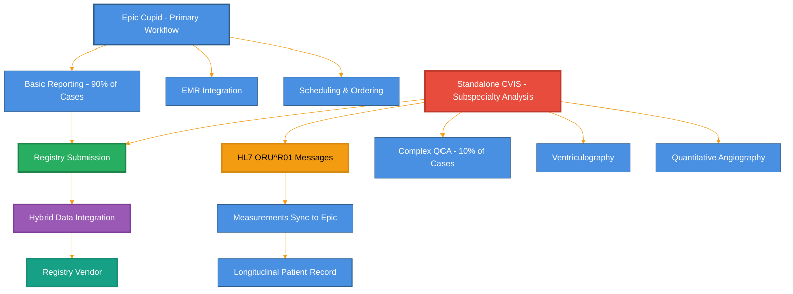

## Practical Application: Case Study Analysis
Real-World Situation: Epic Implementation at Mid-Size Cardiology Service
Organization Profile:

250-bed health system
15 cardiologists, 8 interventional cardiologists
Existing standalone CVIS (ScImage PICOM)
Planning Epic EHR + new Epic Cupid implementation
CathLab: 3 labs performing ~2,000 cases/year
Echo Lab: 4,000 studies/year
Goal: Unified cardiology workflow + NCDR registry automation

Pre-Implementation Decision: Keep Existing CVIS or Migrate to Epic Cupid Native?
Consultant Analysis:
**Recommended Approach:**

## CVIS vs Epic Cupid: Comparison Matrix

| **Consideration** | **Keep Standalone CVIS** | **Migrate to Epic Cupid Only** |
|---|---|---|
| **Data Integration** | 🟠 Requires HL7 bridges; nightly data sync to Epic | 🟢 Single Chronicles database; real-time access |
| **Specialized Reporting** | 🟢 CVIS excels at granular QCA, ventriculography analysis | 🟡 Cupid adequate for most; may lose QCA precision |
| **Registry Submission** | 🔵 CVIS vendor can extract CathPCI data | 🟡 Must validate Cupid-to-registry mappings |
| **Cardiologist Training** | 🔴 Two systems to learn; context-switching | 🟢 One system; simpler workflow |
| **Integration Cost** | 🔴 Interface development + vendor coordination | 🟢 Eliminate third-party CVIS licensing |
| **Future Flexibility** | 🟠 Locked into CVIS vendor roadmap | 🟢 Epic ecosystem flexibility |

Recommendation: Hybrid approach (Epic Cupid + Standalone CVIS)
Rationale:

Implementation Timeline & Data Architecture Decisions

```mermaid
graph TB
    subgraph Planning["WEEKS 1-4: Planning Phase"]
        A1["📋 Document all data flows: Cath lab → Epic → CVIS → Registry"]
        A2["📝 Define HL7 message specifications: ORM, ORU, MDM"]
        A3["🎯 Determine Clarity/Caboodle vs CVIS for cardiology reporting"]
        A4["🤝 Schedule vendor technical alignment: Epic + CVIS + Registry"]
    end
    
    subgraph Build["WEEKS 5-8: Build Phase"]
        B1["⚙️ Configure Epic Cupid procedures, order sets, templates"]
        B2["🔗 Build HL7 interfaces: Cath → Epic, CVIS → Epic"]
        B3["📊 Create Clarity views for cardiologist reports"]
        B4["🔌 Set up FHIR APIs for real-time alert integration"]
        B5["✅ Validate Caboodle dimensional model for registry extraction"]
    end
    
    subgraph Testing["WEEKS 9-10: Testing Phase"]
        C1["🧪 End-to-end testing: Order → Procedure → Report → Registry"]
        C2["⚡ Load test: Can system handle peak procedures?"]
        C3["🔍 Data validation: Epic vs CVIS vs Registry match?"]
        C4["⚠️ Failure scenario testing: What if CVIS is offline?"]
    end
    
    subgraph GoLive["WEEKS 11-12: Go-Live"]
        D1["🚀 Parallel run: Legacy CVIS + Epic simultaneously"]
        D2["👁️ Monitor all interfaces 24/7"]
        D3["📈 Weekly data reconciliation: Epic vs CVIS vs Registry"]
        D4["📞 Establish vendor escalation process"]
    end
    
    A1 --> A2 --> A3 --> A4
    A4 --> B1
    B1 --> B2 --> B3 --> B4 --> B5
    B5 --> C1
    C1 --> C2 --> C3 --> C4
    C4 --> D1
    D1 --> D2 --> D3 --> D4
    
    style Planning fill:#3498DB,stroke:#2980B9,stroke-width:3px,color:#fff
    style Build fill:#2ECC71,stroke:#27AE60,stroke-width:3px,color:#fff
    style Testing fill:#F39C12,stroke:#E67E22,stroke-width:3px,color:#fff
    style GoLive fill:#E74C3C,stroke:#C0392B,stroke-width:3px,color:#fff
```

