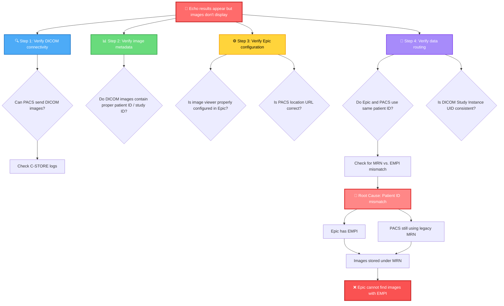

# 🎯 Knowledge Check: Application-Based Questions

---

## 📊 **Q1: Scenario-Based Analysis**

### 🏥 **Situation:**
A health system has Epic EHR + standalone CVIS. Cardiologists complain: 
> *"I order an echo in Epic, but results don't appear for 6 hours."*

### ❓ **What tier likely failed?**

- 🔵 **A)** Chronicles
- 🟢 **B)** Clarity  
- 🟡 **C)** Neither (interface issue)

### 💡 **Consultant Analysis:**
If results appear *eventually* (even if delayed), Chronicles is working. The 6-hour delay suggests the HL7 ORU^R01 message from CVIS isn't being processed quickly, OR the interface is queued for batching. This is a **data integration/interface issue**, not a Chronicles problem. 

✅ **Answer: C**

---

## ⚡ **Q2: Data Latency Decision**

### 🏥 **Question:**
A cardiology director wants: 
> *"Real-time notification when any patient gets admitted with elevated troponin AND has a history of CHF."*

### ❓ **Which data approach is appropriate?**

- 🔵 **A)** Query Clarity SQL daily for patients with this pattern
- 🟢 **B)** Use FHIR API against Chronicles with automated alerts
- 🟡 **C)** Use Caboodle dimensional model for trending analysis

### 💡 **Consultant Analysis:**
"Real-time notification" requires sub-second detection (Chronicles). Clarity SQL is 24-hour batch (too slow). Caboodle is for population analytics, not individual alerts.

✅ **Answer: B**

---

## 📋 **Q3: Standards Application**

### 🏥 **Question:**
You receive a cath lab HL7 message with this OBX segment:

```
OBX|1|NM|8480-6||45|%|||||
```

### ❓ **What's the problem?**

- 🔵 **A)** LOINC code 8480-6 doesn't map to Epic Cupid
- 🟢 **B)** The EF value (45) is out of clinical range
- 🟡 **C)** Missing required LOINC code reference (should include description)

### 💡 **Consultant Analysis:**
This is a standards compliance issue. The OBX segment is missing the LOINC code text reference. Proper format:

```
OBX|1|NM|8480-6^Systolic Blood Pressure||120|mmHg|||||
```

Without the description, downstream systems can't validate the code exists.

✅ **Answer: C**

---

## 🔧 **Q4: Vendor Coordination**

### 🏥 **Question:**
During Epic go-live, echo results appear in Epic but images don't display. PACS vendor says *"Images are being sent."* What's your diagnostic approach?

### 💡 **Answer Structure:**

```
🔍 Step 1: Verify DICOM connectivity
   └─ Can PACS send DICOM images? (Check C-STORE logs)

📊 Step 2: Verify image metadata
   └─ Do DICOM images contain proper patient ID / study ID?

⚙️ Step 3: Verify Epic configuration
   └─ Is image viewer properly configured in Epic?
   └─ Is PACS location URL correct?

🔄 Step 4: Verify data routing
   └─ Do Epic and PACS use same patient ID (not MRN vs. EMPI)?
   └─ Is DICOM Study Instance UID consistent across both systems?

🎯 Root cause likely: Patient ID mismatch between Epic and PACS
   └─ Epic has EMPI; PACS still using legacy MRN
   └─ Images stored under MRN; Epic can't find them with EMPI
```


