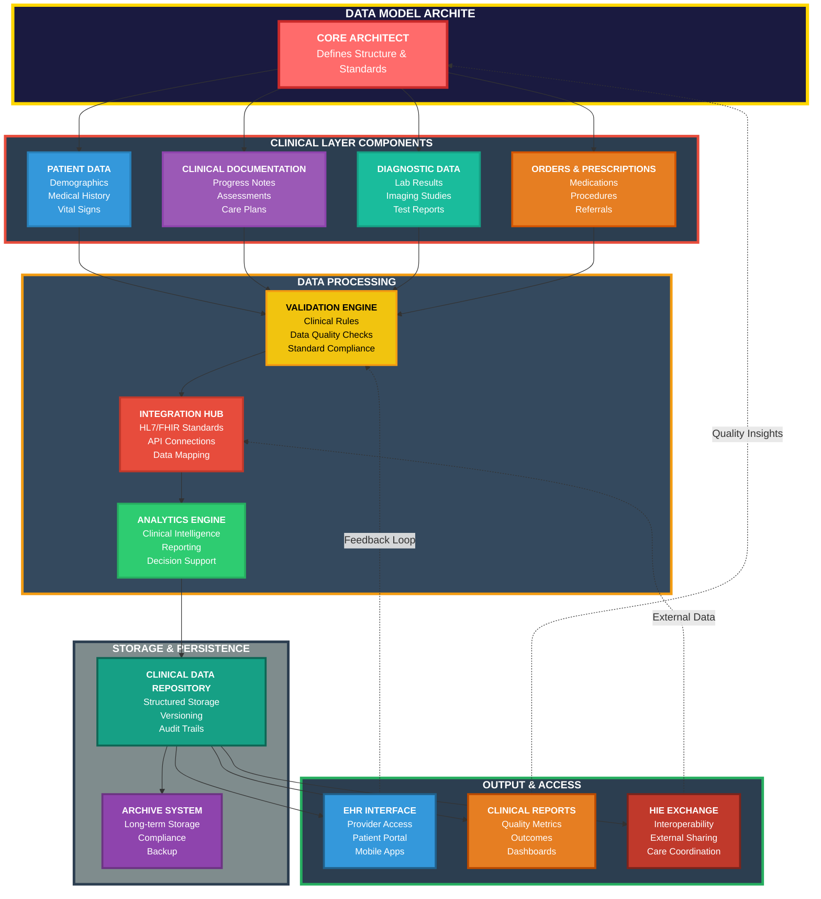
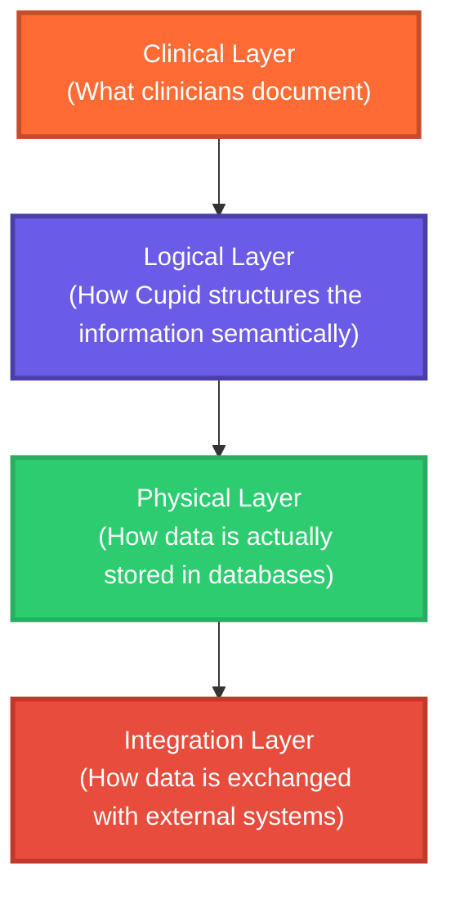
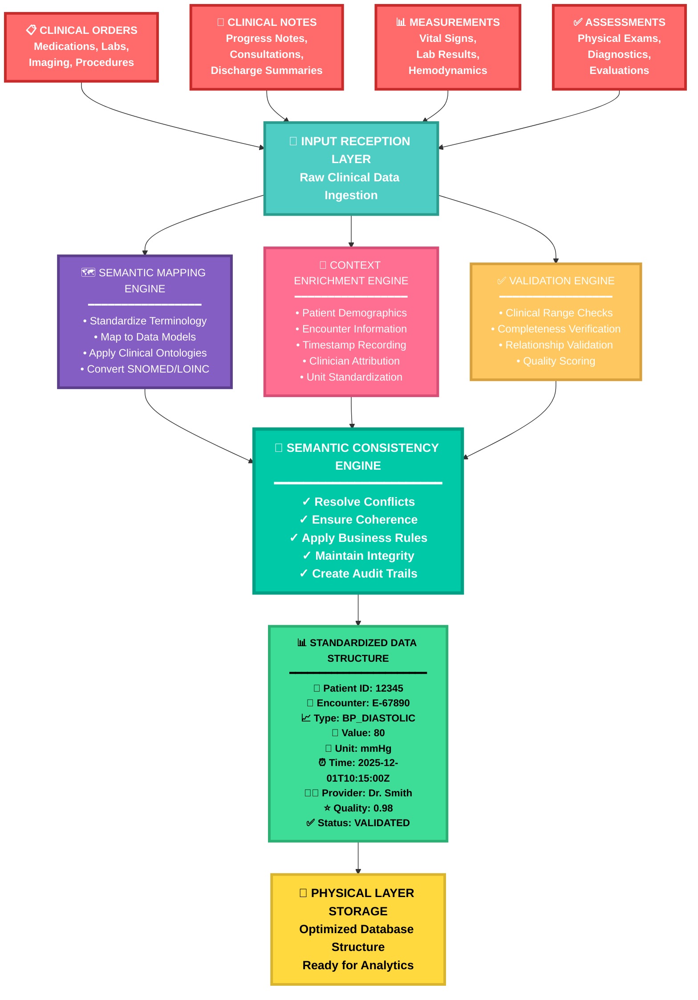
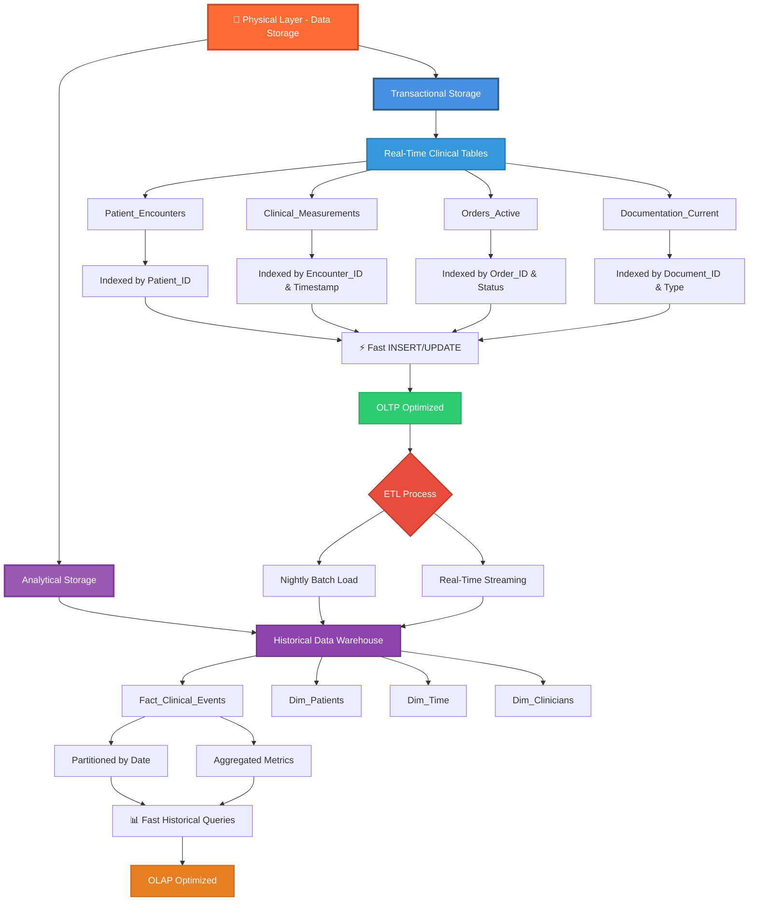

```mermaid
graph TB
    %% Main Entry Point
    START["👨‍⚕️ CLINICIAN<br/>Healthcare Provider<br/>Enters Patient Data"]:::clinician
    
    %% Clinical Documentation Interface
    CDI["🖥️ CLINICAL DOCUMENTATION INTERFACE<br/>═══════════════════════════<br/>Unified Data Entry Portal"]:::interface
    
    START -->|"Documents Care"| CDI
    
    %% Four Main Input Categories
    ORDERS["📋 ORDERS<br/>─────────<br/>Medical Orders<br/>Prescriptions<br/>Procedures"]:::cat1
    NOTES["📝 NOTES<br/>─────────<br/>Progress Notes<br/>Consultations<br/>Summaries"]:::cat2
    MEASURE["📊 MEASUREMENTS<br/>─────────<br/>Vital Signs<br/>Lab Results<br/>Hemodynamics"]:::cat3
    ASSESS["✅ ASSESSMENTS<br/>─────────<br/>Physical Exams<br/>Diagnostics<br/>Findings"]:::cat4
    
    CDI --> ORDERS
    CDI --> NOTES
    CDI --> MEASURE
    CDI --> ASSESS
    
    %% Data Processing Layer 1
    VALIDATE["🔍 VALIDATION CHECKPOINT<br/>═══════════════════════<br/>✓ Format Validation<br/>✓ Required Fields Check<br/>✓ Data Type Verification<br/>✓ Range Validation"]:::validate
    
    ORDERS --> VALIDATE
    NOTES --> VALIDATE
    MEASURE --> VALIDATE
    ASSESS --> VALIDATE
    
    %% Data Processing Layer 2
    SEMANTIC["🗺️ SEMANTIC MAPPING ENGINE<br/>═══════════════════════<br/>• Map to Standard Codes<br/>• Apply Clinical Ontologies<br/>• SNOMED/LOINC Conversion<br/>• Terminology Standardization"]:::semantic
    
    VALIDATE --> SEMANTIC
    
    %% Data Processing Layer 3
    ENRICH["📝 CONTEXT ENRICHMENT<br/>═══════════════════════<br/>➕ Patient Demographics<br/>➕ Encounter Details<br/>➕ Timestamp Recording<br/>➕ Provider Attribution<br/>➕ Location Information<br/>➕ Unit Standardization"]:::enrich
    
    SEMANTIC --> ENRICH
    
    %% Data Processing Layer 4
    INTEGRITY["🛡️ INTEGRITY VALIDATION<br/>═══════════════════════<br/>❌ Block Invalid Values<br/>✓ Systolic > Diastolic<br/>✓ Age-Appropriate Ranges<br/>✓ Clinical Logic Rules<br/>✓ Cross-Field Validation<br/>✓ Relationship Checks"]:::integrity
    
    ENRICH --> INTEGRITY
    
    %% Consistency Engine
    CONSISTENCY["🎯 SEMANTIC CONSISTENCY ENGINE<br/>═══════════════════════════<br/>🔹 Resolve Data Conflicts<br/>🔹 Ensure Coherence<br/>🔹 Apply Business Rules<br/>🔹 Maintain Relationships<br/>🔹 Generate Audit Trail<br/>🔹 Calculate Quality Score"]:::consistency
    
    INTEGRITY --> CONSISTENCY
    
    %% Final Output
    OUTPUT["📊 SEMANTICALLY CONSISTENT DATA<br/>═══════════════════════════════<br/>✅ COMPLETE VALIDATED RECORD<br/>─────────────────────────────<br/>👤 Patient: John Doe (MRN: 12345)<br/>🏥 Encounter: E-67890<br/>📅 Admit Date: 2025-12-01<br/>📈 Data Type: Hemodynamic<br/>🩺 Component: Diastolic BP<br/>🔢 Value: 80 mmHg<br/>⏰ Recorded: 2025-12-01 10:15 GMT+3<br/>👨‍⚕️ Provider: Dr. Ahmad Smith<br/>📍 Location: Cardiac ICU Bed 4<br/>⭐ Quality Score: 0.98<br/>✅ Status: VALIDATED<br/>🔗 Related: Systolic BP 120 mmHg"]:::output
    
    CONSISTENCY --> OUTPUT
    
    %% Physical Storage
    STORAGE["💾 PHYSICAL LAYER STORAGE<br/>═══════════════════════<br/>Database Ready<br/>Analytics Ready<br/>Reporting Ready"]:::storage
    
    OUTPUT --> STORAGE
    
    %% Styling with vivid colors and large text
    classDef clinician fill:#FF3B30,stroke:#CC0000,stroke-width:6px,color:#fff,font-size:22px,font-weight:bold
    classDef interface fill:#00C7BE,stroke:#00A095,stroke-width:6px,color:#fff,font-size:20px,font-weight:bold
    classDef cat1 fill:#AF52DE,stroke:#8E44AD,stroke-width:5px,color:#fff,font-size:19px,font-weight:bold
    classDef cat2 fill:#FF2D55,stroke:#CC1744,stroke-width:5px,color:#fff,font-size:19px,font-weight:bold
    classDef cat3 fill:#FF9500,stroke:#CC7700,stroke-width:5px,color:#fff,font-size:19px,font-weight:bold
    classDef cat4 fill:#34C759,stroke:#28A745,stroke-width:5px,color:#fff,font-size:19px,font-weight:bold
    classDef validate fill:#007AFF,stroke:#0051CC,stroke-width:5px,color:#fff,font-size:18px,font-weight:bold
    classDef semantic fill:#5856D6,stroke:#4644A8,stroke-width:5px,color:#fff,font-size:18px,font-weight:bold
    classDef enrich fill:#FF6482,stroke:#CC4E68,stroke-width:5px,color:#fff,font-size:18px,font-weight:bold
    classDef integrity fill:#FF3B30,stroke:#CC0000,stroke-width:5px,color:#fff,font-size:18px,font-weight:bold
    classDef consistency fill:#00D4AA,stroke:#00A085,stroke-width:6px,color:#fff,font-size:19px,font-weight:bold
    classDef output fill:#FFD60A,stroke:#CCA800,stroke-width:6px,color:#000,font-size:17px,font-weight:bold
    classDef storage fill:#30D158,stroke:#26A745,stroke-width:6px,color:#000,font-size:20px,font-weight:bold
```

### Data Model Architecture

## Clinical Data Model Architecture - Step-by-Step Overview

**🏗️ Step 1: Core Architecture Foundation**

The **Data Model Architect** serves as the foundation, defining the overall structure, standards, and governance for all clinical data. This ensures consistency and compliance across the entire healthcare system.

**📊 Step 2: Clinical Data Components**

The architecture organizes clinical information into four key categories:

- **👤 Patient Data:** Captures demographics, medical history, and vital signs
- **📝 Clinical Documentation:** Stores progress notes, assessments, and care plans
- **🔬 Diagnostic Data:** Manages lab results, imaging studies, and test reports
- **💊 Orders & Prescriptions:** Handles medications, procedures, and referrals

**⚙️ Step 3: Data Processing Layer**

All clinical data flows through three critical processing engines:

- **✅ Validation Engine:** Ensures data quality through clinical rules and compliance checks
- **🔄 Integration Hub:** Connects systems using HL7/FHIR standards and API mappings
- **📈 Analytics Engine:** Generates clinical intelligence, reports, and decision support

**💾 Step 4: Storage and Persistence**

Processed data is securely stored in two layers:

- **🗄️ Clinical Data Repository:** Active storage with versioning and complete audit trails
- **📦 Archive System:** Long-term storage ensuring compliance and backup requirements

**🖥️ Step 5: Output and Access Points**

The final layer delivers data to end-users through multiple channels:

- **🏥 EHR Interface:** Provides provider access, patient portals, and mobile applications
- **📊 Clinical Reports:** Generates quality metrics, outcomes, and executive dashboards
- **🌐 HIE Exchange:** Enables interoperability and care coordination with external systems

**🔁 Step 6: Continuous Improvement Loop**

The architecture includes feedback mechanisms where:

- User interfaces feed insights back to validation processes
- Quality reports inform core architecture improvements
- External data from HIE exchanges enriches the integration layer

**🎯 Key Takeaway:** This architecture ensures clinical data flows seamlessly from capture through processing, storage, and delivery, while maintaining quality, security, and interoperability at every step.

---

summarizing the key aspects of data models in healthcare consulting:

| **🎯 Aspect** | **📋 Description** | **⚡ Impact** | **💡 Example** |
| --- | --- | --- | --- |
| **✅ Clinical Validity** | Ensures data model prevents clinically impossible states | Prevents downstream analytics errors | Blocking systolic BP < diastolic BP entries |
| **🔄 Interoperability** | Determines what information can be exchanged between systems | Enables seamless data flow across platforms | Integration with PACS or cardiology devices |
| **⚡ Performance** | Design choices affect query speed and efficiency | Critical for real-time clinical operations | Optimizing dashboards and population health analytics |
| **📜 Regulatory Compliance** | Enforces audit trails, data integrity, and retention rules | Ensures legal and regulatory adherence | Maintaining audit logs and data retention policies |

This enhanced table uses visual icons to break down the four critical areas where data model design directly impacts healthcare consulting outcomes, making it easier to scan and understand at a glance.

## For healthcare consulting, understanding data models is essential because:

Here's a more visual organization of your data model information with icons:

🏥 **Clinical Validity**

A poorly designed data model may allow clinically impossible data states (e.g., recording systolic BP < diastolic BP), leading to downstream analytics errors

🔗 **Interoperability**

Data models determine which information can be exchanged with external systems like PACS or cardiology devices

⚡ **Performance**

Model design choices impact query performance in real-time clinical dashboards and population health analytics

📋 **Regulatory Compliance**
Audit trail requirements, data integrity constraints, and retention rules are enforced through data model design
---
2. Cupid's Multi-Layered Architecture
Cupid implements a layered data architecture that separates concerns and enables flexibility:

the Cupid architecture in a visual table format with icons:

| **Layer** | **Icon** | **Description** | **Purpose** |
| --- | --- | --- | --- |
| **Clinical Layer** | 👨‍⚕️ | Clinicians enter data through documentation interfaces (orders, notes, assessments). Documentation of echo findings, cath lab procedures, hemodynamic data in natural clinical workflows. | User-facing interface for clinical documentation |
| **Logical Layer** | 🧠 | Maps clinical documentation to standardized, semantically consistent data structures. Stores measurements with context (patient encounter, clinician, timestamp, units, quality indicators). | Ensures semantic consistency and data integrity |
| **Physical Layer** | 💾 | Data stored in relational database tables optimized for both transactional performance (real-time entry) and analytical performance (historical reports). | Optimized data storage for performance |
| **Integration Layer** | 🔗 | External systems query or receive data through well-defined interfaces that map back to the logical model, ensuring consistency across different systems. | Enables interoperability with external systems |

---

---
### Clinical Documentation Workflow - Step by Step
## 📋 Clinical Layer Components - Detailed Breakdown

| **Layer** | **Component** | **Icon** | **Primary Function** | **Data Integrity Role** | **Output** |
| --- | --- | --- | --- | --- | --- |
| **Entry** | Clinician | 👨‍⚕️ | Healthcare provider enters patient care data | Source of clinical information | Raw clinical documentation |
| **Interface** | Clinical Documentation Interface | 🖥️ | Unified portal for all data entry | Ensures consistent entry format | Structured input forms |
| **Input Categories** | Orders | 📋 | Medical orders, prescriptions, procedures | Order validation and completeness | Validated order entries |
| **Input Categories** | Notes | 📝 | Progress notes, consultations, summaries | Links narrative to structured data | Contextualized clinical notes |
| **Input Categories** | Measurements | 📊 | Vital signs, lab results, hemodynamics | Range checks and measurement validation | Validated clinical measurements |
| **Input Categories** | Assessments | ✅ | Physical exams, diagnostics, findings | Clinical finding validation | Structured assessment data |
| **Processing** | Validation Checkpoint | 🔍 | Format and completeness verification | First-pass data quality gate | Validated data format |
| **Processing** | Semantic Mapping Engine | 🗺️ | Standardize terminology to codes | Ensures interoperability | Standardized clinical codes |
| **Processing** | Context Enrichment | 📝 | Add patient, encounter, time context | Complete clinical context | Fully contextualized data |
| **Processing** | Integrity Validation | 🛡️ | Clinical logic and range validation | Prevents impossible values | Clinically valid data |
| **Processing** | Semantic Consistency Engine | 🎯 | Resolve conflicts, ensure coherence | Final quality assurance | Semantically consistent data |
| **Output** | Semantically Consistent Data | 📊 | Complete, validated clinical record | Quality score assignment | Storage-ready data |
| **Storage** | Physical Layer Storage | 💾 | Database persistence | Maintains data integrity at rest | Stored clinical data |

## 🔄 Data Flow Example: Complete Blood Pressure Documentation Journey

| **Step** | **Stage** | **Action** | **Data State** | **Quality Check** | **Output** |
| --- | --- | --- | --- | --- | --- |
| 1 | Clinician Entry | Nurse enters BP reading | Raw: "120/80" | Format check | Accepted input |
| 2 | Validation | System validates format | Separated: 120/80 | ✓ Valid format | Systolic=120, Diastolic=80 |
| 3 | Semantic Mapping | Map to SNOMED codes | BP_SYSTOLIC: 271649006BP_DIASTOLIC: 271650006 | ✓ Standard codes applied | Coded measurements |
| 4 | Context Enrichment | Add patient/encounter data | Patient: MRN-12345Encounter: E-67890Time: 10:15 AMProvider: Dr. SmithLocation: Cardiac ICU | ✓ Complete context | Fully contextualized data |
| 5 | Integrity Check | Validate clinical logic | Systolic (120) > Diastolic (80)✓Within normal adult range ✓Age-appropriate ✓ | ✓ Clinically valid | Validated measurements |
| 6 | Consistency Engine | Apply quality scoring | Completeness: 100%Validation: PassContext: Complete | Quality Score: 0.98 | High-quality data |
| 7 | Final Output | Create complete record | All metadata attachedAll validations passedAudit trail created | ✓ Storage ready | Complete clinical record |
| 8 | Physical Storage | Persist to database | Stored in optimized formatIndexed for analyticsAvailable for reporting | ✓ Data integrity maintained | Stored and accessible |

## ✅ Semantic Consistency Guarantees

| **Guarantee** | **Description** | **Example** | **Benefit** |
| --- | --- | --- | --- |
| **Standardized Terminology** | All clinical terms mapped to standard codes | "High BP" → SNOMED: 38341003 (Hypertension) | Enables accurate analytics and reporting |
| **Complete Context** | Every data point has patient, time, provider context | BP reading includes patient ID, encounter, timestamp, provider | Ensures data traceability and accountability |
| **Clinical Validity** | All values pass clinical logic rules | Systolic BP must be higher than diastolic BP | Prevents impossible or erroneous data |
| **Unit Standardization** | All measurements in consistent units | BP always in mmHg, temperature in °C | Enables accurate comparisons and trends |
| **Quality Scoring** | Each record receives data quality score | Score 0.98 indicates high confidence, fully validated data | Identifies reliable data for critical decisions |
| **Audit Trail** | Complete history of data creation and modifications | Who entered, when, what changed, why | Supports compliance and quality improvement |
| **Relationship Integrity** | Related data points maintain consistent relationships | Systolic and diastolic BP recorded at same time with same quality score | Ensures holistic data analysis |

test

- --

### Logical Layer Workflow - Step by Step

📥 **Step 1: Clinical Documentation Input**

Raw clinical data enters the Logical Layer from the Clinical Documentation Interface. This includes unstructured or semi-structured information from orders, notes, and assessments.

🧠 **Step 2: Logical Layer Processing**

The system processes incoming data through three parallel engines: Semantic Mapping, Context Enrichment, and Data Validation. Each engine performs specific transformations to ensure data quality and consistency.

🗺️ **Step 3: Semantic Mapping Engine**

- **Standardize Terms:** Converts local terminology to standard medical vocabularies (SNOMED CT, LOINC)
- **Map to Data Model:** Aligns documentation elements with the underlying data schema
- **Apply Clinical Ontologies:** Establishes relationships between clinical concepts for semantic consistency

📝 **Step 4: Context Enrichment**

The system enriches each data point with essential contextual metadata:

- 🏥 **Patient Encounter Context:** Links data to specific visits or episodes of care
- 👨‍⚕️ **Clinician Attribution:** Records who documented the information
- ⏰ **Temporal Information:** Captures precise timestamps for all measurements
- 📏 **Units & Measurements:** Standardizes measurement units and ranges

✅ **Step 5: Data Validation**

Multiple validation checks ensure data integrity:

- **Clinical Validity Checks:** Verifies values fall within clinically acceptable ranges
- **Data Integrity Rules:** Ensures required fields are complete and relationships are valid
- **Quality Indicators:** Flags data for quality review when needed

🎯 **Step 6: Standardized Data Structure**

All processed information converges into a unified, semantically consistent data structure. Each data element now includes complete context and metadata.

📊 **Step 7: Structured Data Output Example**

The final output is a fully contextualized data record containing:

- 👤 **Patient ID:** 12345 (unique patient identifier)
- 🏥 **Encounter ID:** E-67890 (specific visit reference)
- 📈 **Measurement Type:** Diastolic BP (standardized terminology)
- 🔢 **Value:** 80 mmHg (measurement with unit)
- ⏰ **Timestamp:** 2025-12-01 10:15 (precise timing)
- 👨‍⚕️ **Clinician ID:** Dr. Smith (attribution)
- ✅ **Quality Flag:** Validated (quality status)

💾 **Step 8: Structured Data Output**

The enriched, validated, and contextualized data is stored in the system, ready for retrieval, analytics, reporting, and integration with downstream systems while maintaining complete semantic consistency and clinical meaning.

**🎯 Key Benefits:**

- ✅ **Semantic Consistency:** All data follows standardized clinical vocabularies
- ✅ **Complete Context:** Every measurement includes who, what, when, and where
- ✅ **Data Quality:** Automated validation ensures clinical accuracy
- ✅ **Interoperability:** Standardized structure enables seamless system integration
- ✅ **Auditability:** Full attribution and timestamp trail for compliance

- --
---
### Physical Laye

**Physical Layer Workflow - Step by Step**

**💾 Step 1: Physical Layer Entry Point**

Data enters the Physical Layer and is split into two optimized storage paths: Transactional Storage for real-time operations and Analytical Storage for historical reporting.

**⚡ Step 2: Transactional Storage (OLTP)**

Real-time clinical operations use highly indexed tables optimized for fast INSERT and UPDATE operations:

- **Patient_Encounters:** Indexed by Patient_ID for quick patient lookup
- **Clinical_Measurements:** Indexed by Encounter_ID & Timestamp for rapid measurement retrieval
- **Orders_Active:** Indexed by Order_ID & Status for efficient order management
- **Documentation_Current:** Indexed by Document_ID & Type for fast documentation access

**📊 Step 3: Analytical Storage (OLAP)**

Historical data warehouse optimized for complex queries and reporting:

- **Fact_Clinical_Events:** Partitioned by date with aggregated metrics for fast trend analysis
- **Dimension Tables:** Dim_Patients, Dim_Time, Dim_Clinicians for efficient joins and filtering

**🔄 Step 4: ETL Process**

Data flows from transactional to analytical storage through two methods:

- **Nightly Batch Load:** Scheduled bulk data transfer for comprehensive historical updates
- **Real-Time Streaming:** Continuous data replication for near-real-time analytics

**🎯 Key Performance Benefits:**

- ✅ **Dual Optimization:** Separate storage for transactional speed and analytical depth
- ✅ **Strategic Indexing:** Indexes tailored to specific query patterns
- ✅ **Data Partitioning:** Date-based partitioning for efficient historical queries
- ✅ **Flexible ETL:** Both batch and streaming options for data synchronization
- ✅ **Scalability:** Architecture supports growing data volumes without performance degradation
