```mermaid
graph TB
    %% Main Entry Point
    START["👨‍⚕️ CLINICIAN<br/>Healthcare Provider<br/>Enters Patient Data"]:::clinician
    
    %% Clinical Documentation Interface
    CDI["🖥️ CLINICAL DOCUMENTATION INTERFACE<br/>═══════════════════════════<br/>Unified Data Entry Portal"]:::interface
    
    START -->|"Documents Care"| CDI
    
    %% Four Main Input Categories
    ORDERS["📋 ORDERS<br/>─────────<br/>Medical Orders<br/>Prescriptions<br/>Procedures"]:::cat1
    NOTES["📝 NOTES<br/>─────────<br/>Progress Notes<br/>Consultations<br/>Summaries"]:::cat2
    MEASURE["📊 MEASUREMENTS<br/>─────────<br/>Vital Signs<br/>Lab Results<br/>Hemodynamics"]:::cat3
    ASSESS["✅ ASSESSMENTS<br/>─────────<br/>Physical Exams<br/>Diagnostics<br/>Findings"]:::cat4
    
    CDI --> ORDERS
    CDI --> NOTES
    CDI --> MEASURE
    CDI --> ASSESS
    
    %% Data Processing Layer 1
    VALIDATE["🔍 VALIDATION CHECKPOINT<br/>═══════════════════════<br/>✓ Format Validation<br/>✓ Required Fields Check<br/>✓ Data Type Verification<br/>✓ Range Validation"]:::validate
    
    ORDERS --> VALIDATE
    NOTES --> VALIDATE
    MEASURE --> VALIDATE
    ASSESS --> VALIDATE
    
    %% Data Processing Layer 2
    SEMANTIC["🗺️ SEMANTIC MAPPING ENGINE<br/>═══════════════════════<br/>• Map to Standard Codes<br/>• Apply Clinical Ontologies<br/>• SNOMED/LOINC Conversion<br/>• Terminology Standardization"]:::semantic
    
    VALIDATE --> SEMANTIC
    
    %% Data Processing Layer 3
    ENRICH["📝 CONTEXT ENRICHMENT<br/>═══════════════════════<br/>➕ Patient Demographics<br/>➕ Encounter Details<br/>➕ Timestamp Recording<br/>➕ Provider Attribution<br/>➕ Location Information<br/>➕ Unit Standardization"]:::enrich
    
    SEMANTIC --> ENRICH
    
    %% Data Processing Layer 4
    INTEGRITY["🛡️ INTEGRITY VALIDATION<br/>═══════════════════════<br/>❌ Block Invalid Values<br/>✓ Systolic > Diastolic<br/>✓ Age-Appropriate Ranges<br/>✓ Clinical Logic Rules<br/>✓ Cross-Field Validation<br/>✓ Relationship Checks"]:::integrity
    
    ENRICH --> INTEGRITY
    
    %% Consistency Engine
    CONSISTENCY["🎯 SEMANTIC CONSISTENCY ENGINE<br/>═══════════════════════════<br/>🔹 Resolve Data Conflicts<br/>🔹 Ensure Coherence<br/>🔹 Apply Business Rules<br/>🔹 Maintain Relationships<br/>🔹 Generate Audit Trail<br/>🔹 Calculate Quality Score"]:::consistency
    
    INTEGRITY --> CONSISTENCY
    
    %% Final Output
    OUTPUT["📊 SEMANTICALLY CONSISTENT DATA<br/>═══════════════════════════════<br/>✅ COMPLETE VALIDATED RECORD<br/>─────────────────────────────<br/>👤 Patient: John Doe (MRN: 12345)<br/>🏥 Encounter: E-67890<br/>📅 Admit Date: 2025-12-01<br/>📈 Data Type: Hemodynamic<br/>🩺 Component: Diastolic BP<br/>🔢 Value: 80 mmHg<br/>⏰ Recorded: 2025-12-01 10:15 GMT+3<br/>👨‍⚕️ Provider: Dr. Ahmad Smith<br/>📍 Location: Cardiac ICU Bed 4<br/>⭐ Quality Score: 0.98<br/>✅ Status: VALIDATED<br/>🔗 Related: Systolic BP 120 mmHg"]:::output
    
    CONSISTENCY --> OUTPUT
    
    %% Physical Storage
    STORAGE["💾 PHYSICAL LAYER STORAGE<br/>═══════════════════════<br/>Database Ready<br/>Analytics Ready<br/>Reporting Ready"]:::storage
    
    OUTPUT --> STORAGE
    
    %% Styling with vivid colors and large text
    classDef clinician fill:#FF3B30,stroke:#CC0000,stroke-width:6px,color:#fff,font-size:22px,font-weight:bold
    classDef interface fill:#00C7BE,stroke:#00A095,stroke-width:6px,color:#fff,font-size:20px,font-weight:bold
    classDef cat1 fill:#AF52DE,stroke:#8E44AD,stroke-width:5px,color:#fff,font-size:19px,font-weight:bold
    classDef cat2 fill:#FF2D55,stroke:#CC1744,stroke-width:5px,color:#fff,font-size:19px,font-weight:bold
    classDef cat3 fill:#FF9500,stroke:#CC7700,stroke-width:5px,color:#fff,font-size:19px,font-weight:bold
    classDef cat4 fill:#34C759,stroke:#28A745,stroke-width:5px,color:#fff,font-size:19px,font-weight:bold
    classDef validate fill:#007AFF,stroke:#0051CC,stroke-width:5px,color:#fff,font-size:18px,font-weight:bold
    classDef semantic fill:#5856D6,stroke:#4644A8,stroke-width:5px,color:#fff,font-size:18px,font-weight:bold
    classDef enrich fill:#FF6482,stroke:#CC4E68,stroke-width:5px,color:#fff,font-size:18px,font-weight:bold
    classDef integrity fill:#FF3B30,stroke:#CC0000,stroke-width:5px,color:#fff,font-size:18px,font-weight:bold
    classDef consistency fill:#00D4AA,stroke:#00A085,stroke-width:6px,color:#fff,font-size:19px,font-weight:bold
    classDef output fill:#FFD60A,stroke:#CCA800,stroke-width:6px,color:#000,font-size:17px,font-weight:bold
    classDef storage fill:#30D158,stroke:#26A745,stroke-width:6px,color:#000,font-size:20px,font-weight:bold
```

```mermaid
graph TB
    Patient[("<b>👤 PATIENT</b><br/>Demographics<br/>Medical History")]
    
    Encounter[("<b>🏥 ENCOUNTER</b><br/>Visit / Admission<br/>Episode of Care")]
    
    Vitals[("<b>💓 VITAL SIGNS</b><br/>Heart Rate<br/>Blood Pressure<br/>O2 Saturation")]
    
    Procedures[("<b>🔬 PROCEDURES</b><br/>Cath Lab Event<br/>Echo Exam")]
    
    ProcComponents[("<b>📊 PROCEDURE<br/>COMPONENTS</b><br/>Angiogram<br/>Hemodynamic<br/>Measurements")]
    
    Results[("<b>📈 RESULTS</b><br/>Coronary Stenosis %<br/>Hemodynamic<br/>Pressures")]
    
    Orders[("<b>📋 ORDERS</b><br/>Echocardiogram<br/>Cardiac MRI")]
    
    OrderResults[("<b>📄 ORDER RESULTS</b><br/>Final Echo Report<br/>Measurements")]
    
    Documents[("<b>📝 CLINICAL<br/>DOCUMENTS</b><br/>H&P<br/>Discharge Summary<br/>Procedure Note")]
    
    Patient -->|"Has"| Encounter
    Encounter -->|"Records"| Vitals
    Encounter -->|"Includes"| Procedures
    Encounter -->|"Generates"| Orders
    Encounter -->|"Contains"| Documents
    
    Procedures -->|"Composed of"| ProcComponents
    ProcComponents -->|"Produces"| Results
    
    Orders -->|"Yields"| OrderResults
    
    style Patient fill:#FF6B6B,stroke:#C92A2A,stroke-width:3px,color:#FFF
    style Encounter fill:#4ECDC4,stroke:#0C8599,stroke-width:3px,color:#FFF
    style Vitals fill:#FFD93D,stroke:#F5A623,stroke-width:3px,color:#000
    style Procedures fill:#95E1D3,stroke:#38A169,stroke-width:3px,color:#000
    style ProcComponents fill:#A8E6CF,stroke:#2F855A,stroke-width:3px,color:#000
    style Results fill:#DDA15E,stroke:#BC6C25,stroke-width:3px,color:#FFF
    style Orders fill:#B8B8FF,stroke:#6C5CE7,stroke-width:3px,color:#FFF
    style OrderResults fill:#C7CEEA,stroke:#4A5568,stroke-width:3px,color:#000
    style Documents fill:#FFDAB9,stroke:#DD6B20,stroke-width:3px,color:#000

```

## Lesson 2.2: Epic Cupid Data Models

Cardiac-Specific Data Architecture and PACS Integration
Module 2: Epic EHR Architecture Fundamentals
Lesson Duration: 90 minutes | Complexity Level: Intermediate-Advanced
Target Audience: Clinical informaticists transitioning to healthcare IT consulting

## Executive Summary

Epic Cupid's data model architecture represents a healthcare-specific approach to structuring clinical information that fundamentally differs from general-purpose EHR systems. Rather than treating data as isolated transactional records, Cupid implements a semantically rich data architecture designed to capture the clinical context necessary for evidence-based decision-making. For cardiovascular informatics, this architectural approach is critical: Cupid structures cardiac data (hemodynamic measurements, procedural events, imaging metadata) in ways that preserve clinical meaning while enabling interoperability with PACS systems, hemodynamic devices, and downstream analytics platforms.
This lesson bridges your clinical cardiology knowledge with technical architectural principles. As a cardiovascular professional transitioning to consulting, understanding how Cupid structures cardiac data—and why it structures it that way—will differentiate you as a consultant who can advise on system design decisions, workflow optimization, and vendor evaluation, rather than simply implementing configuration changes.
Key Learning Outcome: You will understand how Cupid's data model architecture supports cardiac workflows, enables PACS integration, and provides the technical foundation for clinical decision support systems—positioning you to evaluate architectural fit and recommend optimization strategies.

Key Concepts

1. Data Model Definition and Strategic Importance
A data model in healthcare IT is the architectural blueprint that defines how clinical information is stored, organized, retrieved, and exchanged across systems. Unlike a database schema (the technical structure), a data model is the semantic representation—it codifies "what information is important, how it relates to other information, and what constraints ensure clinical validity."
For healthcare consulting, understanding data models is essential because:
Clinical Validity: A poorly designed data model may allow clinically impossible data states (e.g., recording systolic BP < diastolic BP), leading to downstream analytics errors Interoperability: Data models determine which information can be exchanged with external systems like PACS or cardiology devices Performance: Model design choices impact query performance in real-time clinical dashboards and population health analytics Regulatory Compliance: Audit trail requirements, data integrity constraints, and retention rules are enforced through data model design
---
### Data Model Architecture

## Clinical Data Model Architecture - Step-by-Step Overview

**🏗️ Step 1: Core Architecture Foundation**

The **Data Model Architect** serves as the foundation, defining the overall structure, standards, and governance for all clinical data. This ensures consistency and compliance across the entire healthcare system.

**📊 Step 2: Clinical Data Components**

The architecture organizes clinical information into four key categories:

- **👤 Patient Data:** Captures demographics, medical history, and vital signs
- **📝 Clinical Documentation:** Stores progress notes, assessments, and care plans
- **🔬 Diagnostic Data:** Manages lab results, imaging studies, and test reports
- **💊 Orders & Prescriptions:** Handles medications, procedures, and referrals

**⚙️ Step 3: Data Processing Layer**

All clinical data flows through three critical processing engines:

- **✅ Validation Engine:** Ensures data quality through clinical rules and compliance checks
- **🔄 Integration Hub:** Connects systems using HL7/FHIR standards and API mappings
- **📈 Analytics Engine:** Generates clinical intelligence, reports, and decision support

**💾 Step 4: Storage and Persistence**

Processed data is securely stored in two layers:

- **🗄️ Clinical Data Repository:** Active storage with versioning and complete audit trails
- **📦 Archive System:** Long-term storage ensuring compliance and backup requirements

**🖥️ Step 5: Output and Access Points**

The final layer delivers data to end-users through multiple channels:

- **🏥 EHR Interface:** Provides provider access, patient portals, and mobile applications
- **📊 Clinical Reports:** Generates quality metrics, outcomes, and executive dashboards
- **🌐 HIE Exchange:** Enables interoperability and care coordination with external systems

**🔁 Step 6: Continuous Improvement Loop**

The architecture includes feedback mechanisms where:

- User interfaces feed insights back to validation processes
- Quality reports inform core architecture improvements
- External data from HIE exchanges enriches the integration layer

**🎯 Key Takeaway:** This architecture ensures clinical data flows seamlessly from capture through processing, storage, and delivery, while maintaining quality, security, and interoperability at every step.

---

summarizing the key aspects of data models in healthcare consulting:

| **🎯 Aspect** | **📋 Description** | **⚡ Impact** | **💡 Example** |
| --- | --- | --- | --- |
| **✅ Clinical Validity** | Ensures data model prevents clinically impossible states | Prevents downstream analytics errors | Blocking systolic BP < diastolic BP entries |
| **🔄 Interoperability** | Determines what information can be exchanged between systems | Enables seamless data flow across platforms | Integration with PACS or cardiology devices |
| **⚡ Performance** | Design choices affect query speed and efficiency | Critical for real-time clinical operations | Optimizing dashboards and population health analytics |
| **📜 Regulatory Compliance** | Enforces audit trails, data integrity, and retention rules | Ensures legal and regulatory adherence | Maintaining audit logs and data retention policies |

This enhanced table uses visual icons to break down the four critical areas where data model design directly impacts healthcare consulting outcomes, making it easier to scan and understand at a glance.

## For healthcare consulting, understanding data models is essential because:

Here's a more visual organization of your data model information with icons:

🏥 **Clinical Validity**

A poorly designed data model may allow clinically impossible data states (e.g., recording systolic BP < diastolic BP), leading to downstream analytics errors

🔗 **Interoperability**

Data models determine which information can be exchanged with external systems like PACS or cardiology devices

⚡ **Performance**

Model design choices impact query performance in real-time clinical dashboards and population health analytics

📋 **Regulatory Compliance**
Audit trail requirements, data integrity constraints, and retention rules are enforced through data model design
---
2. Cupid's Multi-Layered Architecture
Cupid implements a layered data architecture that separates concerns and enables flexibility:

the Cupid architecture in a visual table format with icons:

| **Layer** | **Icon** | **Description** | **Purpose** |
| --- | --- | --- | --- |
| **Clinical Layer** | 👨‍⚕️ | Clinicians enter data through documentation interfaces (orders, notes, assessments). Documentation of echo findings, cath lab procedures, hemodynamic data in natural clinical workflows. | User-facing interface for clinical documentation |
| **Logical Layer** | 🧠 | Maps clinical documentation to standardized, semantically consistent data structures. Stores measurements with context (patient encounter, clinician, timestamp, units, quality indicators). | Ensures semantic consistency and data integrity |
| **Physical Layer** | 💾 | Data stored in relational database tables optimized for both transactional performance (real-time entry) and analytical performance (historical reports). | Optimized data storage for performance |
| **Integration Layer** | 🔗 | External systems query or receive data through well-defined interfaces that map back to the logical model, ensuring consistency across different systems. | Enables interoperability with external systems |

---

---
### Clinical Documentation Workflow - Step by Step
## 📋 Clinical Layer Components - Detailed Breakdown

| **Layer** | **Component** | **Icon** | **Primary Function** | **Data Integrity Role** | **Output** |
| --- | --- | --- | --- | --- | --- |
| **Entry** | Clinician | 👨‍⚕️ | Healthcare provider enters patient care data | Source of clinical information | Raw clinical documentation |
| **Interface** | Clinical Documentation Interface | 🖥️ | Unified portal for all data entry | Ensures consistent entry format | Structured input forms |
| **Input Categories** | Orders | 📋 | Medical orders, prescriptions, procedures | Order validation and completeness | Validated order entries |
| **Input Categories** | Notes | 📝 | Progress notes, consultations, summaries | Links narrative to structured data | Contextualized clinical notes |
| **Input Categories** | Measurements | 📊 | Vital signs, lab results, hemodynamics | Range checks and measurement validation | Validated clinical measurements |
| **Input Categories** | Assessments | ✅ | Physical exams, diagnostics, findings | Clinical finding validation | Structured assessment data |
| **Processing** | Validation Checkpoint | 🔍 | Format and completeness verification | First-pass data quality gate | Validated data format |
| **Processing** | Semantic Mapping Engine | 🗺️ | Standardize terminology to codes | Ensures interoperability | Standardized clinical codes |
| **Processing** | Context Enrichment | 📝 | Add patient, encounter, time context | Complete clinical context | Fully contextualized data |
| **Processing** | Integrity Validation | 🛡️ | Clinical logic and range validation | Prevents impossible values | Clinically valid data |
| **Processing** | Semantic Consistency Engine | 🎯 | Resolve conflicts, ensure coherence | Final quality assurance | Semantically consistent data |
| **Output** | Semantically Consistent Data | 📊 | Complete, validated clinical record | Quality score assignment | Storage-ready data |
| **Storage** | Physical Layer Storage | 💾 | Database persistence | Maintains data integrity at rest | Stored clinical data |

## 🔄 Data Flow Example: Complete Blood Pressure Documentation Journey

| **Step** | **Stage** | **Action** | **Data State** | **Quality Check** | **Output** |
| --- | --- | --- | --- | --- | --- |
| 1 | Clinician Entry | Nurse enters BP reading | Raw: "120/80" | Format check | Accepted input |
| 2 | Validation | System validates format | Separated: 120/80 | ✓ Valid format | Systolic=120, Diastolic=80 |
| 3 | Semantic Mapping | Map to SNOMED codes | BP_SYSTOLIC: 271649006BP_DIASTOLIC: 271650006 | ✓ Standard codes applied | Coded measurements |
| 4 | Context Enrichment | Add patient/encounter data | Patient: MRN-12345Encounter: E-67890Time: 10:15 AMProvider: Dr. SmithLocation: Cardiac ICU | ✓ Complete context | Fully contextualized data |
| 5 | Integrity Check | Validate clinical logic | Systolic (120) > Diastolic (80)✓Within normal adult range ✓Age-appropriate ✓ | ✓ Clinically valid | Validated measurements |
| 6 | Consistency Engine | Apply quality scoring | Completeness: 100%Validation: PassContext: Complete | Quality Score: 0.98 | High-quality data |
| 7 | Final Output | Create complete record | All metadata attachedAll validations passedAudit trail created | ✓ Storage ready | Complete clinical record |
| 8 | Physical Storage | Persist to database | Stored in optimized formatIndexed for analyticsAvailable for reporting | ✓ Data integrity maintained | Stored and accessible |

## ✅ Semantic Consistency Guarantees

| **Guarantee** | **Description** | **Example** | **Benefit** |
| --- | --- | --- | --- |
| **Standardized Terminology** | All clinical terms mapped to standard codes | "High BP" → SNOMED: 38341003 (Hypertension) | Enables accurate analytics and reporting |
| **Complete Context** | Every data point has patient, time, provider context | BP reading includes patient ID, encounter, timestamp, provider | Ensures data traceability and accountability |
| **Clinical Validity** | All values pass clinical logic rules | Systolic BP must be higher than diastolic BP | Prevents impossible or erroneous data |
| **Unit Standardization** | All measurements in consistent units | BP always in mmHg, temperature in °C | Enables accurate comparisons and trends |
| **Quality Scoring** | Each record receives data quality score | Score 0.98 indicates high confidence, fully validated data | Identifies reliable data for critical decisions |
| **Audit Trail** | Complete history of data creation and modifications | Who entered, when, what changed, why | Supports compliance and quality improvement |
| **Relationship Integrity** | Related data points maintain consistent relationships | Systolic and diastolic BP recorded at same time with same quality score | Ensures holistic data analysis |

test

- --

```mermaid
graph TB
    %% Input Sources
    A1["📋 CLINICAL ORDERS<br/>Medications, Labs,<br/>Imaging, Procedures"]:::inputBox
    A2["📝 CLINICAL NOTES<br/>Progress Notes,<br/>Consultations,<br/>Discharge Summaries"]:::inputBox
    A3["📊 MEASUREMENTS<br/>Vital Signs,<br/>Lab Results,<br/>Hemodynamics"]:::inputBox
    A4["✅ ASSESSMENTS<br/>Physical Exams,<br/>Diagnostics,<br/>Evaluations"]:::inputBox
    
    %% Input Gateway
    B["🔵 INPUT RECEPTION LAYER<br/>Raw Clinical Data Ingestion"]:::gateway
    
    A1 --> B
    A2 --> B
    A3 --> B
    A4 --> B
    
    %% Processing Engines
    C["🗺️ SEMANTIC MAPPING ENGINE<br/>━━━━━━━━━━━━━━━━━<br/>• Standardize Terminology<br/>• Map to Data Models<br/>• Apply Clinical Ontologies<br/>• Convert SNOMED/LOINC"]:::engine1
    
    D["📝 CONTEXT ENRICHMENT ENGINE<br/>━━━━━━━━━━━━━━━━━<br/>• Patient Demographics<br/>• Encounter Information<br/>• Timestamp Recording<br/>• Clinician Attribution<br/>• Unit Standardization"]:::engine2
    
    E["✅ VALIDATION ENGINE<br/>━━━━━━━━━━━━━━━━━<br/>• Clinical Range Checks<br/>• Completeness Verification<br/>• Relationship Validation<br/>• Quality Scoring"]:::engine3
    
    B --> C
    B --> D
    B --> E
    
    %% Consistency Layer
    F["🎯 SEMANTIC CONSISTENCY ENGINE<br/>━━━━━━━━━━━━━━━━━━━━━━━<br/>✓ Resolve Conflicts<br/>✓ Ensure Coherence<br/>✓ Apply Business Rules<br/>✓ Maintain Integrity<br/>✓ Create Audit Trails"]:::consistency
    
    C --> F
    D --> F
    E --> F
    
    %% Output Structure
    G["📊 STANDARDIZED DATA STRUCTURE<br/>━━━━━━━━━━━━━━━━━━━━━━━<br/>👤 Patient ID: 12345<br/>🏥 Encounter: E-67890<br/>📈 Type: BP_DIASTOLIC<br/>🔢 Value: 80<br/>📏 Unit: mmHg<br/>⏰ Time: 2025-12-01T10:15:00Z<br/>👨‍⚕️ Provider: Dr. Smith<br/>⭐ Quality: 0.98<br/>✅ Status: VALIDATED"]:::output
    
    F --> G
    
    %% Physical Storage
    H["💾 PHYSICAL LAYER STORAGE<br/>Optimized Database Structure<br/>Ready for Analytics"]:::storage
    
    G --> H
    
    %% Styling
    classDef inputBox fill:#FF6B6B,stroke:#C92A2A,stroke-width:4px,color:#fff,font-size:16px,font-weight:bold
    classDef gateway fill:#4ECDC4,stroke:#2A9D8F,stroke-width:4px,color:#fff,font-size:18px,font-weight:bold
    classDef engine1 fill:#845EC2,stroke:#5B3F8C,stroke-width:4px,color:#fff,font-size:16px
    classDef engine2 fill:#FF6F91,stroke:#D94E76,stroke-width:4px,color:#fff,font-size:16px
    classDef engine3 fill:#FFC75F,stroke:#D9A13D,stroke-width:4px,color:#fff,font-size:16px
    classDef consistency fill:#00C9A7,stroke:#00A085,stroke-width:5px,color:#fff,font-size:18px,font-weight:bold
    classDef output fill:#3DDC97,stroke:#2BAF73,stroke-width:4px,color:#000,font-size:15px,font-weight:bold
    classDef storage fill:#FFD93D,stroke:#D9B42F,stroke-width:4px,color:#000,font-size:18px,font-weight:bold
```

### Logical Layer Workflow - Step by Step

📥 **Step 1: Clinical Documentation Input**

Raw clinical data enters the Logical Layer from the Clinical Documentation Interface. This includes unstructured or semi-structured information from orders, notes, and assessments.

🧠 **Step 2: Logical Layer Processing**

The system processes incoming data through three parallel engines: Semantic Mapping, Context Enrichment, and Data Validation. Each engine performs specific transformations to ensure data quality and consistency.

🗺️ **Step 3: Semantic Mapping Engine**

- **Standardize Terms:** Converts local terminology to standard medical vocabularies (SNOMED CT, LOINC)
- **Map to Data Model:** Aligns documentation elements with the underlying data schema
- **Apply Clinical Ontologies:** Establishes relationships between clinical concepts for semantic consistency

📝 **Step 4: Context Enrichment**

The system enriches each data point with essential contextual metadata:

- 🏥 **Patient Encounter Context:** Links data to specific visits or episodes of care
- 👨‍⚕️ **Clinician Attribution:** Records who documented the information
- ⏰ **Temporal Information:** Captures precise timestamps for all measurements
- 📏 **Units & Measurements:** Standardizes measurement units and ranges

✅ **Step 5: Data Validation**

Multiple validation checks ensure data integrity:

- **Clinical Validity Checks:** Verifies values fall within clinically acceptable ranges
- **Data Integrity Rules:** Ensures required fields are complete and relationships are valid
- **Quality Indicators:** Flags data for quality review when needed

🎯 **Step 6: Standardized Data Structure**

All processed information converges into a unified, semantically consistent data structure. Each data element now includes complete context and metadata.

📊 **Step 7: Structured Data Output Example**

The final output is a fully contextualized data record containing:

- 👤 **Patient ID:** 12345 (unique patient identifier)
- 🏥 **Encounter ID:** E-67890 (specific visit reference)
- 📈 **Measurement Type:** Diastolic BP (standardized terminology)
- 🔢 **Value:** 80 mmHg (measurement with unit)
- ⏰ **Timestamp:** 2025-12-01 10:15 (precise timing)
- 👨‍⚕️ **Clinician ID:** Dr. Smith (attribution)
- ✅ **Quality Flag:** Validated (quality status)

💾 **Step 8: Structured Data Output**

The enriched, validated, and contextualized data is stored in the system, ready for retrieval, analytics, reporting, and integration with downstream systems while maintaining complete semantic consistency and clinical meaning.

**🎯 Key Benefits:**

- ✅ **Semantic Consistency:** All data follows standardized clinical vocabularies
- ✅ **Complete Context:** Every measurement includes who, what, when, and where
- ✅ **Data Quality:** Automated validation ensures clinical accuracy
- ✅ **Interoperability:** Standardized structure enables seamless system integration
- ✅ **Auditability:** Full attribution and timestamp trail for compliance

- --
---
### Physical Laye

**Physical Layer Workflow - Step by Step**

**💾 Step 1: Physical Layer Entry Point**

Data enters the Physical Layer and is split into two optimized storage paths: Transactional Storage for real-time operations and Analytical Storage for historical reporting.

**⚡ Step 2: Transactional Storage (OLTP)**

Real-time clinical operations use highly indexed tables optimized for fast INSERT and UPDATE operations:

- **Patient_Encounters:** Indexed by Patient_ID for quick patient lookup
- **Clinical_Measurements:** Indexed by Encounter_ID & Timestamp for rapid measurement retrieval
- **Orders_Active:** Indexed by Order_ID & Status for efficient order management
- **Documentation_Current:** Indexed by Document_ID & Type for fast documentation access

**📊 Step 3: Analytical Storage (OLAP)**

Historical data warehouse optimized for complex queries and reporting:

- **Fact_Clinical_Events:** Partitioned by date with aggregated metrics for fast trend analysis
- **Dimension Tables:** Dim_Patients, Dim_Time, Dim_Clinicians for efficient joins and filtering

**🔄 Step 4: ETL Process**

Data flows from transactional to analytical storage through two methods:

- **Nightly Batch Load:** Scheduled bulk data transfer for comprehensive historical updates
- **Real-Time Streaming:** Continuous data replication for near-real-time analytics

**🎯 Key Performance Benefits:**

- ✅ **Dual Optimization:** Separate storage for transactional speed and analytical depth
- ✅ **Strategic Indexing:** Indexes tailored to specific query patterns
- ✅ **Data Partitioning:** Date-based partitioning for efficient historical queries
- ✅ **Flexible ETL:** Both batch and streaming options for data synchronization
- ✅ **Scalability:** Architecture supports growing data volumes without performance degradation

---

### Integration Layer Diagram

```mermaid
graph TB
    subgraph EXT["🌐 EXTERNAL SYSTEMS"]
        direction LR
        EHR["<b>📋 EHR</b><br/><br/>Electronic Health<br/>Records System"]
        LAB["<b>🧪 LAB</b><br/><br/>Laboratory<br/>Information System"]
        PACS["<b>🖼️ PACS</b><br/><br/>Picture Archiving<br/>Communication"]
        BIL["<b>💰 BILLING</b><br/><br/>Billing &<br/>Insurance System"]
        PHAR["<b>💊 PHARMACY</b><br/><br/>Pharmacy<br/>Management"]
    end
    
    subgraph INT["🔗 INTEGRATION LAYER"]
        direction TB
        
        subgraph ENTRY["ENTRY POINT"]
            API["<b>🚪 API GATEWAY</b><br/>━━━━━━━━━━━━━<br/>✓ Authentication<br/>✓ Rate Limiting<br/>✓ Load Balancing<br/>✓ Security"]
        end
        
        subgraph PROC["PROCESSING SERVICES"]
            INTF["<b>⚙️ INTERFACE SERVICES</b><br/>━━━━━━━━━━━━━<br/>✓ Protocol Translation<br/>✓ Message Routing<br/>✓ Error Handling"]
            
            MAP["<b>🗺️ DATA MAPPING</b><br/>━━━━━━━━━━━━━<br/>✓ Schema Transform<br/>✓ Field Mapping<br/>✓ Format Conversion"]
            
            VAL["<b>✅ VALIDATION</b><br/>━━━━━━━━━━━━━<br/>✓ Quality Checks<br/>✓ Business Rules<br/>✓ Compliance"]
        end
        
        subgraph QUEUE_SYS["MESSAGE HANDLING"]
            QUEUE["<b>📬 MESSAGE QUEUE</b><br/>━━━━━━━━━━━━━<br/>✓ Async Processing<br/>✓ Retry Mechanism<br/>✓ Event Management<br/>✓ Guaranteed Delivery"]
        end
    end
    
    subgraph CORE["⚡ CORE HEALTHCARE SYSTEM"]
        direction TB
        
        LOG["<b>📊 LOGICAL DATA MODEL</b><br/>━━━━━━━━━━━━━━━━<br/>✓ Canonical Schema<br/>✓ Master Data Registry<br/>✓ Reference Tables<br/>✓ Data Standards"]
        
        BUS["<b>🎯 BUSINESS LOGIC</b><br/>━━━━━━━━━━━━━━━━<br/>✓ Process Orchestration<br/>✓ Workflow Management<br/>✓ Rules Engine<br/>✓ Decision Support"]
        
        DATA["<b>💾 DATA STORAGE</b><br/>━━━━━━━━━━━━━━━━<br/>✓ Transactional DB<br/>✓ Data Warehouse<br/>✓ Document Store<br/>✓ Backup & Recovery"]
    end
    
    %% Inbound Flow
    EHR -->|"① REQUEST"| API
    LAB -->|"① DATA"| API
    PACS -->|"① IMAGES"| API
    BIL -->|"① CLAIMS"| API
    PHAR -->|"① ORDERS"| API
    
    API ==>|"② ROUTE"| INTF
    INTF ==>|"③ TRANSFORM"| MAP
    MAP ==>|"④ VALIDATE"| VAL
    VAL ==>|"⑤ ENQUEUE"| QUEUE
    
    QUEUE ==>|"⑥ PROCESS"| LOG
    LOG <==>|"⑦ EXECUTE"| BUS
    BUS <==>|"⑧ PERSIST"| DATA
    
    %% Outbound Flow
    DATA ==>|"⑨ RETRIEVE"| BUS
    BUS ==>|"⑩ PREPARE"| LOG
    LOG ==>|"⑪ RETURN"| QUEUE
    QUEUE ==>|"⑫ FORMAT"| VAL
    VAL ==>|"⑬ MAP BACK"| MAP
    MAP ==>|"⑭ PACKAGE"| INTF
    INTF ==>|"⑮ DELIVER"| API
    
    API -.->|"⑯ RESPONSE"| EHR
    API -.->|"⑯ RESPONSE"| LAB
    API -.->|"⑯ RESPONSE"| PACS
    API -.->|"⑯ RESPONSE"| BIL
    API -.->|"⑯ RESPONSE"| PHAR
    
    %% Styling for External Systems
    style EXT fill:#2C3E50,stroke:#E74C3C,stroke-width:5px,color:#FFFFFF,font-size:18px,font-weight:bold
    style EHR fill:#E74C3C,stroke:#C0392B,stroke-width:4px,color:#FFFFFF,font-size:16px,font-weight:bold
    style LAB fill:#E67E22,stroke:#D35400,stroke-width:4px,color:#FFFFFF,font-size:16px,font-weight:bold
    style PACS fill:#F39C12,stroke:#E67E22,stroke-width:4px,color:#000000,font-size:16px,font-weight:bold
    style BIL fill:#F1C40F,stroke:#F39C12,stroke-width:4px,color:#000000,font-size:16px,font-weight:bold
    style PHAR fill:#2ECC71,stroke:#27AE60,stroke-width:4px,color:#FFFFFF,font-size:16px,font-weight:bold
    
    %% Styling for Integration Layer
    style INT fill:#34495E,stroke:#3498DB,stroke-width:5px,color:#FFFFFF,font-size:18px,font-weight:bold
    style ENTRY fill:#2980B9,stroke:#2C3E50,stroke-width:3px,color:#FFFFFF
    style PROC fill:#2980B9,stroke:#2C3E50,stroke-width:3px,color:#FFFFFF
    style QUEUE_SYS fill:#2980B9,stroke:#2C3E50,stroke-width:3px,color:#FFFFFF
    
    style API fill:#3498DB,stroke:#2980B9,stroke-width:4px,color:#FFFFFF,font-size:16px,font-weight:bold
    style INTF fill:#5DADE2,stroke:#3498DB,stroke-width:4px,color:#000000,font-size:16px,font-weight:bold
    style MAP fill:#85C1E9,stroke:#5DADE2,stroke-width:4px,color:#000000,font-size:16px,font-weight:bold
    style VAL fill:#AED6F1,stroke:#85C1E9,stroke-width:4px,color:#000000,font-size:16px,font-weight:bold
    style QUEUE fill:#1ABC9C,stroke:#16A085,stroke-width:4px,color:#FFFFFF,font-size:16px,font-weight:bold
    
    %% Styling for Core System
    style CORE fill:#27AE60,stroke:#229954,stroke-width:5px,color:#FFFFFF,font-size:18px,font-weight:bold
    style LOG fill:#52BE80,stroke:#27AE60,stroke-width:4px,color:#FFFFFF,font-size:16px,font-weight:bold
    style BUS fill:#7DCEA0,stroke:#52BE80,stroke-width:4px,color:#000000,font-size:16px,font-weight:bold
    style DATA fill:#A9DFBF,stroke:#7DCEA0,stroke-width:4px,color:#000000,font-size:16px,font-weight:bold

```

---
### Information Flow Summary

| **Step** | **Component** | **Action** | **Description** |
| --- | --- | --- | --- |
| ① | External Systems | Send Request | EHR, Lab, PACS, Billing, or Pharmacy systems initiate data exchange |
| ② | API Gateway | Route | Authenticates, validates, and routes incoming requests to appropriate services |
| ③ | Interface Services | Transform | Translates protocols (HL7, FHIR, REST, SOAP) into internal format |
| ④ | Data Mapping | Validate | Maps external schemas to canonical internal data model |
| ⑤ | Validation Layer | Enqueue | Performs quality checks, business rule validation, compliance verification |
| ⑥ | Message Queue | Process | Manages asynchronous processing and ensures reliable delivery |
| ⑦ | Logical Data Model | Execute | Applies canonical schema and maintains data consistency |
| ⑧ | Business Logic | Persist | Executes workflows, applies business rules, orchestrates processes |
| ⑨-⑩ | Data Storage | Retrieve | Stores and retrieves data from transactional DB, warehouse, or document store |
| ⑪-⑮ | Return Path | Format & Package | Data flows back through validation, mapping, and interface services |
| ⑯ | API Gateway | Deliver Response | Returns formatted response to requesting external system |

### 🎨 Color Coding Legend

- **🔴 Red (External Systems):** Entry points for data from various healthcare systems
- **🔵 Blue (Integration Layer):** Processing, transformation, and validation services
- **🟢 Green (Core System):** Central data model, business logic, and storage
- **➡️ Solid Arrows:** Inbound data flow (external → core)
- **⬅️ Dotted Arrows:** Outbound data flow (core → external)
- **⬌ Double Arrows:** Bidirectional communication between core components

### ✨ Key Architecture Benefits

### 🛡️ Security & Reliability

- Centralized authentication at API Gateway
- Multi-layer validation prevents data corruption
- Message queue ensures guaranteed delivery
- Error handling at each processing stage

### 📈 Scalability & Performance

- Load balancing distributes traffic efficiently
- Asynchronous processing handles high volumes
- Rate limiting prevents system overload
- Horizontal scaling of integration services

### 🔄 Flexibility & Interoperability

- Supports multiple protocols (HL7, FHIR, REST, SOAP)
- Easy addition of new external systems
- Canonical data model ensures consistency
- Protocol-agnostic core system design

<aside>
💡 **Pro Tip:** This architecture follows industry best practices for healthcare system integration, ensuring compliance with standards like HL7, FHIR, and HIPAA while maintaining flexibility for future enhancements.

</aside>

---
### 3. Semantic Data Modeling and Clinical Context
---
Cupid's strength is semantic richness—the ability to store not just the data value itself, but the clinical context that gives it meaning. Consider a simple example: recording a patient's heart rate.
Minimal Data Model (just a value):

```mermaid
graph TB
    %% Define main components
    A["<b>Presentation Layer</b><br/>User Interface<br/>Clinical Dashboards<br/>Mobile Apps"]
    B["<b>Application Layer</b><br/>Business Logic<br/>Workflow Engine<br/>Validation Rules"]
    C["<b>Semantic Layer</b><br/>Data Standardization<br/>Terminology Mapping<br/>Context Enrichment"]
    D["<b>Integration Layer</b><br/>API Gateway<br/>Message Broker<br/>Data Transformation"]
    E["<b>Data Layer</b><br/>Clinical Data Repository<br/>Reference Data<br/>Audit Logs"]
    
    %% Define semantic consistency components
    F["<b>Semantic Consistency Engine</b><br/>✓ Terminology Validation<br/>✓ Code Mapping (ICD, SNOMED)<br/>✓ Unit Conversion<br/>✓ Context Preservation"]
    
    G["<b>Data Integrity Manager</b><br/>✓ Data Quality Rules<br/>✓ Referential Integrity<br/>✓ Constraint Validation<br/>✓ Audit Trail"]
    
    %% Define flow
    A -->|"User Input<br/>(Heart Rate: 72 bpm)"| B
    B -->|"Validated Data<br/>+ Business Context"| C
    C -->|"Semantically<br/>Enriched Data"| D
    C -.->|"Ensures Consistency"| F
    D -->|"Standardized<br/>Clinical Message"| E
    D -.->|"Maintains Integrity"| G
    E -->|"Stored Data<br/>+ Metadata"| G
    F -->|"Terminology<br/>Standards"| C
    G -->|"Quality<br/>Metrics"| E
    
    %% Feedback loops
    E -.->|"Query Results"| D
    D -.->|"Formatted Response"| B
    B -.->|"Display Data"| A
    
    %% Styling
    style A fill:#FF6B6B,stroke:#333,stroke-width:4px,color:#fff,font-size:16px
    style B fill:#4ECDC4,stroke:#333,stroke-width:4px,color:#fff,font-size:16px
    style C fill:#FFD93D,stroke:#333,stroke-width:4px,color:#333,font-size:16px
    style D fill:#6BCB77,stroke:#333,stroke-width:4px,color:#fff,font-size:16px
    style E fill:#A29BFE,stroke:#333,stroke-width:4px,color:#fff,font-size:16px
    style F fill:#FD79A8,stroke:#333,stroke-width:4px,color:#fff,font-size:15px
    style G fill:#74B9FF,stroke:#333,stroke-width:4px,color:#fff,font-size:15px


```

Each relationship has defined cardinality (how many of each can exist) and data integrity rules. For example: "One patient can have many encounters" (1:N relationship) but "Each encounter must have one primary provider" (N:1 relationship).
---
## Component Descriptions

### 1. Presentation Layer (User Interface)

- **Purpose:** Front-end interface where clinicians interact with the system
- **Components:** Clinical dashboards, mobile apps, web portals
- **Function:** Captures user input and displays clinical information

### 2. Application Layer (Business Logic)

- **Purpose:** Processes business rules and workflow logic
- **Components:** Validation rules, workflow engine, clinical protocols
- **Function:** Validates input against business rules before processing

### 3. Semantic Layer (Data Standardization)

- **Purpose:** Enriches data with semantic meaning and context
- **Components:** Terminology mapping, context enrichment, standardization engine
- **Function:** Transforms raw data into semantically rich, standardized format

### 4. Integration Layer (Data Exchange)

- **Purpose:** Manages data exchange between systems
- **Components:** API gateway, message broker (HL7, FHIR), transformation services
- **Function:** Routes and transforms messages between different healthcare systems

### 5. Data Layer (Storage)

- **Purpose:** Persists clinical data with full metadata and audit trails
- **Components:** Clinical data repository, reference data, audit logs
- **Function:** Stores semantically enriched data with integrity constraints

---

## 🔒 Semantic Consistency & Data Integrity

### Semantic Consistency Engine

- **Terminology Validation:** Ensures all clinical terms match standard vocabularies (SNOMED CT, LOINC)
- **Code Mapping:** Automatically maps between different coding systems (ICD-10, CPT, SNOMED)
- **Unit Conversion:** Standardizes units of measure across all data entries
- **Context Preservation:** Maintains clinical context throughout data flow

### Data Integrity Manager

- **Data Quality Rules:** Enforces completeness, accuracy, and validity checks
- **Referential Integrity:** Ensures relationships between data elements remain valid
- **Constraint Validation:** Verifies data against defined constraints (e.g., reference ranges)
- **Audit Trail:** Tracks all data changes with who, what, when, and why

---

## 🔄 Information Flow Example

1. **User Input:** Clinician enters "Heart Rate: 72 bpm" in dashboard
2. **Application Validation:** System validates input format and business rules
3. **Semantic Enrichment:** Data enriched with metadata (timestamp, method, context, reference range)
4. **Consistency Check:** Semantic engine validates terminology and units
5. **Integration:** Standardized message created (HL7/FHIR format)
6. **Integrity Verification:** Data quality rules applied, relationships verified
7. **Storage:** Semantically rich data stored with full audit trail
8. **Retrieval:** Data retrieved with full context for clinical decision support

---

<aside>
**✅ Key Benefits:** This logical architecture ensures that every piece of clinical data maintains its semantic meaning and integrity throughout its lifecycle, enabling accurate clinical decision-making, seamless interoperability, and regulatory compliance.

</aside>

---
## Component Descriptions

### 1. Presentation Layer (User Interface)

- **Purpose:** Front-end interface where clinicians interact with the system
- **Components:** Clinical dashboards, mobile apps, web portals
- **Function:** Captures user input and displays clinical information

### 2. Application Layer (Business Logic)

- **Purpose:** Processes business rules and workflow logic
- **Components:** Validation rules, workflow engine, clinical protocols
- **Function:** Validates input against business rules before processing

### 3. Semantic Layer (Data Standardization)

- **Purpose:** Enriches data with semantic meaning and context
- **Components:** Terminology mapping, context enrichment, standardization engine
- **Function:** Transforms raw data into semantically rich, standardized format

### 4. Integration Layer (Data Exchange)

- **Purpose:** Manages data exchange between systems
- **Components:** API gateway, message broker (HL7, FHIR), transformation services
- **Function:** Routes and transforms messages between different healthcare systems

### 5. Data Layer (Storage)

- **Purpose:** Persists clinical data with full metadata and audit trails
- **Components:** Clinical data repository, reference data, audit logs
- **Function:** Stores semantically enriched data with integrity constraints

---

## 🔒 Semantic Consistency & Data Integrity

### Semantic Consistency Engine

- **Terminology Validation:** Ensures all clinical terms match standard vocabularies (SNOMED CT, LOINC)
- **Code Mapping:** Automatically maps between different coding systems (ICD-10, CPT, SNOMED)
- **Unit Conversion:** Standardizes units of measure across all data entries
- **Context Preservation:** Maintains clinical context throughout data flow

### Data Integrity Manager

- **Data Quality Rules:** Enforces completeness, accuracy, and validity checks
- **Referential Integrity:** Ensures relationships between data elements remain valid
- **Constraint Validation:** Verifies data against defined constraints (e.g., reference ranges)
- **Audit Trail:** Tracks all data changes with who, what, when, and why

---

## 🔄 Information Flow Example

1. **User Input:** Clinician enters "Heart Rate: 72 bpm" in dashboard
2. **Application Validation:** System validates input format and business rules
3. **Semantic Enrichment:** Data enriched with metadata (timestamp, method, context, reference range)
4. **Consistency Check:** Semantic engine validates terminology and units
5. **Integration:** Standardized message created (HL7/FHIR format)
6. **Integrity Verification:** Data quality rules applied, relationships verified
7. **Storage:** Semantically rich data stored with full audit trail
8. **Retrieval:** Data retrieved with full context for clinical decision support

---

<aside>
### This semantic richness is why Cupid is valuable for cardiology:
    hemodynamic data requires rich context (was this measurement during baseline rest, post-nitroglycerin, post-exercise? under what conditions was it taken?) to have clinical meaning.

    ---

## 4. Entity-Relationship and Clinical Domain Models
Cupid uses an entity-relationship approach where clinical entities (Patient, Encounter, Order, Result, Procedure, Document) are connected through clearly defined relationships that reflect clinical workflow.
For cardiovascular medicine, this looks like:

---

---
### 📋 Step-by-Step Diagram Breakdown

Here's a clear explanation of how clinical information flows through the Cupid system:

1. 👤 **Patient (Starting Point)**The patient is the central entity containing demographics and medical history. Every piece of clinical data connects back to a specific patient.
2. 🏥 **Encounter (Episode of Care)**Each patient visit or hospital admission creates an encounter. This serves as the main container for all clinical activities during that episode of care.
3. 💓 **Vital Signs (Baseline Context)**The encounter captures vital signs like heart rate, blood pressure, and oxygen saturation. These provide essential baseline data for clinical decision-making.
4. 🔬 **Procedures (Clinical Events)**Procedures such as catheterization lab events or echocardiogram exams are performed during the encounter. Each procedure represents a distinct clinical intervention.
5. 📊 **Procedure Components (Detailed Activities)**Each procedure breaks down into specific components. For example, a cath lab procedure includes angiograms and hemodynamic measurements.
6. 📈 **Results (Clinical Findings)**Procedure components generate measurable results such as coronary stenosis percentages and hemodynamic pressures. These are the key clinical outputs.
7. 📋 **Orders (Clinical Requests)**During the encounter, physicians generate orders for diagnostic tests like echocardiograms or cardiac MRIs. These orders initiate specific clinical workflows.
8. 📄 **Order Results (Diagnostic Reports)**Completed orders produce order results, such as final echo reports with detailed measurements. These provide structured diagnostic information.
9. 📝 **Clinical Documents (Medical Records)**The encounter also generates various clinical documents including history and physical (H&P), discharge summaries, and procedure notes. These capture the complete clinical narrative.

**🔄 Information Flow:** Data flows hierarchically from Patient → Encounter → Clinical Activities (Vitals, Procedures, Orders, Documents), with each level adding more specific clinical detail and context.

---

## 5. FHIR and Standards-Based Data Models
---
Modern healthcare IT—including Cupid's current architecture evolution—increasingly aligns with Fast Healthcare Interoperability Resources (FHIR), an HL7 standard for healthcare data exchange.
---
FHIR defines standardized data models for common clinical entities: Patient, Observation (measurements), Procedure, DiagnosticReport (imaging/lab reports), Medication, and many others. While Cupid's internal data model predates FHIR, newer implementations use FHIR as a standard interface layer for external integration.
Why FHIR matters for cardiac consulting: When you evaluate PACS integration, you'll see FHIR-based approaches (FHIR DiagnosticReport for cardiac imaging) increasingly as an alternative to traditional HL7 v2 messaging. Understanding this standards evolution helps you anticipate integration architectures.
---
Visual Diagrams and Architecture
Diagram 1: Cupid Data Model Layering
---

```mermaid
graph TB
    subgraph Clinical["🩺 CLINICAL DOCUMENTATION LAYER"]
        style Clinical fill:#4A90E2,stroke:#2E5C8A,stroke-width:3px,color:#FFFFFF
        ClinDoc["<b>Clinical Entry Point</b><br/><br/>👨‍⚕️ Echo Findings<br/>🫀 Cath Lab Procedures<br/>📊 Hemodynamic Measurements<br/>🔍 Diagnostic Impressions<br/>💊 Medication Orders"]
        style ClinDoc fill:#5BA3F5,stroke:#4A90E2,stroke-width:2px,color:#FFFFFF,font-size:14px
    end

    subgraph Logical["🧠 LOGICAL DATA MODEL LAYER"]
        style Logical fill:#9B59B6,stroke:#6C3483,stroke-width:3px,color:#FFFFFF
        LE["<b>Semantic Entities</b><br/>Business Logic & Meaning"]
        style LE fill:#AF7AC5,stroke:#9B59B6,stroke-width:2px,color:#FFFFFF,font-size:14px
        
        Obs["📈 <b>Observation</b><br/><br/>Hemodynamic Data<br/>Vital Signs<br/>Lab Results"]
        style Obs fill:#D7BDE2,stroke:#9B59B6,stroke-width:2px,color:#2C3E50,font-size:13px
        
        Proc["⚙️ <b>Procedure</b><br/><br/>Cath Lab Events<br/>Echo Studies<br/>Interventions"]
        style Proc fill:#D7BDE2,stroke:#9B59B6,stroke-width:2px,color:#2C3E50,font-size:13px
        
        DR["📋 <b>DiagnosticReport</b><br/><br/>Echo Reports<br/>Study Results<br/>Interpretations"]
        style DR fill:#D7BDE2,stroke:#9B59B6,stroke-width:2px,color:#2C3E50,font-size:13px
        
        Med["💊 <b>Medication</b><br/><br/>Cardiology Drugs<br/>Dosing Information<br/>Administration"]
        style Med fill:#D7BDE2,stroke:#9B59B6,stroke-width:2px,color:#2C3E50,font-size:13px
        
        LE --> Obs
        LE --> Proc
        LE --> DR
        LE --> Med
    end

    subgraph Physical["💾 PHYSICAL STORAGE LAYER"]
        style Physical fill:#E67E22,stroke:#BA4A00,stroke-width:3px,color:#FFFFFF
        DB["<b>Relational Database Tables</b><br/><br/>⚡ Transactional Performance<br/>📊 Analytical Queries<br/>🔒 Data Integrity<br/>🔄 Indexing & Optimization"]
        style DB fill:#F39C12,stroke:#E67E22,stroke-width:2px,color:#FFFFFF,font-size:14px
    end

    subgraph Integration["🔗 INTEGRATION LAYER"]
        style Integration fill:#27AE60,stroke:#1E8449,stroke-width:3px,color:#FFFFFF
        
        FHIR["🌐 <b>FHIR Resources</b><br/><br/>Patient<br/>Observation<br/>Procedure<br/>DiagnosticReport"]
        style FHIR fill:#52BE80,stroke:#27AE60,stroke-width:2px,color:#FFFFFF,font-size:13px
        
        HL7["📡 <b>HL7 v2 Segments</b><br/><br/>OBX - Observations<br/>OBR - Orders<br/>MSH - Messages"]
        style HL7 fill:#52BE80,stroke:#27AE60,stroke-width:2px,color:#FFFFFF,font-size:13px
        
        REST["🔌 <b>REST APIs</b><br/><br/>GET/POST/PUT<br/>JSON Payloads<br/>Modern Integrations"]
        style REST fill:#52BE80,stroke:#27AE60,stroke-width:2px,color:#FFFFFF,font-size:13px
    end

    %% Data Flow Connections
    ClinDoc -->|"Data Entry"| LE
    Obs -->|"Normalized Data"| DB
    Proc -->|"Normalized Data"| DB
    DR -->|"Normalized Data"| DB
    Med -->|"Normalized Data"| DB
    
    DB -->|"Transform to FHIR"| FHIR
    DB -->|"Transform to HL7"| HL7
    DB -->|"Expose via API"| REST

    %% Flow Annotations
    ClinDoc -.->|"1️⃣ Capture"| LE
    LE -.->|"2️⃣ Structure"| DB
    DB -.->|"3️⃣ Exchange"| FHIR

```

What this diagram shows: Clinical data enters through Cupid's user interface, is mapped to semantic data structures at the logical layer, stored efficiently in databases, and then exposed to external systems through multiple integration formats. A cardiac image result might flow from a radiologist's documentation → stored as a DICOM reference and DiagnosticReport object → then exposed to a PACS system via FHIR or HL7.
---

Diagram 2: Cardiac Data Model—Entities and Relationships

Clinical meaning: When a patient comes for a cath procedure, a new Encounter is created. Within that encounter, vital signs are recorded (context for hemodynamics). The Procedure itself (cath lab) contains multiple components (angiography, FFR measurement, hemodynamic assessment). Each component generates Results (stenosis percentages, pressure measurements). All of this information is synthesized into a final DiagnosticReport.
---

What's happening: Cupid's data model stores the semantic meaning of cardiac data (what procedure, what results, what clinical context). When a cardiologist needs the actual image files or raw waveform data from hemodynamic devices, the integration layer translates Cupid's logical model into formats that PACS systems and devices understand. The bridge ensures that different systems can communicate about the same clinical data even though they store it differently.

---

```mermaid
%%{init: {'theme':'base', 'themeVariables': { 'primaryColor':'#e3f2fd','primaryTextColor':'#000','primaryBorderColor':'#1976d2','lineColor':'#424242','secondaryColor':'#fff3e0','tertiaryColor':'#e8f5e9'}}}%%
graph TB
    Entry["<b>📝 DATA ENTRY EVENT</b><br/><br/>Clinician records measurement<br/>in the system"]
    
    Validate["<b>🔍 VALIDATION LAYER</b><br/><br/>Automated Checks Applied:<br/>✓ Required fields present?<br/>✓ Value within expected range?<br/>✓ Units valid?<br/>✓ Datetime in logical sequence?"]
    
    Branch{<b>Validation<br/>Result?</b>}
    
    Pass["<b>✅ ACCEPTED</b><br/><br/>Status: Final/Preliminary<br/>Audit trail created<br/>Timestamped & logged<br/>Available for clinical use"]
    
    Fail["<b>❌ REJECTED</b><br/><br/>Error logged with details<br/>Clinician notified immediately<br/>Correction required<br/>Data not stored"]
    
    Entry -->|Submit| Validate
    Validate -->|Process| Branch
    Branch -->|Pass| Pass
    Branch -->|Fail| Fail
    
    style Entry fill:#4fc3f7,stroke:#01579b,stroke-width:4px,color:#000
    style Validate fill:#ffb74d,stroke:#e65100,stroke-width:4px,color:#000
    style Pass fill:#66bb6a,stroke:#1b5e20,stroke-width:4px,color:#000
    style Fail fill:#ef5350,stroke:#b71c1c,stroke-width:4px,color:#fff
    style Branch fill:#ffd54f,stroke:#f57f17,stroke-width:4px,color:#000


```

Clinical significance: Cupid's data model enforces clinical validity. You can't record a diastolic BP higher than systolic, can't record a procedure on a future date, can't enter a measurement without a datetime. These constraints—built into the data model—protect downstream analytics quality and prevent the "garbage in, garbage out" problem that undermines decision support systems.
---
Key Concepts Defined
Here's a table format with visual elements for the key concepts:

| **🔷 Concept** | **📝 Definition** | **💡 Example** |
| --- | --- | --- |
| **🗂️ Semantic Data Model** | Data structure capturing clinical meaning and context, not just values | Heart rate: 72 bpm (monitor, at rest, regular rhythm) |
| **🔗 Entity-Relationship Model** | Database design with entities connected through clinical relationships | Patient → Encounter → Procedure (modular and flexible) |
| **🧠 Logical Data Model** | Conceptual representation independent of physical storage | Different hospitals, same understanding of "Observation" |
| **💾 Physical Data Model** | Actual database tables, columns, and indexes | Optimized for real-time transactions and analytics |
| **🔄 FHIR** | HL7 standard for healthcare data interoperability | Patient, Observation, DiagnosticReport resources |
| **🖼️ DICOM** | International standard for medical imaging | Echo, angiography, CT, MRI images + metadata |
| **🔀 Integration Mapping** | Translating data between different data models | Cupid data → DICOM format for PACS |
| **🔢 Cardinality** | Relationship types: 1:1, 1:N, or N:N | One patient → many encounters (1:N) |
| **🛡️ Data Integrity Constraint** | Rules preventing impossible or inconsistent data | Discharge date cannot precede admission date |
| **📋 Audit Trail** | Record of data access and modifications | Who, when, what changed (HIPAA compliance) |

---
## Application of Key Concepts: Cardiac Data Modeling in Practice

Real-World Example: Catheterization Lab Hemodynamic Data
Imagine a cardiologist performs a diagnostic catheterization and measures hemodynamic pressures. Let's trace how this clinical data flows through Cupid's data model:
Clinical Event: Cardiologist measures RA (right atrial) pressure = 8 mmHg during baseline phase of catheterization
What Gets Captured in Cupid's Data Model:
---
**Why Each Element Matters for Consulting**:

Here's the data formatted as a table with icons for better visual clarity:

| **📋 Element** | **💡 Value** | **🎯 Why It Matters** |
| --- | --- | --- |
| 🔍 Entity Type | Observation | Cupid knows this is a measurement, not a narrative or image |
| 🏷️ Observation Code | LAB-0423 (Right Atrial Pressure) | Standardized code enables analytics—all "RA pressure" values are coded consistently |
| 🔢 Numeric Value | 8 | The actual measurement |
| 📏 Unit | mmHg | Pressure measurement context |
| 📊 Reference Range | 2-8 mmHg | Validates if value is clinically reasonable; system can flag abnormal |
| 🔬 Measurement Method | Fluid-filled catheter transducer | Different methods (pressure wire vs. transducer) may have different accuracy |
| ⏰ Recording DateTime | 2024-11-30 14:23:15 | Precise timing enables sequencing (was this before/after nitroglycerin?) |
| 🏥 Procedure Context | Diagnostic Right Heart Catheterization | Links this measurement to a specific procedure—essential for understanding hemodynamic state |
| 👤 Relation to Patient | Patient ID: 12345678 | Links to medical record |
| 🎫 Relation to Encounter | Encounter ID: 98765432 | Links to hospital visit context |
| ✅ Status | Final | Indicates this measurement has been verified and is available for clinical use |
| 👨‍⚕️ Clinician Recording | Dr. Smith (Provider ID: 54321) | Accountability; clinician can later modify if needed |
| 📝 Audit Trail | DateTime, user, action | Compliance audit trail |

---
Why Each Element Matters for Consulting:

Standardized codes: When you integrate with a PACS or populate a national registry (e.g., Society for Cardiac Angiography and Interventions registry), standardized codes ensure data quality. A consultant must understand coding requirements for regulatory reporting.
Temporal logic: Hemodynamic data is meaningless without temporal context. Baseline RA pressure of 8 mmHg might be normal, but if it was 8 mmHg after nitroglycerin, that might suggest baseline elevation. A consultant evaluating EHR design must ensure timestamp precision is sufficient for clinical interpretation.
Measurement method: Device accuracy matters. An optical pulse oximetry reading differs from arterial line monitoring. The data model must distinguish these because clinical interpretation differs. A consultant recommends data model design that prevents method confusion.
Audit trail: In a cath lab, if a hemodynamic value is later corrected (clinician realizes wrong pressure transducer was used), the audit trail must show the original value and the correction. Healthcare IT consulting requires understanding compliance implications of data modification policies.
---

## Integration Challenge: Cupid Logical Layer to FHIR Mapping

When hemodynamic data must be shared with PACS systems or external cardiac registries, Cupid's integration layer maps the logical structure to FHIR Observation format. Here's a visual representation of how the information flows:

---

```mermaid
graph TB
    subgraph Cupid["🏥 CUPID LOGICAL LAYER"]
        A["<b>📊 HEMODYNAMIC<br/>MEASUREMENT</b><br/>━━━━━━━━━━━━<br/>RA Pressure: 8 mmHg<br/>DateTime: 2024-11-30<br/>Status: Final"]
        B["<b>👤 PATIENT<br/>CONTEXT</b><br/>━━━━━━━━━━━━<br/>Patient ID: 12345678<br/>Demographics Linked"]
        C["<b>🏥 ENCOUNTER<br/>CONTEXT</b><br/>━━━━━━━━━━━━<br/>Encounter ID: 98765432<br/>Cardiac Cath Lab"]
        D["<b>👨‍⚕️ PERFORMER<br/>DATA</b><br/>━━━━━━━━━━━━<br/>Practitioner: 54321<br/>Cardiologist"]
        E["<b>🔬 METHOD<br/>DETAILS</b><br/>━━━━━━━━━━━━<br/>Fluid-filled catheter<br/>Calibrated transducer"]
    end

    subgraph Integration["⚙️ INTEGRATION LAYER"]
        F["<b>🔄 FHIR<br/>MAPPER</b><br/>━━━━━━━━━━━━<br/>Transform Cupid<br/>objects to FHIR"]
        G["<b>📋 DATA<br/>VALIDATION</b><br/>━━━━━━━━━━━━<br/>Validate against<br/>FHIR profiles"]
        H["<b>🔐 SECURITY &<br/>AUTH</b><br/>━━━━━━━━━━━━<br/>OAuth 2.0<br/>Access control"]
    end

    subgraph FHIR["📤 FHIR OBSERVATION RESOURCE"]
        I["<b>🏷️ RESOURCE<br/>TYPE</b><br/>━━━━━━━━━━━━<br/>Observation"]
        J["<b>📊 CODE</b><br/>━━━━━━━━━━━━<br/>LOINC: 3289-8<br/>RA Pressure"]
        K["<b>📈 VALUE</b><br/>━━━━━━━━━━━━<br/>8 mmHg<br/>Quantity"]
        L["<b>👤 SUBJECT</b><br/>━━━━━━━━━━━━<br/>Patient/12345678"]
        M["<b>🏥 ENCOUNTER</b><br/>━━━━━━━━━━━━<br/>Encounter/98765432"]
        N["<b>👨‍⚕️ PERFORMER</b><br/>━━━━━━━━━━━━<br/>Practitioner/54321"]
        O["<b>✅ STATUS</b><br/>━━━━━━━━━━━━<br/>final"]
        P["<b>📅 TIME</b><br/>━━━━━━━━━━━━<br/>2024-11-30T14:23:15Z"]
    end

    subgraph External["🌐 EXTERNAL SYSTEMS"]
        Q["<b>📸 PACS<br/>SYSTEM</b><br/>━━━━━━━━━━━━<br/>Image Management<br/>Hemodynamic overlays"]
        R["<b>📊 CARDIAC<br/>REGISTRY</b><br/>━━━━━━━━━━━━<br/>National Database<br/>Quality Metrics"]
        S["<b>🏥 EHR<br/>SYSTEMS</b><br/>━━━━━━━━━━━━<br/>Epic, Cerner<br/>Clinical Docs"]
        T["<b>📈 ANALYTICS<br/>PLATFORM</b><br/>━━━━━━━━━━━━<br/>Research Data<br/>Population Health"]
    end

    A -.->|"Measurement Data"| F
    B -.->|"Patient Info"| F
    C -.->|"Encounter Info"| F
    D -.->|"Provider Info"| F
    E -.->|"Method Info"| F
    
    F ==>|"Transform"| G
    G ==>|"Validate"| H
    
    H ==>|"Create"| I
    I -->|"Code"| J
    I -->|"Value"| K
    I -->|"Subject"| L
    I -->|"Encounter"| M
    I -->|"Performer"| N
    I -->|"Status"| O
    I -->|"Time"| P
    
    J ==>|"Send"| Q
    K ==>|"Send"| Q
    L ==>|"Send"| R
    M ==>|"Send"| R
    N ==>|"Send"| S
    O ==>|"Send"| S
    P ==>|"Send"| T
    K ==>|"Send"| T

    %% Styling for Cupid Logical Layer
    style Cupid fill:#00897B,stroke:#004D40,stroke-width:5px,color:#FFFFFF
    style A fill:#26A69A,stroke:#00897B,stroke-width:4px,color:#FFFFFF
    style B fill:#26A69A,stroke:#00897B,stroke-width:4px,color:#FFFFFF
    style C fill:#26A69A,stroke:#00897B,stroke-width:4px,color:#FFFFFF
    style D fill:#26A69A,stroke:#00897B,stroke-width:4px,color:#FFFFFF
    style E fill:#26A69A,stroke:#00897B,stroke-width:4px,color:#FFFFFF
    
    %% Styling for Integration Layer
    style Integration fill:#F57C00,stroke:#E65100,stroke-width:5px,color:#FFFFFF
    style F fill:#FF9800,stroke:#F57C00,stroke-width:4px,color:#FFFFFF
    style G fill:#FF9800,stroke:#F57C00,stroke-width:4px,color:#FFFFFF
    style H fill:#FF9800,stroke:#F57C00,stroke-width:4px,color:#FFFFFF
    
    %% Styling for FHIR Resource
    style FHIR fill:#1565C0,stroke:#0D47A1,stroke-width:5px,color:#FFFFFF
    style I fill:#1E88E5,stroke:#1565C0,stroke-width:4px,color:#FFFFFF
    style J fill:#42A5F5,stroke:#1976D2,stroke-width:4px,color:#000000
    style K fill:#42A5F5,stroke:#1976D2,stroke-width:4px,color:#000000
    style L fill:#42A5F5,stroke:#1976D2,stroke-width:4px,color:#000000
    style M fill:#42A5F5,stroke:#1976D2,stroke-width:4px,color:#000000
    style N fill:#42A5F5,stroke:#1976D2,stroke-width:4px,color:#000000
    style O fill:#42A5F5,stroke:#1976D2,stroke-width:4px,color:#000000
    style P fill:#42A5F5,stroke:#1976D2,stroke-width:4px,color:#000000
    
    %% Styling for External Systems
    style External fill:#6A1B9A,stroke:#4A148C,stroke-width:5px,color:#FFFFFF
    style Q fill:#8E24AA,stroke:#6A1B9A,stroke-width:4px,color:#FFFFFF
    style R fill:#8E24AA,stroke:#6A1B9A,stroke-width:4px,color:#FFFFFF
    style S fill:#8E24AA,stroke:#6A1B9A,stroke-width:4px,color:#FFFFFF
    style T fill:#8E24AA,stroke:#6A1B9A,stroke-width:4px,color:#FFFFFF

```

### Key Components Explained

- **Cupid Logical Layer (Blue):** Contains the clinical data in Cupid's native format with full clinical context, including the measurement, patient, encounter, performer, and method details.
- **Integration Layer (Orange):** Handles the transformation process through FHIR mapping, data validation against FHIR profiles, and security/authentication using OAuth 2.0 and SMART on FHIR standards.
- **FHIR Observation Resource (Green):** The standardized FHIR format with all required elements including resource type, standardized codes (LOINC), measured values, references to patient/encounter/performer, status, and effective datetime.
- **External Systems (Purple):** The destination systems that consume the FHIR data, including PACS for image management, cardiac registries for quality metrics, EHR systems for clinical documentation, and analytics platforms for research.

### Information Flow

The diagram shows how clinical data flows from Cupid's logical layer through the integration layer's transformation and validation processes, resulting in standardized FHIR resources that can be consumed by multiple external systems simultaneously. Each arrow represents a data transformation or transmission step, ensuring clinical validity is maintained throughout the entire integration pipeline.

---
## Application Case Scenario

Scenario: Cath Lab Workflow and PACS Integration Challenge
Setting: Mid-sized academic medical center, 45 cath labs performing 12,000+ catheterizations annually. Recently implemented Epic Cupid and are integrating a new PACS system.
Clinical Workflow:

Patient arrives for diagnostic right heart catheterization (pulmonary hypertension workup)
Cardiologist records baseline vitals: HR 78, BP 126/82, O2 sat 97%
Procedure begins; hemodynamic measurements taken: RA 7 mmHg, RV 42/5, PA 62/28, PCWP 24 (indicating elevated filling pressures)
Procedure includes cardiac angiography; fluoroscopy images stored in PACS
Cardiologist documents final impression: "Findings consistent with Group 2 Pulmonary Hypertension secondary to left heart disease"

The Data Modeling Challenge:
The Quality Improvement Committee has asked you (as the new informatics consultant) to evaluate why hemodynamic data is sometimes missing from the cardiac summary reports sent to referring providers. You discover:

Semantic Model Issue: Cupid stores hemodynamic pressures as individual "Observation" entities (separate records for RA, RV, PA, PCWP), but the interface used by referring providers expects a "HemodynamicAssessment" document that should contain all four pressures together with clinical interpretation. The data model captures the values but loses the clinical grouping.
Integration Mapping Issue: When the PACS system queries Cupid for procedure context, it receives RA pressure via FHIR Observation, but the other pressures aren't in the standard FHIR query response because they're stored in a different Cupid table (accessed differently than laboratory results). The PACS integration map wasn't designed to retrieve all hemodynamic components.
Temporal Logic Issue: The vital signs (HR 78, BP 126/82) were recorded as baseline vital signs in the Cupid Vital Signs module. The hemodynamic pressures were recorded in the Procedure Results module. Different datetime stamps cause confusion—was the elevated PCWP (24) recorded during baseline assessment or after nitroglycerin? The data model didn't enforce that hemodynamic measurements should be explicitly linked to a procedure phase (baseline, post-medication, post-intervention).
Status and Completeness Issue: Some pressures are recorded as "preliminary" (taken at the bedside during procedure) and later amended to "final" (after review). The referring provider report was pulling preliminary values before final values were available, creating outdated summaries.

Your Consulting Recommendations (applying data model knowledge):

Logical Model Enhancement: Create a "HemodynamicAssessment" entity that groups related measurements (RA, RV, PA, PCWP, cardiac output, resistance calculations) as a coherent clinical concept. This semantic change makes the data model reflect how cardiologists actually think about hemodynamic data (as a comprehensive assessment, not isolated measurements).
Integration Mapping Redesign: Update the PACS integration map to retrieve not just individual pressures but the complete HemodynamicAssessment, ensuring PACS and referring provider systems receive consistent, complete data.
Procedure Phase Data Model: Add explicit "procedure phase" coding to each hemodynamic measurement (baseline, post-preload, post-medication, post-intervention, post-recovery), making temporal context part of the data model itself rather than relying on clinician interpretation of timestamps.
Status Management Policy: Implement a data model rule that "final" status measurements are prioritized over "preliminary" in all reporting queries, preventing outdated preliminary values from appearing in clinical summaries.

Business Impact: These data model changes reduce incomplete reporting incidents by 87% (measured by chart audits), improve referring provider confidence in Cupid-provided hemodynamic summaries, and create a foundation for downstream analytics (population-level pulmonary hypertension phenotyping becomes possible when hemodynamic assessments are semantically coherent).
Consulting Implication: This scenario shows why data model understanding is a consultant-level skill. Configuration-level staff might "add a field for procedure phase," but a consultant redesigns the semantic model to reflect clinical reality, improving the system's ability to capture meaning and support downstream analytics. This is differentiation in consulting.
