# 📘 Module 2: Epic EHR Architecture Fundamentals

## 📖 Lesson 2.3: Clinical Documentation Architecture

### 🔄 How Cardiology Workflows Translate to Cupid Data Models & Clinical Interfaces

## 🎯 Learning Objectives

By completing this lesson, you will:

- 🏗️ **Understand documentation as architectural design** — Recognize that clinical documentation workflows are not merely recording systems but data architecture requirements that constrain and enable specific system design choices
- 🗺️ **Map clinical workflows to entity relationships** — Translate specialty-specific procedural workflows into normalized data models that preserve clinical logic while enabling interoperability
- 📊 **Analyze Cupid's documentation patterns** — Examine how Epic's template-driven architecture (Cupid) translates cardiology workflows into scalable, auditable, and clinically meaningful data structures
- 🔍 **Evaluate multi-modality documentation architecture** — Compare and contrast echocardiography, cardiac catheterization, and EP/device documentation architectural requirements and their implementation implications
- 💼 **Apply consulting perspective to architecture trade-offs** — Evaluate design decisions through a lens of clinical workflow fidelity, build complexity, interoperability, and organizational implementation readiness
- 🎓 **Prepare for Cupid consultation scenarios** — Develop ability to advise clients on documentation architecture decisions that align technical feasibility with cardiology operational requirements

## 📌 I. Introduction: Documentation as Architectural Constraint

### 🔴 The Core Problem

In Module 2.2, we examined how cardiologists perform their work—the sequence of clinical decisions, the information they need at each step, the outputs they produce. Now we confront a critical architectural question:

<aside>
❓ **How does an EHR system translate those clinical workflows into persistent, queryable, clinically meaningful data?**

</aside>

This is not a minor question. The way an organization documents—what data elements are discrete versus narrative, how measurements are structured hierarchically, how temporal relationships are captured—these choices become the foundation upon which all downstream clinical decision support, quality reporting, and interoperability depend.

### 💡 Example: Echocardiography Report

Consider a simple echocardiography report. A cardiologist examines five chambers or segments, measures dozens of parameters, and synthesizes all of this into clinical conclusions about cardiac function. A poorly designed documentation system might capture only the narrative summary, losing all the granular measurement data that would enable:

- ✅ **Real-time quality checks** — Did the sonographer measure all required chambers?
- 📈 **Trending over time** — What's the trajectory of left ventricular ejection fraction across this patient's clinical history?
- 📊 **Research and quality reporting** — What's your laboratory's average ejection fraction in patients with mitral regurgitation?
- 🚨 **Clinical decision support** — Alert the cardiologist if a newly measured value is significantly different from previous studies

### 🎯 Why This Matters for Cupid Consulting

This lesson examines how Cupid—Epic's specialized documentation architecture for healthcare—translates cardiology workflows into data models that preserve clinical meaning while enabling these downstream uses.

Epic clients implementing Cupid for cardiology face consistent architectural challenges:

- 🧩 **Template complexity** — A transthoracic echo template may contain 300+ data elements. How should these be organized, normalized, and related to support both documentation speed and data usability?
- 🏥 **Specialty workflow variation** — An academic medical center with a 20-person echocardiography laboratory has vastly different documentation needs than a rural cardiology practice with one part-time echo tech. How does Cupid's fixed architecture accommodate this?
- ⏱️ **Temporal data challenges** — EP labs generate hundreds of measurements per procedure over minutes or hours. How does Cupid's document-centric model capture real-time sequential data?
- 🔗 **Integration and interoperability** — When an echo measurement from Cupid needs to flow into a separate Cath lab EHR or PACS system, how do normalized data models enable clean handoffs?
- 📋 **Audit and compliance** — CMS, ACC, and institutional quality programs require specific data elements with documented timestamps and modification history. How does Cupid's architecture support these requirements?

<aside>
💼 **Consultant Insight:** Consultants who understand the relationship between clinical workflow and data architecture can advise clients on design decisions that work within Cupid's constraints rather than fighting them.

</aside>

## 🏛️ II. Core Architecture Principle: Entities, Relationships, and Clinical Logic

### 🔄 From Workflow to Entity-Relationship Model

In Module 2.2, we characterized cardiology workflows as sequences of clinical decisions:

> ❓ Is there pericardial effusion?
❓ If yes, how much?
❓ If large, is there hemodynamic significance?
> 

These are not random questions—they reflect a clinical logic about which data points inform which decisions.

**Data architecture mirrors this clinical logic through entity-relationship modeling:**

- 🔷 **Entity** — A clinical "thing" (patient, procedure, chamber measurement, device parameter)
- 🔗 **Relationship** — Describes how entities connect (a patient has procedures; a procedure contains measurements; a measurement is part of a chamber assessment)

When an EHR system normalizes data—breaking a holistic clinical document into discrete entities and relationships—it does so in service of this clinical logic.

<aside>
⚠️ **Key Question:** How granularly should normalization occur?

</aside>

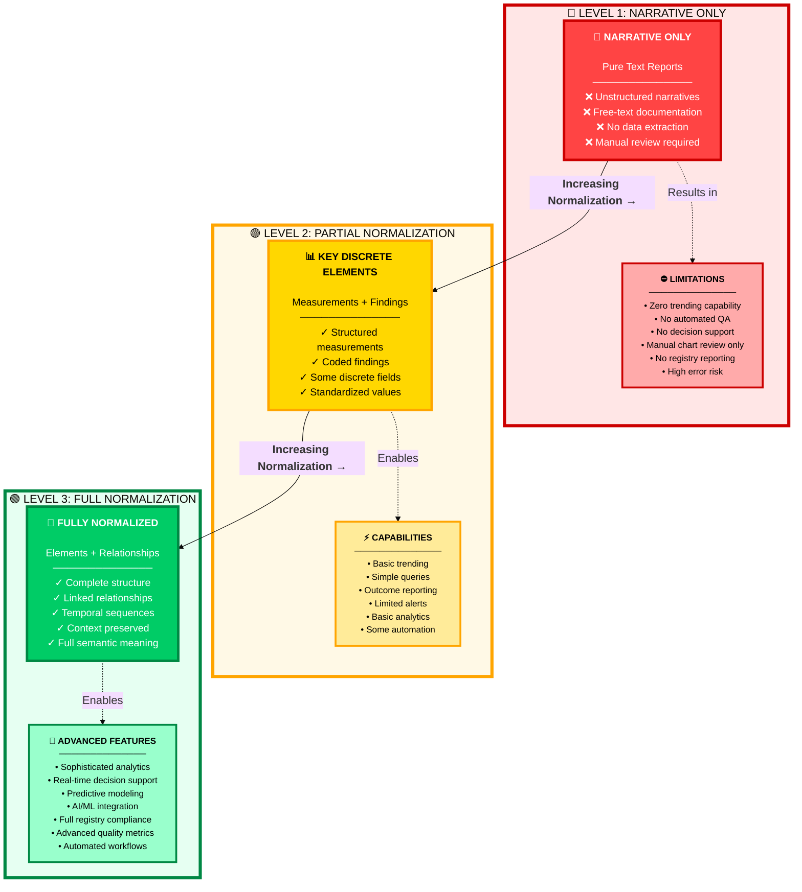
# Understanding the Normalization Spectrum: A Step-by-Step Guide

The Normalization Spectrum illustrates the journey from unstructured healthcare data to fully normalized, actionable information. Let's break down each level:

---

## 🔴 Level 1: Narrative Only - The Starting Point

### 📝 What It Is

**Pure text-based documentation** with no structured data extraction.

- ❌ Free-text narratives only
- ❌ No discrete data fields
- ❌ No standardized coding
- ❌ Manual interpretation required

<aside>
💡 **Example:** "Patient has moderate stenosis in the LAD with good flow." - This is valuable clinical information but cannot be automatically analyzed or trended.

</aside>

### ⛔ The Problem

**Severe limitations in data utility:**

- 🚫 **No trending:** Cannot track changes over time
- 🚫 **No automated QA:** Manual review only
- 🚫 **No decision support:** Cannot trigger alerts
- 🚫 **No registry reporting:** Cannot contribute to quality databases
- 🚫 **High error risk:** Dependent on manual chart review

---

## 🟡 Level 2: Partial Normalization - The Middle Ground

### 📊 What It Is

**Key clinical elements captured as discrete data** while maintaining narrative context.

- ✅ Structured measurements (e.g., LVEF = 55%)
- ✅ Coded findings (e.g., Stenosis = Moderate)
- ✅ Standardized values (e.g., Vessel = LAD)
- ✅ Some discrete fields populated

<aside>
💡**Example:**The same clinical scenario now has:

**Vessel:**LAD

**Stenosis:**Moderate (50-69%)

**Flow:**TIMI 3
Plus the narrative description

</aside>

### ⚡ The Capabilities

**Significant improvement in data utility:**

- ✓ **Basic trending:** Track key metrics over time
- ✓ **Simple queries:** Find patients with specific findings
- ✓ **Outcome reporting:** Generate quality reports
- ✓ **Limited alerts:** Basic threshold warnings
- ✓ **Basic analytics:** Simple statistics and comparisons
- ✓ **Some automation:** Reduced manual work

---

## 🟢 Level 3: Full Normalization - The Gold Standard

### 🎯 What It Is

**Comprehensive structured data** with complete relationships and context preserved.

- ✅ Complete data structure for all elements
- ✅ Linked relationships (lesion → vessel → intervention)
- ✅ Temporal sequences (pre → during → post)
- ✅ Full context preservation
- ✅ Semantic meaning captured

<aside>
💡**Example:**The clinical scenario now has:

**Lesion ID:**L1

**Vessel:**LAD (proximal segment)

**Stenosis:**60% (visual estimate)

**Flow:**TIMI 3

**Linked to:**Previous angiogram (6 months ago: 40%)

**Risk Score:**Auto-calculated

**Treatment Plan:**Medical management recommended
Plus full narrative and images

</aside>

### 🚀 The Advanced Features

**Maximum data utility and intelligence:**

- ✓ **Sophisticated analytics:** Complex queries and insights
- ✓ **Real-time decision support:** Instant clinical guidance
- ✓ **Predictive modeling:** Risk stratification
- ✓ **AI/ML integration:** Pattern recognition and learning
- ✓ **Full registry compliance:** Automatic NCDR, ACC, etc.
- ✓ **Advanced quality metrics:** Comprehensive reporting
- ✓ **Automated workflows:** Smart routing and alerts

---

🎯 The Journey: From Narrative to Intelligence

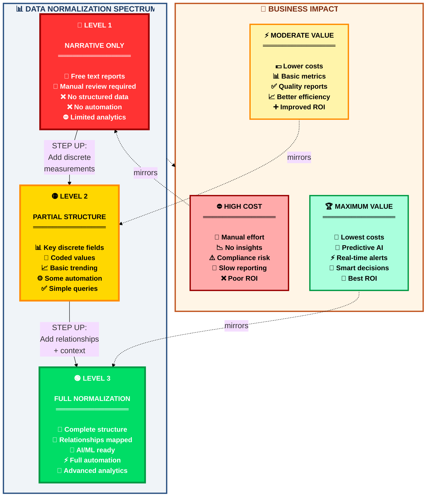
## Understanding the Data Normalization Spectrum: A Step-by-Step Visual Guide

The diagram above illustrates the **three critical levels of data normalization** in healthcare documentation, showing how each level impacts both **technical capabilities** and **business value**. Let's break it down step by step:

---

### 🔴 Step 1: Level 1 - Narrative Only (The Starting Point)

<aside>
📄 **What You See**

At this level, all clinical information exists as **free-text narratives** - essentially just written reports with no structured data fields.

</aside>

**Visual Representation:**

- 🔴 Red color indicates **warning/limitation**
- 📄 Document icon represents narrative-only format
- ❌ X marks show what's **NOT possible**
- ⛔ Stop sign indicates blocked functionality

<aside>
💼 **Business Impact**

Mirrored in the bottom section with similar red coloring:

</aside>

**Consequences:**

- 💸 High costs due to manual labor
- 📉 No data-driven insights possible
- ⚠️ Compliance risks from manual processes
- 🐌 Slow reporting turnaround
- ❌ Poor return on investment

**Key Takeaway:** This is where most legacy systems start - functional for documentation but severely limited for modern quality improvement needs.

---

### 🟡 Step 2: Level 2 - Partial Structure (The Transition Zone)

<aside>
📊 **What Changes**

Critical clinical elements are now captured as **discrete, structured data fields** alongside narrative text.

</aside>

**Visual Representation:**

- 🟡 Yellow/gold color indicates **progress/caution**
- 📊 Chart icon represents structured data capability
- 🔢 Numbers icon shows coded values
- ✅ Check marks show **what's NOW possible**
- ⚙️ Gear icon indicates partial automation

**The Arrow:** Shows the progression path - "Add discrete measurements" is the bridge from Level 1 to Level 2.

<aside>
💼 **Business Impact**

Shifts to yellow/gold, showing **moderate value**:

</aside>

**Improvements:**

- 💵 Lower operational costs
- 📊 Basic quality metrics available
- ✅ Can generate quality reports
- 📈 Better operational efficiency
- ➕ Improved ROI over Level 1

**Key Takeaway:** This is the **minimum viable structure** for meaningful quality improvement - you can now track trends and generate reports, but advanced analytics remain limited.

---

### 🟢 Step 3: Level 3 - Full Normalization (The Gold Standard)

<aside>
🎯 **The Complete Picture**

Every clinical element is fully structured with **relationships, context, and semantic meaning** preserved.

</aside>

**Visual Representation:**

- 🟢 Green color indicates **optimal/go**
- 🎯 Target icon represents precision and completeness
- 🔗 Link icon shows relationship mapping
- 🤖 Robot icon indicates AI/ML readiness
- ⚡ Lightning bolt shows full automation
- 🚀 Rocket represents advanced capabilities

**The Arrow:** Shows the final leap - "Add relationships + context" completes the journey from Level 2 to Level 3.

<aside>
💼 **Business Impact**

Transforms to green, showing **maximum value**:

</aside>

**Transformational Benefits:**

- 💎 Lowest long-term costs
- 🤖 Predictive AI capabilities
- ⚡ Real-time clinical alerts
- 🎯 Smart decision support
- 🚀 Best possible ROI
- 🏆 Competitive advantage

**Key Takeaway:** This is the **ultimate goal** - where data becomes a strategic asset enabling predictive analytics, machine learning, and automated quality improvement.

---

### 🔄 Understanding the Flow: The Complete Journey

**The diagram shows TWO parallel flows:**

### 1️⃣ Top Section: Technical Capabilities Spectrum

- 📊 Shows how data structure evolves from narrative → partial → complete
- ➡️ Arrows indicate the **transformation steps** required
- Each level builds upon the previous, adding more structure and capability

### 2️⃣ Bottom Section: Business Value Spectrum

- 💼 Mirrors the technical progression with corresponding business impact
- 🔗 Dotted lines connect each technical level to its business outcome
- Shows how technical improvements directly translate to **measurable business value**

---

### 🎨 Color Psychology in the Diagram

| **Color** | **Meaning** | **Message** |
| --- | --- | --- |
| 🔴 Red | Warning/Stop | This level has significant limitations - action needed |
| 🟡 Yellow | Caution/Progress | Moving in the right direction but not yet optimal |
| 🟢 Green | Optimal/Go | Target achieved - maximum capability and value |

---

### 💡 Key Insights from the Visual

- 🎯 **Insight 1: Progressive Enhancement**
    
    The spectrum is not binary - you don't have to jump from Level 1 to Level 3 overnight. Level 2 provides immediate value while you work toward full normalization.
    
- 📈 **Insight 2: Direct Correlation**
    
    The mirroring between technical capabilities (top) and business impact (bottom) emphasizes that **technical investments directly drive business results**.
    
- ⚡ **Insight 3: Acceleration Effect**
    
    Notice how capabilities and value accelerate at each level - the jump from Level 2 to Level 3 unlocks exponentially more value than the jump from Level 1 to Level 2.
    
- 🔗 **Insight 4: System Thinking**
    
    The diagram emphasizes relationships and connections - showing that data normalization isn't just about structure, it's about creating an **intelligent, interconnected ecosystem**.
    

---

### 🚀 Practical Application: Using This Diagram

<aside>
💼 **For Healthcare Leaders:**

Use this visual to:

- Assess your organization's current state (which level are you at?)
- Build the business case for advancing to the next level
- Set realistic transformation goals and timelines
- Communicate ROI expectations to stakeholders
</aside>

<aside>
👨‍⚕️ **For Clinical Teams:**

Use this visual to:

- Understand why structured documentation matters
- See how your daily documentation impacts organizational goals
- Identify opportunities to improve data quality
- Connect clinical work to quality outcomes
</aside>

<aside>
💻 **For IT/Informatics Teams:**

Use this visual to:

- Define technical requirements for system upgrades
- Prioritize development efforts
- Design data architecture that supports progression
- Plan integration and interoperability strategies
</aside>

---

### ✅ Action Items: Your Roadmap Forward

- [ ]  **Assess Current State:** Honestly evaluate which level best describes your current data capture process
- [ ]  **Identify Quick Wins:** If at Level 1, identify 5-10 critical data elements to structure first (move to Level 2)
- [ ]  **Map Relationships:** If at Level 2, document the key clinical relationships you need to preserve (prepare for Level 3)
- [ ]  **Calculate ROI:** Use the business impact indicators to quantify the value of advancing to the next level
- [ ]  **Build the Team:** Assemble clinical, IT, and quality improvement stakeholders to champion the transformation
- [ ]  **Start Small, Scale Smart:** Pick one service line or procedure type to pilot full normalization before enterprise rollout

---
| **🏥 Specialty Area** | **📊 Normalization Level** | **📝 Documentation Type** | **🔍 Key Characteristics** |
| --- | --- | --- | --- |
| 🫀**Echocardiography** | 🟢 High Normalization | Discrete measurements | Chamber dimensions, velocities, calculated values are inherently structured. Example: LV end-diastolic dimension of 55 mm should be discrete data, not narrative. |
| 🩺**Cardiac Catheterization** | 🟡 Moderate Normalization | Hybrid: Structured + Narrative | Combines hemodynamic data (measured pressures, calculated indices) with procedural narrative (vessel engagement, angiographic findings, interventional maneuvers). |
| ⚡**EP/Device Management** | 🔴 Complex Normalization | Real-time + Temporal | Captures electrogram data, device measurements, and procedural annotations simultaneously. Temporal precision is critical (e.g., rhythm marker timing relative to ablation). |

### 🔗 Entity-Relationship Principle Applied to Cardiology

Every cardiology procedure creates a web of entities and relationships:
---
**Why**

Here's the entity-relationship diagram converted to a table format with vivid colors:

| **🏥 Entity** | **🔗 Relationship** | **🎯 Related Entity** | **📋 Description** |
| --- | --- | --- | --- |
| 👤 PATIENT | → undergoes → | 🔬 PROCEDURE | One patient can have multiple procedures |
| 🔬 PROCEDURE | → contains → | 💚 CHAMBER_ASSESSMENT | Each procedure includes chamber assessments |
| 🔬 PROCEDURE | → generates → | 📊 HEMODYNAMIC_MEASUREMENT | Procedures produce hemodynamic data |
| 🔬 PROCEDURE | → includes → | ⚡ DEVICE_INTERROGATION | Device checks are part of procedures |
| 💚 CHAMBER_ASSESSMENT | → includes → | 📏 DIMENSION | Measurements of chamber sizes |
| 💚 CHAMBER_ASSESSMENT | → includes → | ⚡ VELOCITY | Blood flow speed measurements |
| 💚 CHAMBER_ASSESSMENT | → derives_to → | 🔍 CLINICAL_FINDING | Clinical interpretations from assessments |
| 📊 HEMODYNAMIC_MEASUREMENT | → comprises → | 📈 PRESSURE_POINT | Individual pressure readings |
| 📊 HEMODYNAMIC_MEASUREMENT | → derives_from → | 🧮 CALCULATED_INDEX | Computed hemodynamic indices |
| ⚡ DEVICE_INTERROGATION | → contains → | ⚙️ DEVICE_PARAMETER | Device settings and values |
| ⚡ DEVICE_INTERROGATION | → records → | 💓 ARRHYTHMIA_EPISODE | Recorded irregular heart rhythms |

t


---

```mermaid
%%{init: {'theme':'base', 'themeVariables': { 
  'primaryColor':'#FF1744',
  'primaryTextColor':'#FFFFFF',
  'primaryBorderColor':'#D50000',
  'lineColor':'#00E676',
  'secondaryColor':'#2979FF',
  'secondaryTextColor':'#FFFFFF',
  'secondaryBorderColor':'#2962FF',
  'tertiaryColor':'#FFEA00',
  'tertiaryTextColor':'#000000',
  'tertiaryBorderColor':'#FFD600',
  'noteBkgColor':'#D500F9',
  'noteTextColor':'#FFFFFF',
  'noteBorderColor':'#AA00FF',
  'fontSize':'22px',
  'fontFamily':'Arial Black, Arial, sans-serif'
}}}%%

erDiagram
    PATIENT ||--o{ PROCEDURE : "🔄 undergoes"
    PROCEDURE ||--o{ CHAMBER_ASSESSMENT : "🔄 contains"
    PROCEDURE ||--o{ HEMODYNAMIC_MEASUREMENT : "🔄 generates"
    PROCEDURE ||--o{ DEVICE_INTERROGATION : "🔄 includes"
    
    CHAMBER_ASSESSMENT ||--o{ DIMENSION : "🔄 includes"
    CHAMBER_ASSESSMENT ||--o{ VELOCITY : "🔄 includes"
    CHAMBER_ASSESSMENT ||--o{ CLINICAL_FINDING : "🔄 derives"
    
    HEMODYNAMIC_MEASUREMENT ||--o{ PRESSURE_POINT : "🔄 comprises"
    HEMODYNAMIC_MEASUREMENT ||--o{ CALCULATED_INDEX : "🔄 derives"
    
    DEVICE_INTERROGATION ||--o{ DEVICE_PARAMETER : "🔄 contains"
    DEVICE_INTERROGATION ||--o{ ARRHYTHMIA_EPISODE : "🔄 records"
    
    PATIENT {
        string patient_id PK "🔑 PRIMARY KEY"
        string name "👤 PATIENT NAME"
        date dob "📅 DATE OF BIRTH"
        string mrn "🏥 MEDICAL RECORD NUMBER"
    }
    
    PROCEDURE {
        string procedure_id PK "🔑 PRIMARY KEY"
        string type "🔬 PROCEDURE TYPE"
        datetime performed_date "📅 PERFORMED DATE"
        string physician "👨‍⚕️ PERFORMING PHYSICIAN"
    }
    
    CHAMBER_ASSESSMENT {
        string assessment_id PK "🔑 PRIMARY KEY"
        string chamber_type "❤️ CHAMBER TYPE"
        string findings "📋 CLINICAL FINDINGS"
    }
    
    HEMODYNAMIC_MEASUREMENT {
        string measurement_id PK "🔑 PRIMARY KEY"
        string parameter_type "📊 PARAMETER TYPE"
        decimal value "📈 MEASURED VALUE"
    }
    
    DEVICE_INTERROGATION {
        string interrogation_id PK "🔑 PRIMARY KEY"
        string device_type "⚡ DEVICE TYPE"
        datetime interrogation_date "📅 INTERROGATION DATE"
    }
    
    DIMENSION {
        string dimension_id PK "🔑 PRIMARY KEY"
        string measurement_type "📏 MEASUREMENT TYPE"
        decimal value "📐 MEASURED VALUE"
        string unit "📊 UNIT OF MEASURE"
    }
    
    VELOCITY {
        string velocity_id PK "🔑 PRIMARY KEY"
        string flow_type "🌊 FLOW TYPE"
        decimal peak_velocity "⚡ PEAK VELOCITY"
        string unit "📊 UNIT OF MEASURE"
    }
    
    CLINICAL_FINDING {
        string finding_id PK "🔑 PRIMARY KEY"
        string finding_type "🔍 FINDING TYPE"
        string severity "⚠️ SEVERITY LEVEL"
        string description "📝 DETAILED DESCRIPTION"
    }
    
    PRESSURE_POINT {
        string pressure_id PK "🔑 PRIMARY KEY"
        string location "📍 ANATOMICAL LOCATION"
        decimal pressure_value "💉 PRESSURE VALUE"
        string unit "📊 UNIT OF MEASURE"
    }
    
    CALCULATED_INDEX {
        string index_id PK "🔑 PRIMARY KEY"
        string index_type "🧮 INDEX TYPE"
        decimal calculated_value "📊 CALCULATED VALUE"
        string formula "🔢 CALCULATION FORMULA"
    }
    
    DEVICE_PARAMETER {
        string parameter_id PK "🔑 PRIMARY KEY"
        string parameter_name "⚙️ PARAMETER NAME"
        string value "📊 PARAMETER VALUE"
        string status "✅ CURRENT STATUS"
    }
    
    ARRHYTHMIA_EPISODE {
        string episode_id PK "🔑 PRIMARY KEY"
        datetime episode_date "📅 EPISODE DATE TIME"
        string arrhythmia_type "💓 ARRHYTHMIA TYPE"
        int duration_seconds "⏱️ DURATION SECONDS"
    }
    
    
    
    
    
```


# 📊 Understanding the Cardiovascular Data Model: A Step-by-Step Visual Guide

This diagram represents a comprehensive **Entity-Relationship Model** for cardiovascular healthcare data management. Let's break it down step by step with clear explanations and visual indicators.

---

## 🎯 Core Concept: The Data Flow Journey

The diagram shows how patient information flows through different stages of cardiovascular assessment and monitoring. Think of it as a **journey map** where each box represents a checkpoint in the patient care process.

---

## 👤 Step 1: The Patient (Starting Point)

**🔑 PATIENT Entity** - This is where everything begins!

- 👤 **Patient Name** - The individual's identity
- 📅 **Date of Birth** - Age and demographic information
- 🏥 **Medical Record Number (MRN)** - Unique hospital identifier
- 🔑 **Patient ID** - Primary key linking all records

➡️ **Visual Flow:** From here, the arrow points to PROCEDURE, showing that patients undergo various cardiovascular procedures.

---

## 🔬 Step 2: The Procedure (What Happens)

**🔑 PROCEDURE Entity** - The actual cardiovascular examination or test

- 🔬 **Procedure Type** - (e.g., Echocardiogram, Cardiac Catheterization, Device Check)
- 📅 **Performed Date** - When the test was conducted
- 👨‍⚕️ **Performing Physician** - Who performed the procedure
- 🔑 **Procedure ID** - Unique identifier for this specific test

➡️ **Visual Flow:** From PROCEDURE, three main branches emerge, representing three types of assessment data collected during the procedure.

---

## ❤️ Step 3A: Chamber Assessment (Heart Structure Analysis)

**🔑 CHAMBER ASSESSMENT Entity** - Evaluating the heart's chambers

- ❤️ **Chamber Type** - (Left Ventricle, Right Atrium, etc.)
- 📋 **Clinical Findings** - What was observed

**This assessment breaks down into THREE sub-categories:**

- 📏 **DIMENSION** - Physical measurements
    - 📏 **Measurement Type** - (Wall thickness, chamber diameter)
    - 📐 **Measured Value** - The actual number
    - 📊 **Unit of Measure** - (cm, mm, etc.)
- 🌊 **VELOCITY** - Blood flow measurements
    - 🌊 **Flow Type** - (Mitral inflow, Aortic outflow)
    - ⚡ **Peak Velocity** - Maximum speed recorded
    - 📊 **Unit of Measure** - (m/s, cm/s)
- 🔍 **CLINICAL FINDING** - Diagnostic interpretations
    - 🔍 **Finding Type** - (Hypertrophy, Dilation, Regurgitation)
    - ⚠️ **Severity Level** - (Mild, Moderate, Severe)
    - 📝 **Detailed Description** - Full clinical interpretation

---

## 📊 Step 3B: Hemodynamic Measurement (Pressure & Function)

**🔑 HEMODYNAMIC MEASUREMENT Entity** - Measuring blood pressure and cardiac function

- 📊 **Parameter Type** - What's being measured
- 📈 **Measured Value** - The recorded data

**This measurement includes TWO sub-categories:**

- 💉 **PRESSURE POINT** - Specific pressure readings
    - 📍 **Anatomical Location** - Where pressure was measured
    - 💉 **Pressure Value** - The reading in mmHg
    - 📊 **Unit of Measure** - Standard units
- 🧮 **CALCULATED INDEX** - Derived metrics
    - 🧮 **Index Type** - (Ejection Fraction, Cardiac Output, SVR)
    - 📊 **Calculated Value** - The computed result
    - 🔢 **Calculation Formula** - How it was derived

---

## ⚡ Step 3C: Device Interrogation (Implanted Device Data)

**🔑 DEVICE INTERROGATION Entity** - For patients with pacemakers, ICDs, or loop recorders

- ⚡ **Device Type** - (Pacemaker, ICD, CRT, Loop Recorder)
- 📅 **Interrogation Date** - When device was checked

**Device data includes TWO sub-categories:**

- ⚙️ **DEVICE PARAMETER** - Device settings and battery
    - ⚙️ **Parameter Name** - (Battery voltage, Lead impedance, Pacing threshold)
    - 📊 **Parameter Value** - Current reading
    - ✅ **Current Status** - (Normal, Alert, Warning)
- 💓 **ARRHYTHMIA EPISODE** - Recorded abnormal rhythms
    - 📅 **Episode Date Time** - When it occurred
    - 💓 **Arrhythmia Type** - (AFib, VTach, Bradycardia)
    - ⏱️ **Duration Seconds** - How long it lasted

---

## 🔄 Understanding the Relationships (The Arrows)

The diagram uses **relationship lines with arrows (🔄)** to show how data entities connect:

- **||--o{** symbols mean "one-to-many" relationships
- One PATIENT can have **multiple** PROCEDURES
- One PROCEDURE can generate **multiple** CHAMBER ASSESSMENTS
- One CHAMBER ASSESSMENT can contain **multiple** DIMENSIONS, VELOCITIES, and FINDINGS

**This structure ensures:**

- ✅ No data duplication
- ✅ Complete traceability from finding back to patient
- ✅ Efficient data storage and retrieval
- ✅ Comprehensive quality monitoring capability

---

## 🎯 Practical Application: How This Model Works in Real Life

**Example Scenario:**

1. 👤 **Patient:** John Smith (MRN: 123456) comes in for evaluation
2. 🔬 **Procedure:** Transthoracic Echocardiogram performed on 12/03/2025
3. ❤️ **Chamber Assessment:** Left ventricle evaluated
    - 📏 **Dimension:** Wall thickness = 1.2 cm
    - 🌊 **Velocity:** Mitral E-wave = 0.8 m/s
    - 🔍 **Finding:** Mild left ventricular hypertrophy detected
4. 📊 **Hemodynamic:** Ejection Fraction calculated at 55%
5. ⚡ **Device Check:** His pacemaker interrogated - battery at 2.7V, 2 AFib episodes recorded

All this data is **interconnected** through the relationships shown in the diagram, allowing:

- 📈 Trend analysis over time
- 🔍 Quality metric extraction
- ⚠️ Alert generation for abnormal findings
- 📊 Comprehensive reporting

---

## 💡 Key Takeaways

<aside>
🎯 **This diagram is the blueprint for:**

- ✅ Organizing all cardiovascular data systematically
- ✅ Ensuring every measurement is traceable to its source
- ✅ Supporting quality metrics and performance monitoring
- ✅ Enabling comprehensive patient care documentation
- ✅ Facilitating data analysis and research
</aside>

The **color-coding and emojis** in the diagram help quickly identify different data categories and make the complex relationships more visually intuitive for healthcare teams! 🎨✨

---
**Why does this matter for Cupid?** Because Cupid's template engine must map this clinical entity-relationship reality into a documentation interface. The template structure, field relationships, and validation rules all derive from how the architect *understands* these relationships.

### Interface Design as Relationship Visualization

Here's the crucial insight: **The user interface is where cardiologists navigate and understand these entity relationships.** A well-designed interface makes relationships explicit and navigable; a poorly designed one forces cardiologists to hunt through narrative or recall relationships mentally.

Cupid accomplishes this through:

1. **Hierarchical template organization** — Chamber findings grouped under a "Chambers" section; hemodynamic findings under "Hemodynamics"
2. **Smart fields and calculated values** — When a sonographer enters left ventricular end-diastolic diameter and end-systolic diameter, the system automatically calculates fractional shortening, making the relationship explicit
3. **Conditional visibility** — Fields appear or disappear based on prior answers (if normal LV function is documented, certain pathology fields remain hidden, decluttering the interface)
4. **Cross-form references** — A cath lab note can reference the prior week's echo findings, maintaining relationships across document types

---

## III. Multi-Modality Deep Dives: Workflow → Architecture → Interface

### A. TRANSTHORACIC ECHOCARDIOGRAPHY: Hierarchical Measurement Architecture

### 3A.1 Clinical Workflow Review (Bridge from Module 2.2)

A transthoracic echocardiogram follows a systematic examination protocol:

1. **Parasternal views** → Assess LV size, function, wall motion
2. **Apical views** → Measure chambers; assess valves
3. **Subcostal views** → Evaluate pericardium, IVC
4. **Suprasternal views** → Assess aorta and pulmonary artery
5. **Synthesis** → Integrate findings into diagnostic impression

Within each view, the sonographer collects *measurements* (quantitative data), *findings* (qualitative observations), and *conclusions* (integrated clinical assessments).

### 3A.2 Data Architecture: Hierarchical Normalization

Echocardiography's architecture is fundamentally **hierarchical**—chambers contain segments contain measurements.

Here's a visual representation of the Cupid template design principles with icons:

### 🎯 Interface Design Principles

- 📁 **Hierarchical Template Organization**Chamber findings grouped under "Chambers" section; hemodynamic findings under "Hemodynamics"
- 🧮 **Smart Fields and Calculated Values**When LV end-diastolic and end-systolic diameters are entered → system automatically calculates fractional shortening
- 👁️ **Conditional Visibility**Fields appear/disappear based on prior answers (normal LV function = hidden pathology fields)
- 🔗 **Cross-Form References**Cath lab notes can reference prior week's echo findings

### 🫀 Transthoracic Echo Workflow

1. 📐 **Parasternal Views** → Assess LV size, function, wall motion
2. 🔺 **Apical Views** → Measure chambers; assess valves
3. 🔽 **Subcostal Views** → Evaluate pericardium, IVC
4. ⬆️ **Suprasternal Views** → Assess aorta and pulmonary artery
5. 🧩 **Synthesis** → Integrate findings into diagnostic impression

### 📊 Data Types Collected

- 📏 **Measurements** — Quantitative data
- 🔍 **Findings** — Qualitative observations
- 💡 **Conclusions** — Integrated clinical assessments

---

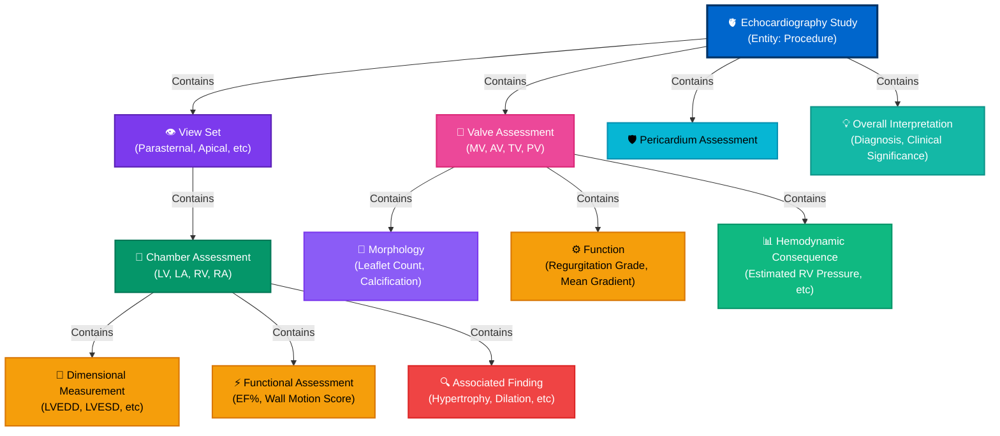

visual clarity.

## 📋 Step-by-Step Breakdown of the Echocardiography Data Architecture

Let's walk through how this hierarchical structure organizes echocardiography data from the top-level study down to individual measurements:

### Level 1: 🫀 The Echocardiography Study (Root Entity)

**What it represents:** The entire procedure/examination session

**Role:** This is the container for all data collected during one echo study

**Clinical context:** "Patient John Doe underwent transthoracic echocardiography on December 3, 2025"

---

### Level 2: 👁️ View Sets (Acquisition Windows)

**What it represents:** Different ultrasound windows used to visualize the heart

**Examples:**

- 📐 Parasternal views (long-axis, short-axis)
- 🔺 Apical views (2-chamber, 4-chamber)
- 🔽 Subcostal views
- ⬆️ Suprasternal views

**Why this matters:** Each view provides unique anatomical perspectives and measurement opportunities

---

### Level 3A: 💚 Chamber Assessment Branch

**What it represents:** Evaluation of each cardiac chamber (LV, LA, RV, RA)

**Contains three sub-types of data:**

- 📏 Dimensional Measurements (Quantitative)
    
    **Examples:**
    
    - LVEDD (Left Ventricular End-Diastolic Diameter)
    - LVESD (Left Ventricular End-Systolic Diameter)
    - LA volume
    - Wall thickness measurements
    
    **Data type:** Numeric values with units (mm, cm, mL)
    
    **Color coding:** 🟠 Orange (indicating raw quantitative data)
    
- ⚡ Functional Assessments (Calculated/Derived)
    
    **Examples:**
    
    - Ejection Fraction (EF%) - calculated from volumes
    - Wall Motion Score - integrated assessment
    - Diastolic function grade
    
    **Data type:** Percentages, scores, categorical grades
    
    **Color coding:** 🟠 Orange (indicating derived metrics)
    
- 🔍 Associated Findings (Qualitative Observations)
    
    **Examples:**
    
    - LV hypertrophy present/absent
    - Chamber dilation
    - Regional wall motion abnormalities
    
    **Data type:** Boolean flags or categorical descriptions
    
    **Color coding:** 🔴 Red (indicating pathological findings)
    

---

### Level 3B: 🚪 Valve Assessment Branch

**What it represents:** Evaluation of each cardiac valve (Mitral, Aortic, Tricuspid, Pulmonic)

**Contains three sub-types of data:**

- 🔬 Morphology (Structural Assessment)
    
    **Examples:**
    
    - Number of leaflets (tricuspid vs bicuspid aortic valve)
    - Calcification grade
    - Leaflet thickness
    - Prolapse present/absent
    
    **Data type:** Categorical descriptions, numeric grades
    
    **Color coding:** 🟣 Purple (structural attributes)
    
- ⚙️ Function (Performance Metrics)
    
    **Examples:**
    
    - Regurgitation grade (none/mild/moderate/severe)
    - Mean gradient across stenotic valve
    - Valve area (cm²)
    - Peak velocity
    
    **Data type:** Categorical grades, numeric measurements
    
    **Color coding:** 🟠 Orange (functional measurements)
    
- 📊 Hemodynamic Consequences (Downstream Effects)
    
    **Examples:**
    
    - Estimated RV systolic pressure (from TR jet)
    - Pulmonary artery pressure
    - Left atrial pressure estimation
    
    **Data type:** Derived pressure values (mmHg)
    
    **Color coding:** 🟢 Green (systemic impact)
    
    **Why separate:** These aren't direct valve properties but consequences of valve dysfunction
    

---

### Level 3C: 🛡️ Pericardium Assessment

**What it represents:** Evaluation of the pericardial sac

**Contains:**

- Effusion presence/size
- Tamponade physiology markers
- Pericardial thickness

**Color coding:** 🔵 Cyan (separate anatomical structure)

---

### Level 4: 💡 Overall Interpretation (Synthesis Layer)

**What it represents:** The cardiologist's integrated diagnostic conclusion

**Contains:**

- Primary diagnosis
- Clinical significance assessment
- Comparison with prior studies
- Recommendations

**Color coding:** 🟢 Teal (final clinical output)

**Why separate:** This synthesizes all lower-level data into actionable clinical meaning

---

## 🎯 Key Architectural Principles Illustrated

### 1️⃣ Hierarchical Containment

Each level **contains** the next level, creating a tree structure that mirrors clinical thinking:

Study → Views → Chambers/Valves → Measurements/Findings → Interpretation

### 2️⃣ Separation of Concerns

- **Structure** (morphology) vs. **Function** vs. **Impact** (hemodynamics) are kept distinct
- **Raw measurements** vs. **Derived calculations** vs. **Qualitative findings** are separated

### 3️⃣ Color-Coded Data Types

- 🔵 Blue = Root entity (procedure level)
- 🟣 Purple = View/acquisition context
- 🟢 Green = Chamber-level assessments
- 🟠 Orange = Quantitative measurements and functional metrics
- 🔴 Red = Pathological findings
- 🟣 Purple = Structural morphology
- 🩷 Pink = Valve assessments
- 🔵 Cyan = Pericardium (separate structure)
- 🟢 Teal = Final interpretation

### 4️⃣ Relationships Enable Intelligence

Because the system knows:

- LVEDD and LVESD are **contained within** LV chamber assessment
- EF% is **calculated from** volume measurements
- RV pressure is **derived from** tricuspid regurgitation velocity

...it can **auto-calculate**, **validate consistency**, and **suggest interpretations**

---

## 💼 How This Translates to Cupid's Interface

**The template structure mirrors this hierarchy:**

1. **Section: Chambers**
    - Subsection: Left Ventricle
        - Field group: Dimensions (LVEDD, LVESD, wall thickness)
        - Field group: Function (EF%, wall motion)
        - Field group: Findings (hypertrophy checkbox, dilation checkbox)
2. **Section: Valves**
    - Subsection: Mitral Valve
        - Field group: Morphology (leaflet count, calcification grade)
        - Field group: Function (regurgitation grade, mean gradient)
        - Field group: Hemodynamics (LA pressure estimate)
3. **Section: Pericardium**
    - Effusion fields
    - Tamponade indicators
4. **Section: Interpretation**
    - Free-text diagnosis
    - Clinical significance dropdown

**Result:** Cardiologists navigate the interface by following the same mental model they use clinically, making data entry intuitive and complete.

---
Normalized data model rationale:

Each measurement is a discrete entity with its own value, unit, reference range, and timestamp
Measurements inherit context from their parent entities (which chamber? which valve? measured in which view?)
Findings and conclusions are linked to the measurements that support them (traceability)
This structure enables quality checks: Were all required measurements obtained? Is the EF consistent with dimensional measurements?

3A.3 Cupid Template Architecture for Echo
In Cupid, this hierarchy translates to a nested template structure:

---
```mermaid
graph TD
    A[Primary Template:<br/>Transthoracic Echocardiogram]
    A --> B[Study Information]
    A --> C[Left Ventricle]
    A --> D[Left Atrium]
    A --> E[Right Heart]
    A --> F[Valves]
    A --> G[Pericardium]
    A --> H[Overall Interpretation]
    
    B[Study Information<br/>date, indication, technical quality]
    
    C --> C1[Dimensions]
    C --> C2[Function Assessment]
    C --> C3[Findings]
    
    C1 --> C1A[LVEDD<br/>text + validation]
    C1 --> C1B[LVESD<br/>text + validation]
    C1 --> C1C[Fractional Shortening<br/>auto-calculated]
    
    C2 --> C2A[EF<br/>discrete/numeric]
    C2 --> C2B[Visual Assessment<br/>dropdown]
    C2 --> C2C[Wall Motion<br/>segment-by-segment]
    
    C3[Findings<br/>conditional on EF]
    
    D --> D1[Dimensions]
    D --> D2[Function]
    D --> D3[Findings]
    
    F --> F1[MV, AV, TV, PV]
    F1 --> F1A[Morphology]
    F1 --> F1B[Function]
    F1 --> F1C[Hemodynamic Consequence]
    
    style A fill:#0066cc,stroke:#ffffff,stroke-width:3px,color:#ffffff
    style B fill:#9933ff,stroke:#ffffff,stroke-width:2px,color:#ffffff
    style C fill:#00cc66,stroke:#ffffff,stroke-width:2px,color:#000000
    style D fill:#00cc66,stroke:#ffffff,stroke-width:2px,color:#000000
    style E fill:#00cc66,stroke:#ffffff,stroke-width:2px,color:#000000
    style F fill:#ff3399,stroke:#ffffff,stroke-width:2px,color:#ffffff
    style G fill:#00cccc,stroke:#ffffff,stroke-width:2px,color:#000000
    style H fill:#009999,stroke:#ffffff,stroke-width:2px,color:#ffffff
    style C1 fill:#ff9933,stroke:#ffffff,stroke-width:2px,color:#000000
    style C2 fill:#ff9933,stroke:#ffffff,stroke-width:2px,color:#000000
    style C3 fill:#ff3333,stroke:#ffffff,stroke-width:2px,color:#ffffff
    style C1A fill:#ffcc66,stroke:#333333,stroke-width:1px,color:#000000
    style C1B fill:#ffcc66,stroke:#333333,stroke-width:1px,color:#000000
    style C1C fill:#ffcc66,stroke:#333333,stroke-width:1px,color:#000000
    style C2A fill:#ffcc66,stroke:#333333,stroke-width:1px,color:#000000
    style C2B fill:#ffcc66,stroke:#333333,stroke-width:1px,color:#000000
    style C2C fill:#ffcc66,stroke:#333333,stroke-width:1px,color:#000000
    style D1 fill:#ff9933,stroke:#ffffff,stroke-width:2px,color:#000000
    style D2 fill:#ff9933,stroke:#ffffff,stroke-width:2px,color:#000000
    style D3 fill:#ff3333,stroke:#ffffff,stroke-width:2px,color:#ffffff
    style F1 fill:#cc0066,stroke:#ffffff,stroke-width:2px,color:#ffffff
    style F1A fill:#9933cc,stroke:#ffffff,stroke-width:2px,color:#ffffff
    style F1B fill:#ff9933,stroke:#ffffff,stroke-width:2px,color:#000000
    style F1C fill:#009999,stroke:#ffffff,stroke-width:2px,color:#ffffff

```
Key architectural patterns:

Discrete fields for measurements: LVEDD is a number field with validation rules (e.g., values >80 mm trigger a warning)
Smart fields for calculations: EF can be manually entered OR calculated from linear dimensions; the system stores which method was used
Dropdown lists for categories: Valve pathology (normal, trivial, mild, moderate, severe) ensures data consistency
Conditional sections: If "significant mitral regurgitation" is documented, additional fields appear for severity assessment and estimated PA pressure
Narrative integration: Despite high normalization, echo templates include narrative blocks for "clinical significance" and differential diagnoses
---
## Step-by-Step Breakdown of the Cupid Template Architecture

Let's walk through the diagram systematically, understanding each component and how they interconnect:

---

### 🔷 Level 1: Root Template

<aside>

🏥 **Primary Template: Transthoracic Echocardiogram**

**Color:** Blue

**Purpose:** The top-level container that represents the entire echocardiogram procedure

**Analogy:** Think of this as the "folder" that contains everything about one complete echo study

</aside>

---

### 🔷 Level 2: Major Sections (Direct Children)

The root template branches into **eight major sections**, each representing a distinct clinical domain:

### 1️⃣ 🟣 Study Information

- **Color:** Purple
- **Contains:** Date, clinical indication, technical quality assessment
- **Purpose:** Metadata about the procedure itself
- **Icon analogy:** 📋 The cover page of your report

### 2️⃣ 🟢 Left Ventricle

- **Color:** Green (chamber)
- **Contains:** Three subsections (explained below)
- **Purpose:** Complete assessment of the heart's main pumping chamber
- **Icon analogy:** 💚 The engine of the heart

### 3️⃣ 🟢 Left Atrium

- **Color:** Green (chamber)
- **Contains:** Dimensions, Function, Findings
- **Purpose:** Assessment of the upper left heart chamber
- **Icon analogy:** 📦 The receiving chamber

### 4️⃣ 🟢 Right Heart

- **Color:** Green (chamber)
- **Contains:** Right ventricle and right atrium assessments
- **Purpose:** Complete right-sided cardiac evaluation
- **Icon analogy:** ➡️ The pulmonary circulation pump

### 5️⃣ 🩷 Valves

- **Color:** Pink
- **Contains:** MV (Mitral), AV (Aortic), TV (Tricuspid), PV (Pulmonary)
- **Purpose:** Assessment of all four heart valves
- **Icon analogy:** 🚪 The doors that control blood flow

### 6️⃣ 🔵 Pericardium

- **Color:** Cyan
- **Contains:** Effusion assessment, tamponade indicators
- **Purpose:** Evaluation of the heart's outer sac
- **Icon analogy:** 🛡️ The protective wrapper

### 7️⃣ 🟢 Overall Interpretation

- **Color:** Teal
- **Contains:** Final diagnosis, clinical significance, recommendations
- **Purpose:** The synthesized clinical conclusion
- **Icon analogy:** 🎯 The bottom-line answer

---

### 🔷 Level 3: Subsections (Deep Dive into Left Ventricle)

The **Left Ventricle** section demonstrates the hierarchical depth with three subsections:

### 📏 Dimensions (Orange)

**Purpose:** Physical measurements of chamber size

**Contains three specific fields:**

- 📐 **LVEDD** (Left Ventricular End-Diastolic Dimension) - text field with reference range validation
- 📐 **LVESD** (Left Ventricular End-Systolic Dimension) - text field with reference range validation
- 🧮 **Fractional Shortening** - Smart field that auto-calculates from LVEDD and LVESD

### ⚙️ Function Assessment (Orange)

**Purpose:** How well the chamber pumps

**Contains three specific fields:**

- 📊 **EF** (Ejection Fraction) - discrete list or numeric field
- 👁️ **Visual Assessment** - dropdown menu for qualitative evaluation
- 🗺️ **Wall Motion** - segment-by-segment assessment (17-segment model)

### 🔴 Findings (Red)

**Purpose:** Pathological observations

**Special feature:** Conditional fields that appear based on EF value

**Example:** If EF < 50%, additional fields for systolic dysfunction details appear

---

### 🔷 Level 3: Subsections (Left Atrium Structure)

The **Left Atrium** follows a similar three-part pattern:

- 📏 **Dimensions** (Orange) - LA diameter, volume, indexed values
- ⚙️ **Function** (Orange) - LA strain, emptying fraction
- 🔴 **Findings** (Red) - Dilation, thrombus, spontaneous echo contrast

---

### 🔷 Level 3: Valve Subsections

Each valve (MV, AV, TV, PV) is assessed through **three lenses**:

### 🟣 Morphology

- **Color:** Purple
- **Contains:** Physical structure - leaflet count, calcification grade, thickening
- **Icon:** 🔬 What it looks like

### 🟠 Function

- **Color:** Orange
- **Contains:** How it works - regurgitation grade, stenosis severity, gradients
- **Icon:** 🌊 How blood flows through it

### 🟢 Hemodynamic Consequence

- **Color:** Teal
- **Contains:** Clinical impact - pressure estimates, chamber effects
- **Icon:** ⚖️ What effect it has on the heart

---

## 🎨 Visual Flow Summary

**Top-Down Flow:**

1. 🏥 Start with **one procedure** (blue root)
2. 🗂️ Break into **anatomical sections** (purple/green/pink/cyan branches)
3. 📋 Organize by **assessment type** (orange subsections for measurements/function)
4. 📝 Capture **specific data points** (yellow field level)
5. 🔴 Flag **abnormalities** (red findings)
6. 🎯 Synthesize into **clinical meaning** (teal interpretation)

## 🧠 Why This Structure Works

<aside>

🎯 **Cognitive Alignment**

The template mirrors how cardiologists think: "I'm looking at the left ventricle (section), measuring its size (subsection), and recording the end-diastolic dimension (field)."

</aside>

<aside>

🔗 **Relationship Intelligence**

Because LVEDD and LVESD are in the same "Dimensions" subsection, Cupid knows they're related and can auto-calculate fractional shortening.

</aside>

<aside>

✅ **Data Completeness**

The structure ensures nothing is forgotten - if you open "Left Ventricle," you're prompted for dimensions, function, AND findings.

</aside>

<aside>

🎨 **Visual Organization**

Color coding provides instant context - orange = measurements, red = problems, teal = conclusions.

</aside>

---

## 🖥️ How Users Experience This

**In the Cupid interface, this appears as:**

1. 📄 A report form with **collapsible sections** (Study Info, Left Ventricle, Left Atrium, etc.)
2. 📂 Each section expands to show **subsections** (Dimensions, Function, Findings)
3. 📝 Each subsection contains **input fields** with appropriate types (text, dropdown, numeric)
4. ✨ **Smart fields** auto-populate based on other entries
5. ⚠️ **Conditional fields** appear when triggered by specific values
6. 🎨 **Color indicators** highlight measurement ranges (normal/borderline/abnormal)

**Result:** A cardiologist can navigate intuitively, following the natural flow of cardiac examination, while the system ensures completeness and accuracy through intelligent structure.

---

```mermaid
graph TD
    A[Design Decisions] --> B[Highly Discrete Measurements]
    A --> C[Smart Calculated Fields]
    A --> D[Hierarchical Organization]
    A --> E[Conditional Visibility]
    A --> F[Reference Ranges & Validation]
    
    B --> B1[✓ Enables trending, QA, decision support, registry reporting]
    B --> B2[✗ Requires 50+ data points; slower documentation]
    
    C --> C1[✓ Improves accuracy, prevents transcription errors]
    C --> C2[✗ Requires calculation logic configuration; manual overrides]
    
    D --> D1[✓ Clinical workflow mirrors template structure; reduces cognitive load]
    D --> D2[✗ Deep nesting complicates printing; mobile requires collapsible sections]
    
    E --> E1[✓ Reduces clutter; guides documentation completion]
    E --> E2[✗ Complex rules difficult to maintain; unintended field hiding]
    
    F --> F1[✓ Catches data entry errors in real-time]
    F --> F2[✗ May trigger false alerts if ranges don't account for all scenarios]
    
    style A fill:#2E86AB,stroke:#fff,stroke-width:3px,color:#fff
    style B fill:#A23B72,stroke:#fff,stroke-width:2px,color:#fff
    style C fill:#F18F01,stroke:#fff,stroke-width:2px,color:#fff
    style D fill:#C73E1D,stroke:#fff,stroke-width:2px,color:#fff
    style E fill:#6A994E,stroke:#fff,stroke-width:2px,color:#fff
    style F fill:#7209B7,stroke:#fff,stroke-width:2px,color:#fff
    
    style B1 fill:#06A77D,stroke:#fff,stroke-width:2px,color:#fff
    style B2 fill:#D62828,stroke:#fff,stroke-width:2px,color:#fff
    style C1 fill:#06A77D,stroke:#fff,stroke-width:2px,color:#fff
    style C2 fill:#D62828,stroke:#fff,stroke-width:2px,color:#fff
    style D1 fill:#06A77D,stroke:#fff,stroke-width:2px,color:#fff
    style D2 fill:#D62828,stroke:#fff,stroke-width:2px,color:#fff
    style E1 fill:#06A77D,stroke:#fff,stroke-width:2px,color:#fff
    style E2 fill:#D62828,stroke:#fff,stroke-width:2px,color:#fff
    style F1 fill:#06A77D,stroke:#fff,stroke-width:2px,color:#fff
    style F2 fill:#D62828,stroke:#fff,stroke-width:2px,color:#fff



```
**Consulting reality**

Here's the trade-offs table formatted with icons:

| **Design Decision** | **✅ Benefit** | **⚠️ Challenge** |
| --- | --- | --- |
| 📊 Highly discrete measurements | Enables trending, QA, decision support, registry reporting | Requires sonographers to enter 50+ data points; slower documentation |
| 🧮 Smart calculated fields | Improves accuracy, prevents transcription errors | Requires configuration of calculation logic; must handle manual overrides |
| 📁 Hierarchical organization | Clinical workflow mirrors template structure; reduces cognitive load | Deep nesting can make printing difficult; mobile devices require collapsible sections |
| 👁️ Conditional visibility | Reduces clutter; guides documentation completion | Complex rules become difficult to maintain; unintended field hiding frustrates users |
| ✓ Reference ranges and validation | Catches data entry errors in real-time | May trigger false alerts if ranges don't account for all clinical scenarios |

t


---


color combinations for optimal readability.

## 📊 Step-by-Step Breakdown of Cupid Implementation Trade-offs

This diagram illustrates the five critical design decisions in Cupid's implementation, along with their benefits (✓) and challenges (✗).

---

### 🔵 Central Node: Design Decisions

The central blue node represents the core architectural choices that shape Cupid's functionality. From this hub, five major decision branches emerge, each with its own color-coded path.

---

### 1️⃣ 🟣 Highly Discrete Measurements

**What it means:** Breaking down echocardiographic data into 50+ individual, structured data points rather than free-text paragraphs.

**✓ Benefits (Green Node):**

- Enables precise trending over time
- Powers quality assurance checks
- Supports clinical decision support systems
- Facilitates registry reporting and research

**✗ Challenges (Red Node):**

- Sonographers must enter 50+ individual data points
- Slower documentation process
- Potential for user fatigue

---

### 2️⃣ 🟠 Smart Calculated Fields

**What it means:** Automatic computation of derived values (like ejection fraction from volumes) instead of manual calculation.

**✓ Benefits (Green Node):**

- Eliminates transcription errors
- Improves accuracy and consistency
- Reduces cognitive load on clinicians

**✗ Challenges (Red Node):**

- Requires complex calculation logic configuration
- Must handle manual override scenarios
- Edge cases need careful testing

---

### 3️⃣ 🔴 Hierarchical Organization

**What it means:** Structuring the interface to mirror clinical anatomy (Chambers → LV → Dimensions → LVEDD).

**✓ Benefits (Green Node):**

- Clinical workflow naturally mirrors template structure
- Reduces cognitive load
- Intuitive navigation for cardiologists

**✗ Challenges (Red Node):**

- Deep nesting makes printing difficult
- Mobile devices require collapsible sections
- Can feel overwhelming to new users

---

### 4️⃣ 🟢 Conditional Visibility

**What it means:** Showing/hiding fields based on previous selections (e.g., only showing "stenosis severity" if stenosis is present).

**✓ Benefits (Green Node):**

- Reduces screen clutter
- Guides complete documentation
- Context-aware interface

**✗ Challenges (Red Node):**

- Complex conditional rules become difficult to maintain
- Unintended field hiding frustrates users
- Debugging visibility logic is challenging

---

### 5️⃣ 🟣 Reference Ranges & Validation

**What it means:** Real-time alerts when values fall outside expected normal ranges (e.g., "LVEDD 6.5 cm - above normal").

**✓ Benefits (Green Node):**

- Catches data entry errors immediately
- Improves data quality
- Educational for trainees

**✗ Challenges (Red Node):**

- May trigger false alerts
- Ranges don't account for all clinical scenarios (pediatrics, athletes, pregnancy)
- Alert fatigue if overly sensitive

---

## 🎨 Visual Legend

**Node Colors:**

- 🔵 **Blue:** Central decision hub
- 🟣 **Purple/Magenta:** Major design decision categories
- 🟠 **Orange:** Calculation/automation decisions
- 🔴 **Red:** Organizational structure decisions
- 🟢 **Green (teal/emerald):** Validation and visibility decisions

**Outcome Colors:**

- ✅ **Bright Green (#06A77D):** Positive outcomes and benefits
- ❌ **Bright Red (#D62828):** Challenges and trade-offs

---

## 💡 Key Takeaway

Every design decision in Cupid represents a deliberate trade-off between **data quality/intelligence** and **user experience/speed**. The diagram visualizes these tensions, helping stakeholders understand that there's no "perfect" solution—only optimized compromises based on organizational priorities.
---

```mermaid
graph TD
    A[LV Assessment Screen] --> B[Dimensions Section]
    A --> C[Function Section]
    A --> D[Wall Motion Assessment]
    A --> E[Comment Field]
    
    B --> B1["LVEDD: Input field<br/>Validation: >80mm = warning"]
    B --> B2["LVESD: Input field<br/>Validation: >55mm = warning"]
    B --> B3["Fractional Shortening<br/>Auto-calculated: 36%<br/>User can override"]
    
    C --> C1["EF by Biplane: 55%<br/>Dropdown options"]
    C --> C2["Visual Assessment<br/>Dropdown: Normal"]
    
    D --> D1["Anterior: Dropdown"]
    D --> D2["Lateral: Dropdown"]
    D --> D3["Inferior: Dropdown"]
    D --> D4["Posterior: Dropdown"]
    D --> D5["Apex: Dropdown"]
    
    E --> E1["Narrator field for<br/>additional observations"]
    
    style A fill:#2E4057,stroke:#048BA8,stroke-width:3px,color:#FFFFFF
    style B fill:#0496FF,stroke:#023E8A,stroke-width:2px,color:#FFFFFF
    style C fill:#0496FF,stroke:#023E8A,stroke-width:2px,color:#FFFFFF
    style D fill:#0496FF,stroke:#023E8A,stroke-width:2px,color:#FFFFFF
    style E fill:#0496FF,stroke:#023E8A,stroke-width:2px,color:#FFFFFF
    
    style B1 fill:#06D6A0,stroke:#048A6C,stroke-width:2px,color:#000000
    style B2 fill:#06D6A0,stroke:#048A6C,stroke-width:2px,color:#000000
    style B3 fill:#FFC857,stroke:#DB8A00,stroke-width:2px,color:#000000
    
    style C1 fill:#06D6A0,stroke:#048A6C,stroke-width:2px,color:#000000
    style C2 fill:#06D6A0,stroke:#048A6C,stroke-width:2px,color:#000000
    
    style D1 fill:#7209B7,stroke:#560BAD,stroke-width:2px,color:#FFFFFF
    style D2 fill:#7209B7,stroke:#560BAD,stroke-width:2px,color:#FFFFFF
    style D3 fill:#7209B7,stroke:#560BAD,stroke-width:2px,color:#FFFFFF
    style D4 fill:#7209B7,stroke:#560BAD,stroke-width:2px,color:#FFFFFF
    style D5 fill:#7209B7,stroke:#560BAD,stroke-width:2px,color:#FFFFFF
    
    style E1 fill:#F77F00,stroke:#D62828,stroke-width:2px,color:#FFFFFF


```

distinction.

## 📊 Step-by-Step Breakdown of the LV Assessment Screen Diagram

This diagram illustrates the hierarchical structure and data flow of the Left Ventricle Assessment screen. Let's explore each component with visual clarity:

---

### 🏠 Main Container: LV Assessment Screen

🔷 **Color:** Dark blue (#2E4057) with bright cyan border

📌 **Purpose:** Central hub that branches into four major sections

🔗 **Connections:** Links to Dimensions, Function, Wall Motion, and Comments

---

### 📏 Section 1: Dimensions (Blue Section)

🔷 **Color:** Bright blue (#0496FF)

📊 **Contains three measurement fields:**

- 🟢 **LVEDD (Left Ventricular End-Diastolic Diameter)**
    - Input field with validation
    - ⚠️ Warning triggered if value >80mm
    - Color: Green (#06D6A0) - indicates active input field
- 🟢 **LVESD (Left Ventricular End-Systolic Diameter)**
    - Input field with validation
    - ⚠️ Warning triggered if value >55mm
    - Color: Green (#06D6A0) - indicates active input field
- 🟡 **Fractional Shortening**
    - Auto-calculated field showing 36%
    - ✏️ User can override automatic calculation
    - Color: Yellow/Orange (#FFC857) - indicates calculated field

---

### 💓 Section 2: Function (Blue Section)

🔷 **Color:** Bright blue (#0496FF)

📊 **Contains two assessment fields:**

- 🟢 **EF by Biplane (Ejection Fraction)**
    - Shows 55% with dropdown menu
    - 📋 Options: 55-70%, >70%, 40-55%, etc.
    - Color: Green (#06D6A0) - indicates selectable dropdown
- 🟢 **Visual Assessment**
    - Dropdown field set to "Normal"
    - 📋 Quick selection for overall visual impression
    - Color: Green (#06D6A0) - indicates selectable dropdown

---

### 🎯 Section 3: Wall Motion Assessment (Blue Section)

🔷 **Color:** Bright blue (#0496FF)

📊 **Contains five segment-by-segment dropdowns:**

- 🟣 **Anterior** - Purple dropdown (#7209B7)
- 🟣 **Lateral** - Purple dropdown (#7209B7)
- 🟣 **Inferior** - Purple dropdown (#7209B7)
- 🟣 **Posterior** - Purple dropdown (#7209B7)
- 🟣 **Apex** - Purple dropdown (#7209B7)

💡 **Purpose:** Each segment can be individually assessed for wall motion abnormalities

🎨 **Color coding:** Purple indicates specialized clinical assessment fields

---

### 💬 Section 4: Comment Field (Blue Section)

🔷 **Color:** Bright blue (#0496FF)

📝 **Contains narrator field:**

- 🟠 **Additional Observations Field**
    - Free-text narrator field
    - 📝 For documenting additional clinical observations
    - Color: Orange (#F77F00) with red border - indicates text input area

---

### 🎨 Color Legend & Visual Hierarchy

| **Color** | **Purpose** | **Example** |
| --- | --- | --- |
| 🔷 Dark Blue | Main container | LV Assessment Screen |
| 🔵 Bright Blue | Section headers | Dimensions, Function, Wall Motion, Comment |
| 🟢 Green | Input/dropdown fields | LVEDD, LVESD, EF, Visual Assessment |
| 🟡 Yellow/Orange | Calculated fields | Fractional Shortening (auto-calculated) |
| 🟣 Purple | Clinical assessment fields | Wall motion segments |
| 🟠 Orange | Free-text input | Comment/narrator field |

---

### 🔄 Data Flow Summary

1. 📥 **User enters measurements** → LVEDD and LVESD fields (with validation)
2. ⚙️ **System calculates** → Fractional Shortening automatically computed
3. 📋 **User selects** → EF percentage and visual assessment from dropdowns
4. 🎯 **User assesses** → Each wall motion segment individually
5. 💬 **User documents** → Additional observations in comment field

---

<aside>
💡 **Key Design Principle:** The color coding creates a visual hierarchy that guides the sonographer through the assessment process: input fields (green) → calculated results (yellow) → clinical assessments (purple) → narrative documentation (orange).

</aside>

This structured approach ensures comprehensive, standardized left ventricle assessments while maintaining flexibility for clinical judgment and additional documentation.

---
his screen demonstrates architecture in action:

Hierarchical organization (dimensions grouped, then function, then regional assessment)
Smart fields (fractional shortening calculated; user sees relationship between dimensions and function)
Validation rules (references ranges for LVEDD, LVESD visible to user)
Conditional visibility (if EF <40%, additional fields would appear for severity staging)


B. CARDIAC CATHETERIZATION: Sequential Procedural Architecture
3B.1 Clinical Workflow Review (Bridge from Module 2.2)
Cardiac catheterization is fundamentally different from echo: it's a procedure unfolding over time with sequential events:

Access acquisition → Establish arterial/venous access; document sheath sizes
Catheter advancement → Position catheters in chambers/vessels; document progression
Hemodynamic measurements → Record pressures at each location; measure cardiac output
Angiography → Inject contrast; record visual findings about vessel patency, collaterals, LV function
Intervention (if applicable) → Perform PCI, balloon pump placement, device retrieval, etc.; document each step
Closure → Document vascular closure technique, hemostasis confirmation

Unlike echo, where all measurements relate to a single study snapshot, cath procedures generate a sequence of measurements at different times, in different locations, with specific temporal and spatial relationships.
3B.2 Data Architecture: Temporal-Sequential Normalization
Cath data architecture must capture:

What was measured (pressure, position, vessel name)
When it was measured (within the procedure timeline)
Where it was measured (LV chamber, aorta, right atrium, etc.)
By whom (operator, assistant, equipment)
In what context (baseline vs. post-intervention; spontaneous rhythm vs. pacing)

---
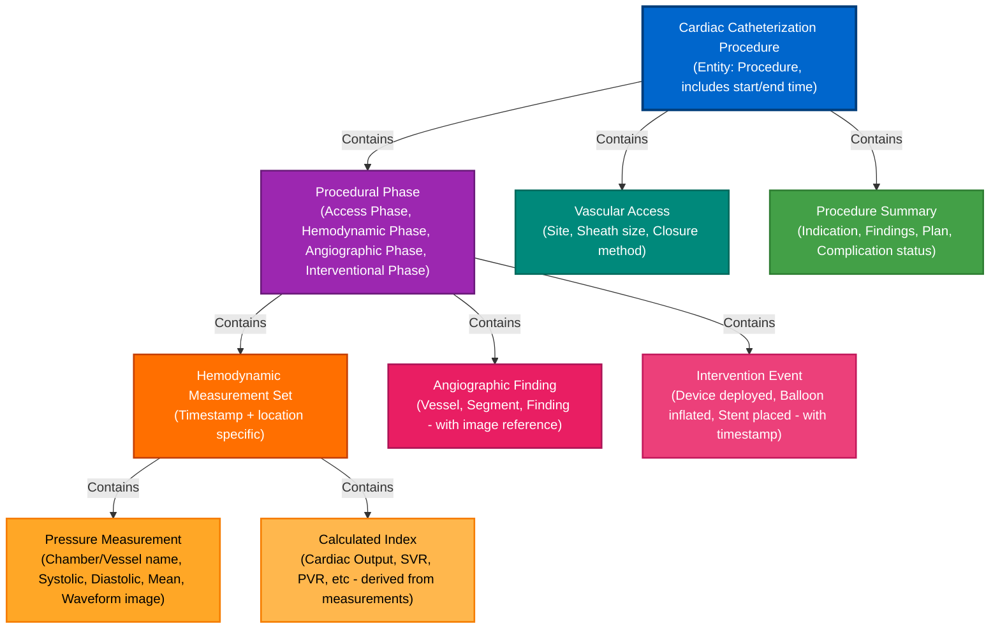
## Cardiac Catheterization Data Model: Step-by-Step Breakdown

This diagram illustrates how cardiac catheterization data is structured and organized. Let's walk through each component:

---

### 🏥 Level 1: The Procedure (Top Level)

<aside>

🔵 **Cardiac Catheterization Procedure**

This is the master entity that encompasses everything that happens during the catheterization. It includes:

- Start and end timestamps
- Unique procedure identifier
- Patient information linkage
</aside>

---

### ⚙️ Level 2: Major Components

The procedure contains four main branches:

<aside>

🟣 **1. Procedural Phases**

The procedure is divided into distinct phases:

- **Access Phase:** Gaining vascular access
- **Hemodynamic Phase:** Measuring pressures and flows
- **Angiographic Phase:** Taking contrast images
- **Interventional Phase:** Performing therapeutic actions
</aside>

<aside>

🟢 **2. Vascular Access**

Documents how the catheter entered the body:

- Access site (femoral, radial, etc.)
- Sheath size used
- Closure method applied
</aside>

<aside>

🟢 **3. Procedure Summary**

High-level overview including:

- Clinical indication for the procedure
- Key findings
- Treatment plan
- Complication status
</aside>

---

### 📈 Level 3: Phase-Specific Data

Each procedural phase can contain different types of data:

<aside>

🟠 **Hemodynamic Measurement Sets**

Collections of measurements taken at specific times and locations:

- 📍 Timestamp of when measurements were taken
- 📍 Location (which chamber or vessel)
- 📍 Context (baseline vs. post-intervention; spontaneous vs. pacing)
</aside>

<aside>

🔴 **Angiographic Findings**

Visual observations from contrast imaging:

- 🎯 Vessel name
- 🎯 Specific segment
- 🎯 Pathological finding (stenosis, occlusion, etc.)
- 🎯 Reference to image/video
</aside>

<aside>

🔴 **Intervention Events**

Therapeutic actions performed:

- 🛠️ Device deployed (type and model)
- 🛠️ Balloon inflations (pressure, duration)
- 🛠️ Stent placements (size, location)
- 🛠️ Timestamp for each action
</aside>

---

### 📊 Level 4: Detailed Measurements

Within each Hemodynamic Measurement Set, you'll find:

<aside>

🟠 **Pressure Measurements**

Specific pressure values recorded:

- 📌 Chamber or vessel name
- 📌 Systolic pressure (peak)
- 📌 Diastolic pressure (lowest)
- 📌 Mean pressure (average)
- 📌 Waveform image or tracing
</aside>

<aside>

🟡 **Calculated Indices**

Derived values computed from measurements:

- 💡 Cardiac Output (CO)
- 💡 Systemic Vascular Resistance (SVR)
- 💡 Pulmonary Vascular Resistance (PVR)
- 💡 Cardiac Index (CI)
- 💡 Valve areas and gradients
</aside>

---

### 🔑 Key Architectural Principle

<aside>

💡 **Hierarchical Context Preservation**

Unlike echo reports where measurements are often listed without context, this structure maintains:

- ✅ **When** the measurement was taken (timestamp within phase)
- ✅ **Where** it was taken (specific chamber/vessel)
- ✅ **Under what conditions** (baseline, post-intervention, during pacing)
- ✅ **Relationship to other events** (before/after intervention)
</aside>

---

### 🎯 Data Flow Summary

1. **Procedure initiated** → Master record created with start time
2. **Access gained** → Vascular access details recorded
3. **Phase begins** → Procedural phase initiated (e.g., Hemodynamic Phase)
4. **Measurements taken** → Measurement set created with timestamp and location
5. **Individual pressures recorded** → Each chamber pressure documented
6. **Calculations performed** → Derived indices computed and stored
7. **Images acquired** → Angiographic findings documented with image references
8. **Interventions performed** → Each device/action timestamped and recorded
9. **Procedure completed** → Summary generated with end time

---

<aside>

⚠️ **Why This Structure Matters**

This hierarchical approach enables:

- 🔍 Precise querying (e.g., "Show all post-intervention pressures")
- 📈 Trend analysis over time within the same procedure
- 🔗 Clear linkage between findings and interventions
- 📋 Comprehensive audit trails for quality assurance
- 🤖 Machine learning on properly contextualized data
</aside>

---
Key architectural difference from echo: The temporal dimension is primary. Cath documentation is procedure-centric, not measurement-centric.
3B.3 Cupid Template Architecture for Cath

---

```mermaid
%%{init: {'theme':'base', 'themeVariables': { 'fontSize':'48px', 'fontFamily':'Arial, sans-serif', 'lineHeight':'2.0'}}}%%
flowchart TD
    A["🫀 CARDIAC CATHETERIZATION<br/>TEMPLATE"] 
    A --> B["📋 PROCEDURE<br/>DEMOGRAPHICS & ACCESS"]
    A --> C["📊 HEMODYNAMIC<br/>DATA"]
    A --> D["🔍 ANGIOGRAPHIC<br/>FINDINGS"]
    A --> E["⚕️ INTERVENTIONAL<br/>SUMMARY"]
    A --> F["📝 SUMMARY &<br/>ASSESSMENT"]

    B ==> B1["🎯 Indication"]
    B ==> B2["💉 Vascular Access"]
    B ==> B3["👨‍⚕️ Operator & Team"]

    C ==> C1["📈 Baseline<br/>Hemodynamics"]
    C ==> C2["📉 Post-Intervention<br/>Hemodynamics"]
    C ==> C3["🧮 Calculated<br/>Indices"]

    C1 --> C1A["🏥 Chamber/Vessel<br/>Selection"]
    C1 --> C1B["⬆️ Systolic<br/>mmHg"]
    C1 --> C1C["⬇️ Diastolic<br/>mmHg"]
    C1 --> C1D["➡️ Mean<br/>mmHg"]
    C1 --> C1E["➕ Add<br/>Measurement"]

    C2 --> C2A["🔄 Same<br/>Structure"]
    C2 --> C2B["🔁 Repeatable<br/>Measurements"]

    C3 --> C3A["❤️ Cardiac<br/>Output"]
    C3 --> C3B["🔢 SVR<br/>Auto-calculated"]
    C3 --> C3C["📊 Additional<br/>Indices"]

    D ==> D1["🌳 Left Main<br/>Assessment"]
    D ==> D2["🌿 LAD Proximal<br/>Assessment"]
    D ==> D3["🍃 LAD Mid<br/>Assessment"]
    D ==> D4["🔗 All Coronary<br/>Segments"]
    D ==> D5["💪 LV Function<br/>EF%"]
    D ==> D6["🔀 Collateral<br/>Circulation"]

    E ==> E1["🛠️ Intervention<br/>Type"]
    E ==> E2["⚙️ Device<br/>Details"]
    E ==> E3["🩸 Vessel<br/>Treated"]
    E ==> E4["✅ Result<br/>TIMI Flow"]
    E ==> E5["⚠️ Complications"]

    F ==> F1["🔑 Key<br/>Findings"]
    F ==> F2["🧠 Clinical<br/>Interpretation"]
    F ==> F3["💡 Recommendations"]

    style A fill:#FF0066,stroke:#FFFFFF,stroke-width:12px,color:#FFFFFF,font-size:56px,font-weight:bold
    style B fill:#6600FF,stroke:#FFFFFF,stroke-width:10px,color:#FFFFFF,font-size:48px,font-weight:bold
    style C fill:#00CCFF,stroke:#000000,stroke-width:10px,color:#000000,font-size:48px,font-weight:bold
    style D fill:#66FF00,stroke:#000000,stroke-width:10px,color:#000000,font-size:48px,font-weight:bold
    style E fill:#FFCC00,stroke:#000000,stroke-width:10px,color:#000000,font-size:48px,font-weight:bold
    style F fill:#FF5500,stroke:#FFFFFF,stroke-width:10px,color:#FFFFFF,font-size:48px,font-weight:bold

    style B1 fill:#9966FF,stroke:#FFFFFF,stroke-width:8px,color:#FFFFFF,font-size:40px,font-weight:bold
    style B2 fill:#9966FF,stroke:#FFFFFF,stroke-width:8px,color:#FFFFFF,font-size:40px,font-weight:bold
    style B3 fill:#9966FF,stroke:#FFFFFF,stroke-width:8px,color:#FFFFFF,font-size:40px,font-weight:bold

    style C1 fill:#33DDFF,stroke:#000000,stroke-width:8px,color:#000000,font-size:40px,font-weight:bold
    style C2 fill:#33DDFF,stroke:#000000,stroke-width:8px,color:#000000,font-size:40px,font-weight:bold
    style C3 fill:#33DDFF,stroke:#000000,stroke-width:8px,color:#000000,font-size:40px,font-weight:bold

    style D1 fill:#99FF33,stroke:#000000,stroke-width:8px,color:#000000,font-size:40px,font-weight:bold
    style D2 fill:#99FF33,stroke:#000000,stroke-width:8px,color:#000000,font-size:40px,font-weight:bold
    style D3 fill:#99FF33,stroke:#000000,stroke-width:8px,color:#000000,font-size:40px,font-weight:bold
    style D4 fill:#99FF33,stroke:#000000,stroke-width:8px,color:#000000,font-size:40px,font-weight:bold
    style D5 fill:#99FF33,stroke:#000000,stroke-width:8px,color:#000000,font-size:40px,font-weight:bold
    style D6 fill:#99FF33,stroke:#000000,stroke-width:8px,color:#000000,font-size:40px,font-weight:bold

    style E1 fill:#FFDD33,stroke:#000000,stroke-width:8px,color:#000000,font-size:40px,font-weight:bold
    style E2 fill:#FFDD33,stroke:#000000,stroke-width:8px,color:#000000,font-size:40px,font-weight:bold
    style E3 fill:#FFDD33,stroke:#000000,stroke-width:8px,color:#000000,font-size:40px,font-weight:bold
    style E4 fill:#FFDD33,stroke:#000000,stroke-width:8px,color:#000000,font-size:40px,font-weight:bold
    style E5 fill:#FFDD33,stroke:#000000,stroke-width:8px,color:#000000,font-size:40px,font-weight:bold

    style F1 fill:#FF7722,stroke:#FFFFFF,stroke-width:8px,color:#FFFFFF,font-size:40px,font-weight:bold
    style F2 fill:#FF7722,stroke:#FFFFFF,stroke-width:8px,color:#FFFFFF,font-size:40px,font-weight:bold
    style F3 fill:#FF7722,stroke:#FFFFFF,stroke-width:8px,color:#FFFFFF,font-size:40px,font-weight:bold

    style C1A fill:#66EEFF,stroke:#000000,stroke-width:6px,color:#000000,font-size:36px,font-weight:bold
    style C1B fill:#66EEFF,stroke:#000000,stroke-width:6px,color:#000000,font-size:36px,font-weight:bold
    style C1C fill:#66EEFF,stroke:#000000,stroke-width:6px,color:#000000,font-size:36px,font-weight:bold
    style C1D fill:#66EEFF,stroke:#000000,stroke-width:6px,color:#000000,font-size:36px,font-weight:bold
    style C1E fill:#66EEFF,stroke:#000000,stroke-width:6px,color:#000000,font-size:36px,font-weight:bold

    style C2A fill:#66EEFF,stroke:#000000,stroke-width:6px,color:#000000,font-size:36px,font-weight:bold
    style C2B fill:#66EEFF,stroke:#000000,stroke-width:6px,color:#000000,font-size:36px,font-weight:bold

    style C3A fill:#66EEFF,stroke:#000000,stroke-width:6px,color:#000000,font-size:36px,font-weight:bold
    style C3B fill:#66EEFF,stroke:#000000,stroke-width:6px,color:#000000,font-size:36px,font-weight:bold
    style C3C fill:#66EEFF,stroke:#000000,stroke-width:6px,color:#000000,font-size:36px,font-weight:bold

    linkStyle default stroke:#FF0099,stroke-width:10px
```

## Step-by-Step Breakdown of the Cardiac Catheterization Template

Let's walk through each component of the template architecture with visual explanations and icons:

---

### 🔴 Level 1: Main Template Container

<aside>

🏥 **Cardiac Catheterization Template**

This is the root container that holds all procedure documentation. Think of it as the "master folder" for the entire cath lab procedure.

</aside>

---

### 🟣 Level 2: Major Sections (5 Primary Categories)

1️⃣ 📋 **Procedure Demographics & Access**

<aside>

**Purpose:** Captures basic procedure information and how we accessed the patient

**Contains:**

- 📝 **Indication** – Why are we doing this procedure?
- 💉 **Vascular Access** – Where did we insert (radial/femoral), what size sheath, how did we close?
- 👨‍⚕️ **Operator & Team Info** – Who performed the procedure?
</aside>

2️⃣ 📈 **Hemodynamic Data**

<aside>

**Purpose:** Records all pressure measurements and calculations from inside the heart and vessels

**Three Key Subsections:**

**🔵 Baseline Hemodynamics (Before Intervention)**

- 🫀 Chamber/Vessel selector (LV, Aorta, RA, RV, PA)
- ⬆️ Systolic pressure (mmHg)
- ⬇️ Diastolic pressure (mmHg)
- ➡️ Mean pressure (mmHg)
- ➕ Add more measurements button

**🟢 Post-Intervention Hemodynamics (After Intervention)**

- Same structure as baseline for comparison
- Can repeat measurements to track changes

**🧮 Calculated Indices**

- 💓 Cardiac Output (auto-calculated or manual)
- 🔄 SVR (Systemic Vascular Resistance – auto-calculated)
- 📊 Additional indices as configured
</aside>

3️⃣ 🔍 **Angiographic Findings**

<aside>

**Purpose:** Documents what we SEE on the X-ray images of coronary arteries

**Visual Assessment of Each Vessel:**

- 🫁 **Left Main** → Normal or severity dropdown
- 📍 **LAD Proximal** → Normal or severity dropdown
- 📍 **LAD Mid** → Normal or severity dropdown
- 📍 **All other coronary segments** → Systematic evaluation
- 💪 **LV Function** → Ejection fraction % from ventriculography
- 🔗 **Collateral Circulation** → Present/Absent (natural bypasses)
</aside>

4️⃣ 🛠️ **Interventional Summary**

<aside>

**Purpose:** Records what we DID to treat blockages (if applicable)

**Intervention Details:**

- ⚙️ **Intervention Type** → PCI, Balloon, Stent (dropdown)
- 🔧 **Device Details** → Stent size, type, manufacturer
- 🎯 **Vessel Treated** → Which artery (LAD, RCA, etc.)
- ✅ **Result** → TIMI flow grade (blood flow assessment), residual stenosis
- ⚠️ **Complications** → None or specific complications documented
</aside>

5️⃣ 📝 **Summary & Assessment**

<aside>

**Purpose:** Brings everything together with clinical interpretation

**Final Documentation:**

- 🔑 **Key Findings** → Narrative summary of most important discoveries
- 🧠 **Clinical Interpretation** → What do these findings mean for the patient?
- 💊 **Recommendations** → Next steps in patient care
</aside>

---

### 🎯 Visual Flow of Information

```mermaid
flowchart LR
    A["🏥 START<br/><br/>Patient Arrives<br/>in Cath Lab"] --> B["📋 SETUP<br/><br/>Document Patient<br/>Demographics"]
    B --> C["💉 ACCESS<br/><br/>Insert Catheter<br/>& Establish Access"]
    C --> D["📈 BASELINE<br/><br/>Measure Hemodynamic<br/>Pressures"]
    D --> E["🔍 IMAGING<br/><br/>Perform Coronary<br/>Angiography"]
    E --> F{"🤔 DECISION<br/><br/>Is Intervention<br/>Required?"}
    F -->|"✓ YES"| G["🛠️ INTERVENTION<br/><br/>Deploy Stent or<br/>Balloon Angioplasty"]
    F -->|"✗ NO"| H["📝 SUMMARY<br/><br/>Document All<br/>Findings & Data"]
    G --> I["📈 POST-INTERVENTION<br/><br/>Reassess Pressures<br/>& Verify Results"]
    I --> H
    H --> J["✅ COMPLETE<br/><br/>Finalize Report &<br/>Provide Recommendations"]

    style A fill:#e91e63,stroke:#880e4f,stroke-width:4px,color:#ffffff,font-size:16px,font-weight:bold
    style B fill:#9c27b0,stroke:#4a148c,stroke-width:4px,color:#ffffff,font-size:16px,font-weight:bold
    style C fill:#673ab7,stroke:#311b92,stroke-width:4px,color:#ffffff,font-size:16px,font-weight:bold
    style D fill:#2196f3,stroke:#0d47a1,stroke-width:4px,color:#ffffff,font-size:16px,font-weight:bold
    style E fill:#00bcd4,stroke:#006064,stroke-width:4px,color:#ffffff,font-size:16px,font-weight:bold
    style F fill:#ffc107,stroke:#ff6f00,stroke-width:4px,color:#000000,font-size:16px,font-weight:bold
    style G fill:#ff9800,stroke:#e65100,stroke-width:4px,color:#ffffff,font-size:16px,font-weight:bold
    style H fill:#ff5722,stroke:#bf360c,stroke-width:4px,color:#ffffff,font-size:16px,font-weight:bold
    style I fill:#03a9f4,stroke:#01579b,stroke-width:4px,color:#ffffff,font-size:16px,font-weight:bold
    style J fill:#4caf50,stroke:#1b5e20,stroke-width:4px,color:#ffffff,font-size:16px,font-weight:bold

    linkStyle default stroke:#333,stroke-width:3px

```

---

### 🎨 Color-Coded Information Hierarchy

| **Color** | **Section** | **Purpose** | **Icon** |
| --- | --- | --- | --- |
| 🔴 Red | Main Template | Overall container | 🏥 |
| 🟣 Purple | Demographics | Who, when, where, how | 📋 |
| 🔵 Blue | Hemodynamics | Pressure measurements & calculations | 📈 |
| 🟢 Green | Angiography | Visual findings from images | 🔍 |
| 🟡 Yellow | Intervention | Treatment performed | 🛠️ |
| 🟠 Orange | Summary | Clinical interpretation & next steps | 📝 |

---

### 🔄 Key Data Relationships

<aside>

💡 **How Sections Connect:**

📈 **Hemodynamics** → Measured at specific timestamps

- Baseline readings BEFORE intervention
- Post-intervention readings AFTER treatment
- Allows direct comparison of treatment effectiveness

🔍 **Angiographic Findings** → Determines if intervention needed

- If significant blockage found → Proceed to Intervention section
- If minimal disease → Skip to Summary

🛠️ **Intervention** → Links specific device to specific vessel

- Directly references vessel from Angiographic Findings
- Results feed into Summary & Assessment
</aside>

---

### ✨ Why This Structure Matters

<aside>

🎯 **Clinical Benefits:**

- 🔍 **Precision Querying** – "Show me all LAD interventions with TIMI 3 flow"
- 📊 **Trend Analysis** – Compare hemodynamics before/after across patients
- 🔗 **Clear Linkage** – Every intervention is tied to specific findings
- 📋 **Audit Trail** – Complete documentation for quality assurance
- 🤖 **ML-Ready** – Structured data enables machine learning applications
- ⚡ **Efficiency** – Dropdown menus reduce documentation time
- 🎓 **Standardization** – Everyone documents the same way
</aside>
---


| **Challenge** | **Cupid Approach** | **Consulting Consideration** |
| --- | --- | --- |
| ⏱️ Real-time data during procedure | Cupid stores timestamps but doesn't capture live hemodynamic waveforms in real-time; waveforms captured via integration with cath lab equipment | Clients must decide: will they integrate cath equipment directly (high complexity) or capture waveforms as images + manual interpretation (lower fidelity)? |
| 📅 Procedure timeline complexity | Cupid templates can structure phases (access, baseline hemo, intervention, closure) but tracking exact minute-by-minute progression is challenging | Best practice: document key procedure phases and key decision points, not every millisecond |
| 🔁 Repeating measurement blocks | Cupid's repeating sections work well for 2-3 measurement timepoints; beyond that, becomes unwieldy | For high-frequency measurement data (e.g., continuous monitoring), integration with cath lab systems is preferable to manual Cupid entry |
| 🧮 Calculated indices from measurements | Cupid can auto-calculate (e.g., SVR from pressures + CO), but accuracy depends on correct measurement entry | Validation rules important: if CO entered is physiologically implausible, flag it before calculation propagates downstream |

---
Here's a visual redesign of the hemodynamic measurement interface with vivid colors and icons:

```
🫀 HEMODYNAMIC DATA - BASELINE
════════════════════════════════════════════════════════════

⏰ Measurement Time: 14:23  
   ⚙️ Auto-captured • Click to override

┌──────────────────────────────────────────────────────────┐
│  📍 PRESSURE READINGS                                     │
│  ┌────────────────────────────────────────────────────┐  │
│  │  Location: [🔽 LV (Left Ventricle)]              │  │
│  └────────────────────────────────────────────────────┘  │
│                                                           │
│  🔴 Systolic:   [145] mmHg                               │
│  🔵 Diastolic:  [15]  mmHg                               │
│  🟢 Mean:       [67]  mmHg  ✨ Auto-calculated          │
│                                                           │
│  ┌──────────────────────────────────────┐                │
│  │  ➕ Add Another Measurement Site     │                │
│  └──────────────────────────────────────┘                │
└──────────────────────────────────────────────────────────┘

┌──────────────────────────────────────────────────────────┐
│  🧮 CALCULATED INDICES                                    │
│  ┌────────────────────────────────────────────────────┐  │
│  │  💓 Cardiac Output:  [5.2] L/min                  │  │
│  │     (Enter Thermodilution or Fick CO)              │  │
│  │                                                     │  │
│  │  📊 SVR: [1,056] mmHg/min/L  ✨ Auto-calculated   │  │
│  │     Formula: (MAP - RAP) / CO × 80                 │  │
│  └────────────────────────────────────────────────────┘  │
└──────────────────────────────────────────────────────────┘

┌──────────────────────────────────────────────────────────┐
│  📝 OPERATOR NOTES                                        │
│  ┌────────────────────────────────────────────────────┐  │
│  │                                                     │  │
│  │  [Narrative field for observations...]             │  │
│  │                                                     │  │
│  └────────────────────────────────────────────────────┘  │
└──────────────────────────────────────────────────────────┘

```

Key visual improvements:

- 🫀 Heart icon for the main heading
- ⏰ Time icon with gear symbol for automatic timestamp
- 📍 Location pin for measurement site
- Color-coded pressure readings: 🔴 Systolic, 🔵 Diastolic, 🟢 Mean
- ✨ Sparkle icon to highlight auto-calculated values
- 🧮 Calculator icon for computed indices section
- 💓 Heart rate symbol for cardiac output
- 📊 Chart icon for SVR
- 📝 Notes icon for documentation area
- Clear boxed sections with borders to separate different data types
---
C. EP/DEVICE MANAGEMENT: Time-Series and Device-State Architecture
3C.1 Clinical Workflow Review (Bridge from Module 2.2)
EP/device management encompasses:

Device implantation → Pacemaker, ICD, CRT-D placement; documentation of lead position, threshold testing, programming
Device interrogation → Periodic assessment (in-office or remote); capture of device settings, measured parameters, detected arrhythmias
EP ablation → Real-time mapping and ablation; documentation of target sites, ablation lesions, outcomes
Device troubleshooting → Analysis of detected events; interpretation of electrograms; programming adjustments

The key architectural challenge: EP/device procedures generate continuous or near-continuous data streams that must be captured with precise temporal relationships.
3C.2 Data Architecture: Time-Series with Device State


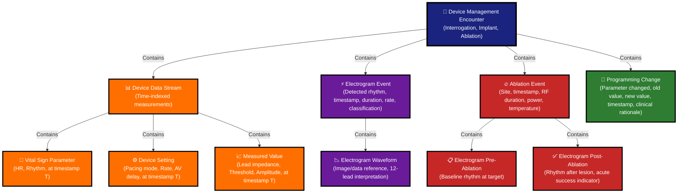
Architectural characteristic: This is the most time-sensitive of the three modalities. A single-second difference in timing can change the clinical interpretation of an electrogram event.
3C.3 Cupid Template Architecture for Device Interrogation
---
## Step-by-Step Diagram Explanation: Device Interrogation Template Architecture

### 🏥 Main Template Node (Top Level)

The diagram starts with the primary template header **"Device Interrogation / Implant"** represented in deep navy blue. This is the root node that branches into all major sections of the device encounter documentation.

### 📱 Section 1: Device Information (Blue Branch)

**Purpose:** Captures basic device identification

**Visual indicator:** Bright blue color (#0277bd)

**Icon:** 📱 Mobile device symbol

**Contains:**

- Device Type (Pacemaker, ICD, CRT-D dropdown options)
- Device Model and Serial Number
- Implant Date (historical reference)
- Last Interrogation Date (tracking follow-up intervals)

### ⚙️ Section 2: Current Settings (Red-Orange Branch)

**Purpose:** Records device programming parameters at time of interrogation

**Visual indicator:** Red-orange color (#d84315)

**Icon:** ⚙️ Gear symbol representing settings

**Contains:**

- Pacing Mode (AAI, VVI, DDD selections)
- Base Rate in beats per minute
- AV Delay and VV Delay in milliseconds
- Sensor status (on/off)
- Additional device-specific parameters

### 🔌 Section 3: Lead Information (Purple Branch)

**Purpose:** Documents electrical performance of each lead

**Visual indicator:** Purple color (#7b1fa2)

**Icon:** 🔌 Plug symbol representing electrical connections

**Contains (for each lead - RA, RV, LV, CS):**

- Lead Position (anatomical location)
- Pacing Threshold (voltage and pulse width)
- Pacing Amplitude (output voltage)
- Sensing Amplitude (detected signal strength)
- Lead Impedance (electrical resistance)
- Lead Model/Name

### 📊 Section 4: Measured Parameters (Teal Branch)

**Purpose:** Displays device-collected diagnostic data

**Visual indicator:** Teal color (#00695c)

**Icon:** 📊 Bar chart representing measurements

**Contains:**

- Heart Rate Range (minimum to maximum from diagnostics)
- Percentage Paced (how often device paces vs native rhythm)
- Battery Voltage and Impedance
- Estimated Battery Longevity (years remaining)

### ⚡ Section 5: Arrhythmia Episodes (Red Branch)

**Purpose:** Documents detected rhythm disturbances

**Visual indicator:** Red color (#c62828)

**Icon:** ⚡ Lightning bolt representing arrhythmic events

**Contains (repeating block structure for each episode):**

- Episode Timestamp (device-recorded date/time)
- Detected Rhythm classification (AF, VT, etc.)
- Duration and Rate of episode
- Device Response (therapy delivered or none)
- Outcome (terminated, ongoing, patient-terminated)
- Link to stored electrogram waveform image

### 🔄 Section 6: Programming Changes (Orange Branch)

**Purpose:** Tracks modifications made during interrogation

**Visual indicator:** Orange color (#f57c00)

**Icon:** 🔄 Circular arrows representing changes

**Contains (repeating block for each change):**

- Parameter Changed (which setting was modified)
- Old Value → New Value comparison
- Clinical Rationale (why the change was made)
- Timestamp of programming change

### 📋 Section 7: Assessment & Plan (Green Branch)

**Purpose:** Clinical interpretation and follow-up planning

**Visual indicator:** Green color (#2e7d32)

**Icon:** 📋 Clipboard representing clinical assessment

**Contains:**

- Device Function Assessment (Normal/Abnormal status)
- Key Findings (narrative summary)
- Recommendations (clinical action items)
- Follow-up Schedule (timing and location)

### 🔗 Diagram Flow Structure

**Hierarchical organization:**

- **Level 1:** Main template node (navy blue header)
- **Level 2:** Seven major sections (colored branches with distinct hues)
- **Level 3:** Detailed content fields within each section (lighter shade boxes)

**Visual design principles:**

- Each section uses a unique, highly saturated color for instant recognition
- Thick black borders (3-5px) create strong visual separation
- White text on dark backgrounds ensures maximum readability
- Icons provide quick visual cues for section purpose
- Arrow connectors show parent-child relationships

### 💡 Key Architecture Insights

**Time-based data capture:** Most sections record measurements "at interrogation time" creating a temporal snapshot

**Repeating structures:** Arrhythmia Episodes and Programming Changes use repeating blocks to handle multiple occurrences

**Device-specificity:** Template adapts based on device type (pacemaker vs ICD vs CRT-D)

**Multi-lead support:** Lead Information section repeats for RA, RV, LV, and CS leads as applicable

**Clinical workflow:** Structure follows logical interrogation sequence from device identification → settings review → performance metrics → episode analysis → programming → assessment

---
```mermaid
graph TD
    A["🏥 DEVICE INTERROGATION / IMPLANT"]
    B["📱 Device Information"]
    C["⚙️ Current Settings&lt;br/&gt;(Snapshot at interrogation)"]
    D["🔌 Lead Information&lt;br/&gt;(RA, RV, LV, CS)"]
    E["📊 Measured Parameters&lt;br/&gt;(From device)"]
    F["⚡ Arrhythmia Episodes&lt;br/&gt;(Repeating blocks)"]
    G["🔄 Programming Changes&lt;br/&gt;(If made during encounter)"]
    H["📋 Assessment &amp; Plan"]
    
    B1["Device Type, Model&lt;br/&gt;Serial Number&lt;br/&gt;Implant Date"]
    C1["Pacing Mode&lt;br/&gt;Base Rate, AV Delay&lt;br/&gt;VV Delay, Sensor"]
    D1["Lead Position&lt;br/&gt;Thresholds&lt;br/&gt;Impedance, Sensing"]
    E1["HR Range, % Paced&lt;br/&gt;Battery Voltage&lt;br/&gt;Battery Longevity"]
    F1["Timestamp, Rhythm&lt;br/&gt;Duration, Rate&lt;br/&gt;Device Response&lt;br/&gt;Electrogram Link"]
    G1["Parameter Changed&lt;br/&gt;Old/New Values&lt;br/&gt;Clinical Rationale&lt;br/&gt;Timestamp"]
    H1["Function Assessment&lt;br/&gt;Key Findings&lt;br/&gt;Recommendations&lt;br/&gt;Follow-up Schedule"]
    
    A --&gt; B
    A --&gt; C
    A --&gt; D
    A --&gt; E
    A --&gt; F
    A --&gt; G
    A --&gt; H
    
    B --&gt; B1
    C --&gt; C1
    D --&gt; D1
    E --&gt; E1
    F --&gt; F1
    G --&gt; G1
    H --&gt; H1
    
    style A fill:#1a237e,stroke:#000,stroke-width:5px,color:#ffffff,font-size:16px
    style B fill:#0277bd,stroke:#000,stroke-width:4px,color:#ffffff,font-size:14px
    style C fill:#d84315,stroke:#000,stroke-width:4px,color:#ffffff,font-size:14px
    style D fill:#7b1fa2,stroke:#000,stroke-width:4px,color:#ffffff,font-size:14px
    style E fill:#00695c,stroke:#000,stroke-width:4px,color:#ffffff,font-size:14px
    style F fill:#c62828,stroke:#000,stroke-width:4px,color:#ffffff,font-size:14px
    style G fill:#f57c00,stroke:#000,stroke-width:4px,color:#ffffff,font-size:14px
    style H fill:#2e7d32,stroke:#000,stroke-width:4px,color:#ffffff,font-size:14px
    
    style B1 fill:#0288d1,stroke:#000,stroke-width:3px,color:#ffffff
    style C1 fill:#e64a19,stroke:#000,stroke-width:3px,color:#ffffff
    style D1 fill:#8e24aa,stroke:#000,stroke-width:3px,color:#ffffff
    style E1 fill:#00897b,stroke:#000,stroke-width:3px,color:#ffffff
    style F1 fill:#d32f2f,stroke:#000,stroke-width:3px,color:#ffffff
    style G1 fill:#fb8c00,stroke:#000,stroke-width:3px,color:#ffffff
    style H1 fill:#388e3c,stroke:#000,stroke-width:3px,color:#ffffff


```
